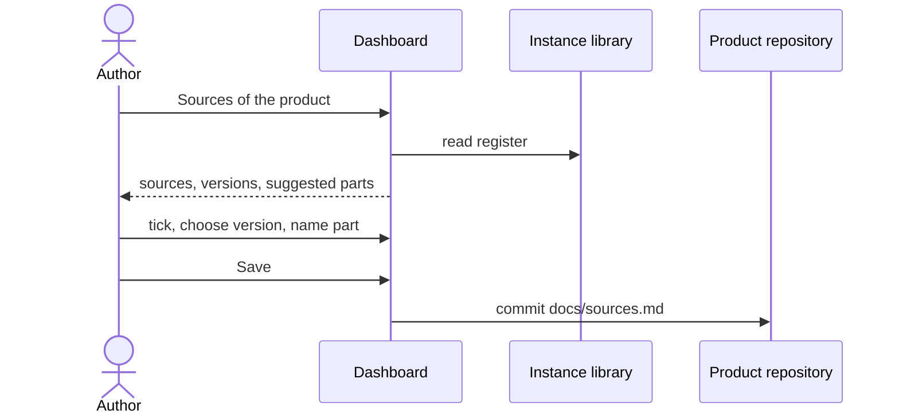

# UC-015 Link sources to a product

**Goal.** The author states which sources from the library apply to a product, in which version and
to which extent — so that every requirement of the product can name where it comes from.

## Actors

- **Author** — decides which rules the product must meet.

## Precondition

- The product is managed by the instance (UC-001).
- The library contains at least one source (UC-004).

## Main flow

1. In the product's view, the author opens **Sources**. Agent M shows the library, each source with
   kind, authority and its versions.
2. The author ticks the sources that apply.
3. For each ticked source, the author chooses the version — preset to the newest — and may name the
   part that applies. Agent M suggests parts where the source has known ones: *safety class A, B or C*
   for IEC 62304, a risk category for the EU AI Act; any text is allowed.
4. The author presses **Save** — one click. Agent M commits `docs/sources.md` to the product
   repository: one line per source with its identifier, version, the version's hash, and the part.

A folded **What is this?** explains the difference between the library (which sources exist) and
this list (which apply here), and why the version is fixed.

## Alternative flows

- **2a. A needed source is not in the library.** A link opens UC-004; afterwards the author returns
  here.
- **2b. The author removes a link.** Agent M lists the product's requirements that name this source
  before saving; they would lose their source, so they are listed, not deleted.
- **3a. The source's content is restricted and not readable for this author.** The link is still
  possible; register entry, version and hash are public, only the content needs access.

## Postcondition

- The product repository names every applicable source with a fixed version and, where given, the
  applicable part.
- Requirements can be derived from these sources (UC-005) and name them.
