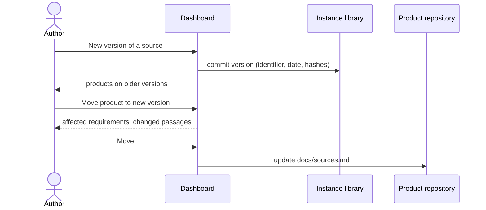

# UC-016 A source gets a new version

**Goal.** When a law is amended, a norm gets a new edition, or a document is revised, the library
records the new version beside the old one, and each product moves to it only when its author
decides to — seeing first which of its requirements are affected.

## Actors

- **Author** — maintains the library and the products.
- **Fetch workflow** — fetches new versions of EU legal texts.

## Precondition

- The source is in the library (UC-004).

## Main flow

1. The author opens the source in the library and chooses **+ New version** — the same routes as in
   UC-004: a new EUR-Lex address or consolidated version, a new designation (for example the next
   edition of a norm), new files, or a newer commit of a repository.
2. Agent M records the new version with its identifier, date and hashes; earlier versions stay as
   they are.
3. The library shows which products still link to an earlier version.
4. For one of them, the author chooses **Move to the new version**. Agent M lists the product's
   requirements that came from this source, and — where both versions are text — which passages
   changed.
5. The author presses **Move** — one click. Agent M updates the product's `docs/sources.md`; the listed
   requirements are marked *source changed* on the dashboard until each is looked at again.

## Alternative flows

- **4a. The author keeps a product on the old version** — for example because it was certified
  against it. Nothing changes; the library keeps showing that a newer version exists.
- **1a. The new version has the same bytes as an existing one.** Agent M says so and records nothing.

## Postcondition

- The library holds both versions, unchanged.
- Each product links to the version its author chose; a move is visible in the product's history
  together with the requirements it affected.
