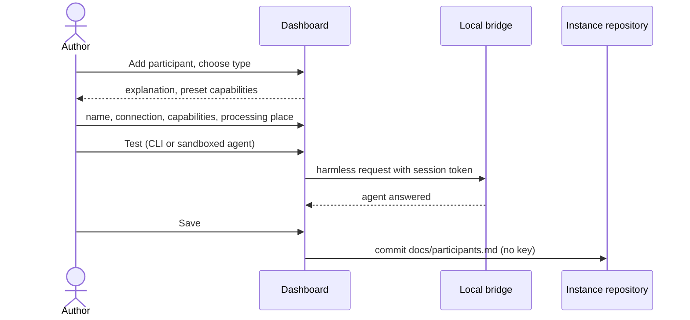

# UC-017 Configure the participants of the instance

**Goal.** The author describes, once, the people and agents who can work on the instance's products
— what each of them can do and where the data given to it goes — so that any product can assign them
to roles (UC-002).

| Type | Example | Reached through | Typical capabilities |
|---|---|---|---|
| **Person** | a colleague's GitHub or GitLab account | the dashboard | all, and decisions |
| **Model endpoint** | NHR hub, an OpenAI or Anthropic endpoint | the browser (UC-003) | draft text |
| **CI agent** | an agent run inside a GitHub Actions workflow | a workflow (UC-010) | read, write, run code and tests |
| **CLI agent** | Claude Code or Codex on the author's machine | the local bridge (UC-011) | read, write, run code and tests, tools |
| **Sandboxed agent** | a CLI agent inside a VM or container | the bridge through a tunnel (UC-011) | as CLI agent, isolated |

## Actors

- **Author** — configures the instance.
- **GitHub** — holds the instance repository.

## Precondition

- The author has an instance with its token stored in this browser (UC-014).

## Main flow

1. The author opens **Participants** on the dashboard and chooses **+ Add participant**.
2. The author picks the type. A folded **What is this?** explains each type with an example and what
   it means for cost, speed and control.
3. The author names the participant and fills in the type-specific part:
   - **Person:** the account on GitHub or on the GitLab server;
   - **Model endpoint:** which configured endpoint and model (the key itself is set up in UC-003 and
     stays in the browser);
   - **CI agent:** which workflow and model; the key is named as an Actions secret, never entered here;
   - **CLI agent / sandboxed agent:** the bridge address (for a sandbox, the tunnel's local address)
     and which agent runs there.
4. Agent M presets the capabilities typical for the type — draft text, read the repository, write to
   the repository, run code and tests, use tools, reach the web — and the author adjusts them.
5. The author states where the participant processes data. Agent M presets it where it can tell
   (*this machine* for a CLI agent) and asks otherwise, with examples.
6. For a CLI or sandboxed agent, the author presses **Test**; Agent M sends a harmless request through
   the bridge and shows what answered.
7. The author presses **Save** — one click. Agent M commits the participant to
   `docs/participants.md` of the instance: name, type, capabilities, processing place — no key.

## Alternative flows

- **3a. The endpoint is not configured yet.** A link leads to UC-003; afterwards the author returns
  here.
- **6a. The bridge does not answer.** Agent M names the reason — not running, wrong address, token
  missing — and saves nothing until the author decides to save untested.
- **5a. A participant processes data outside places that some sources permit.** Agent M lists those
  sources; the participant can be saved, but will never be given their content.
- **7a. The author changes a participant that products already use.** Agent M lists the products and
  roles; if a capability is removed that a role needs, those assignments are shown as invalid until
  reassigned.

## Postcondition

- The instance lists the participant with type, capabilities and processing place; no key is in the
  repository.
- Products can assign it to roles that need no more than its capabilities (UC-002).
