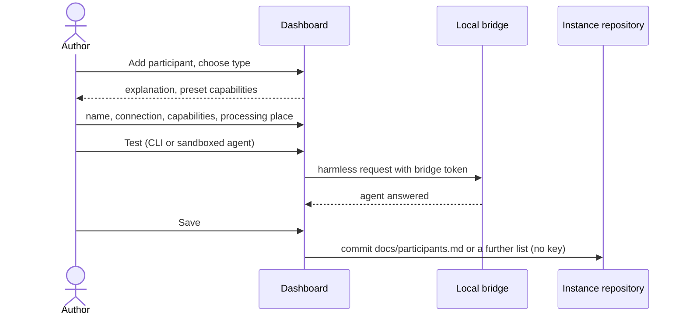

# UC-017 Configure the participants of the instance

**Goal.** The author describes, once, the people and agents who can work on the instance's products
— what each of them can do and where the data given to it goes — so that any product can assign them
to roles (UC-002).

| Type | Example | Reached through | Typical capabilities |
|---|---|---|---|
| **Person** | a colleague's GitHub or GitLab account | the dashboard | all, and decisions |
| **Model endpoint** | NHR hub, an OpenAI or Anthropic endpoint; a local model server such as Ollama | the browser (UC-003); a local model server through the bridge on its machine (UC-011) | draft text |
| **CI agent** | an agent run inside a GitHub Actions or GitLab CI job — on GitHub's machines, or on a **self-hosted runner** on the person's own machine or VM | a workflow (UC-010) | read, write, run code and tests |
| **CLI agent** | Claude Code or Codex on the author's machine | the local bridge (UC-011) | read, write, run code and tests, tools |
| **Sandboxed agent** | a CLI agent inside a VM or container | the bridge through a tunnel (UC-011) | as CLI agent, isolated |

## Actors

- **Author** — configures the instance.
- **GitHub** — holds the instance repository.

## Precondition

- The author has an instance with its token stored in this browser (UC-014).

## Main flow

1. The author opens **Participants** on the dashboard and chooses **+ Add participant**.
2. The author picks the type. A folded **What is this?** explains each type with an example and what
   it means for cost, speed and control.
3. The author names the participant and fills in the type-specific part:
   - **Person:** the account on GitHub or on the GitLab server;
   - **Model endpoint:** which configured endpoint and model (the key itself is set up in UC-003 and
     stays in the browser);
   - **CI agent:** which workflow and model, and where it runs — on GitHub's machines, or on a
     **self-hosted runner** the person installed on a machine or VM they control. The key is named
     as an Actions secret, never entered here. A folded explanation says why: a workflow runs on its
     runner, not in this browser, so nothing stored here — no token, no SSH key — reaches it. To let
     a workflow use a CLI or sandboxed agent, the runner is installed **on that agent's machine**;
     the workflow's job then runs there and reaches the agent locally, with no inbound SSH and no key
     stored on GitHub — which also works for a machine behind NAT, because the runner only connects
     out. The runner is registered to a **private** repository only: Agent M reads the repository's
     visibility and refuses a public one, with the reason — on a public repository, a pull request from
     any fork could run its own code on that machine;
   - **CLI agent / sandboxed agent:** chosen from the agents the paired Agent M Bridge reports as installed
     (UC-044) — or, without the app, the bridge address (for a sandbox, the tunnel's local address)
     and which agent runs there; for a machine behind NAT, the remote session reached through the
     jump host (UC-011, 1c) — and the **model** the agent is configured to use, for example
     `claude-opus-5-5`.

   Every participant that works with a language model names its model; Agent M compares these names when
   it picks three checkers that differ from the rewriting participant (UC-038, step 6). A person names none.
   Such a participant also names how many tokens its model's context holds, so that a job can check before it
   sends that everything fits, and — where the author wants costs in money — its price per million input and
   output tokens, so that the usage a runtime reports can be priced (`NO COST IS GUESSED`). Left empty, a job is
   not sent to it, and its costs are shown as usage with *price unknown*.
4. Agent M presets the capabilities typical for the type — draft text, read the repository, write to
   the repository, run code and tests, use tools, reach the web — and the author adjusts them.
5. The author states where the participant processes data. Agent M presets it where it can tell
   (*this machine* for a CLI agent) and asks otherwise, with examples.
6. For a CLI or sandboxed agent, the author presses **Test**; Agent M sends a harmless request through
   the bridge and shows what answered.
7. The author presses **Save** — one click. Agent M commits the participant to
   `docs/participants.md` of the instance, or to the further list `docs/participants_<name>.md` the author chose: name, type, model, context and price where it has them, capabilities,
   processing place — no key.

```mermaid
sequenceDiagram
    actor A as Author
    participant D as Dashboard
    participant B as Local bridge
    participant I as Instance repository
    A->>D: Add participant, choose type
    D-->>A: explanation, preset capabilities
    A->>D: name, connection, capabilities, processing place
    A->>D: Test (CLI or sandboxed agent)
    D->>B: harmless request with bridge token
    B-->>D: agent answered
    A->>D: Save
    D->>I: commit docs/participants.md or a further list (no key)
```

## Alternative flows

- **3a. The endpoint is not configured yet.** The endpoint's fields of UC-003 — address, model, key —
  open in place, with UC-003's test request; the author does not leave this page.
- **3c. Another list holds the name with a different entry.** Agent M names that list and the difference, and saves
  nothing until the entries agree or the author chooses another name. The same participant with the same entry may
  stand in several lists.
- **6a. The bridge does not answer.** Agent M names the reason — not running, wrong address, token
  missing — and saves nothing until the author decides to save untested.
- **5a. A participant processes data outside places that some sources permit.** Agent M lists those
  sources; the participant can be saved, but will never be given their content.
- **3b. The author wants a workflow to use an agent behind SSH without a self-hosted runner.** Agent M
  explains the alternative and its cost: the SSH key as an Actions secret on GitHub, and a host that
  GitHub's machines can reach from the internet. It recommends the runner.
- **7a. The author changes a participant that products already use.** Agent M lists the products and
  roles; if a capability is removed that a role needs, those assignments are shown as invalid until
  reassigned.

## Postcondition

- The instance lists the participant with type, capabilities and processing place; no key is in the
  repository.
- Products can assign it to roles that need no more than its capabilities (UC-002).
