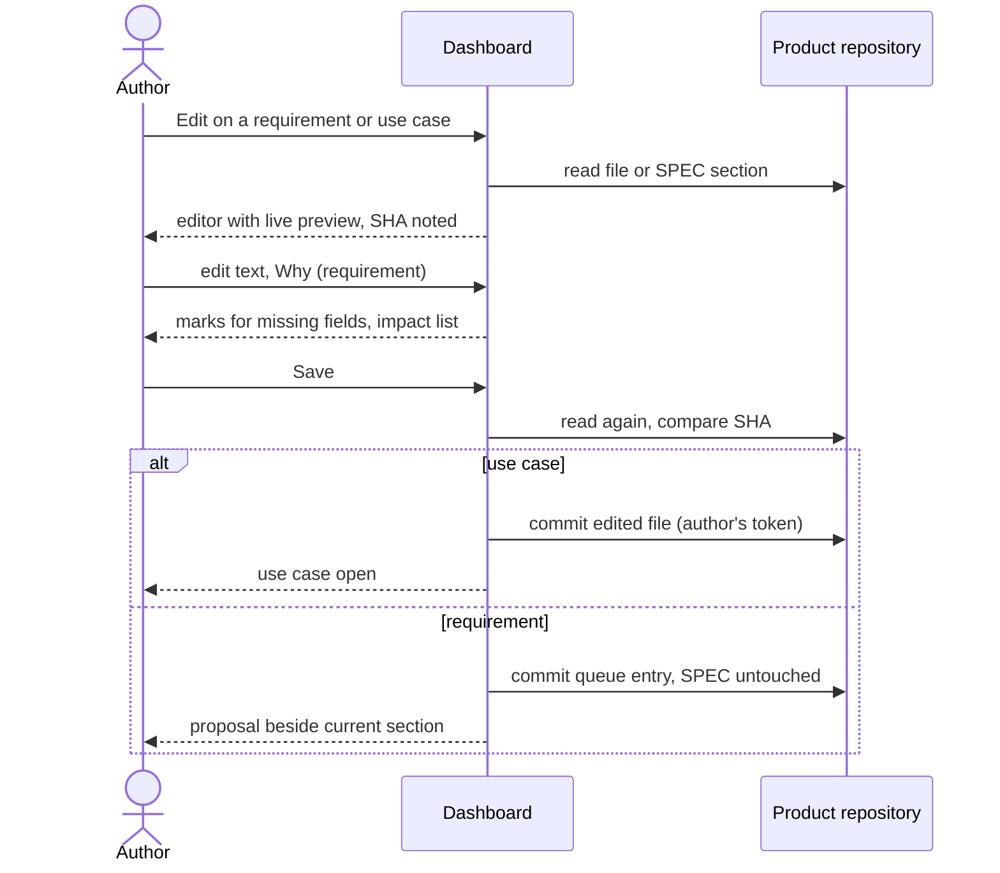

# UC-018 Edit a specification or a use case in the dashboard

**Goal.** The author changes a requirement or a use case by typing, in an editor on the dashboard,
without leaving it for GitHub. A use case is saved directly and is open until accepted (UC-008). A
requirement is never written into the SPEC by this use case: saving creates a proposal beside the
current text, accepted in UC-006. Requirements move because understanding moves (Vibe Coding, ch. 8
§6); the editor is where that learning is written down.

## Actors

- **Author** — anyone with write access to the product repository; often the reviewer who found the
  wording wrong.
- **GitHub** — hosts the product repository and receives the commit (a GitLab server takes its place
  for a GitLab product).

## Precondition

- The product is managed by the instance (UC-001).
- A token that can write to the product repository is stored in this browser (otherwise 4a, 4b).
- The requirement exists in the product's SPEC, or the use case exists under `docs/use-cases/`.

## Main flow

1. The author opens a requirement in the specification browser (UC-020) or a use case in the review
   list (UC-008) and presses **Edit**.
2. The dashboard opens the editor on the same page: Markdown on the left, live preview on the right,
   including rendered Mermaid diagrams. It notes the blob SHA of what it opened — the use-case file,
   or, for a requirement, the SPEC section that holds it.
3. The author edits. The preview follows each keystroke. Agent M marks, without blocking:
   - for a requirement: a missing one of the five fields, and a conjunction in the rule
     (`ONE STATEMENT PER REQUIREMENT`);
   - for a use case: a missing actor, precondition, main flow, alternative flows or postcondition,
     and a name under `realises` that matches no requirement.
4. For a requirement only, the editor shows a **Why** field: one or two sentences the reviewer will
   read as the rationale of the proposal. For an existing requirement, Agent M lists beside it every
   artifact that names it — the impact list.
5. The author presses **Save** — one click. Agent M reads the file again from the default branch and
   compares its blob SHA with the one from step 2; they are equal.
6. **Use case:** Agent M commits the edited file to the default branch under the author's own
   account. Its SHA changes; no approval record names the new SHA, so the dashboard shows it as open,
   or as changed since acceptance.
   **Requirement:** Agent M writes a new queue under `docs/spec-freigaben/<date>_<slug>/` — the entry
   with the complete SPEC section as edited, its rationale from the *Why* field, its impact list, and
   the queue's index naming the section it replaces — in one commit under the author's account.
   `SPEC.md` is not touched.
7. The dashboard shows the commit as a link. For a requirement it opens the new entry in the
   approval view: current section, proposal and difference side by side, ready for UC-006.

Each step carries a folded **What is this?**: why a SPEC edit waits for approval while a use-case
edit is saved at once, what a blob SHA is, and why an edit after acceptance reopens the review.

## Alternative flows

- **1a. The author edits an open proposal**, not the SPEC. That is UC-006 alternative flow 3a: the
  entry itself is saved directly, because it is already a proposal; no second queue is created.
- **3a. The author changes a requirement's name.** The dashboard says that the name is the
  identifier. On save, the proposal withdraws the old name, with the withdrawal note, and adds a new
  requirement under the new name; the impact list shows everything that still names the old one.
- **3b. The author changes a use case's `id`.** *Save* is disabled and the reason is shown: an
  identifier never changes. A use case that should become two is split by keeping this one and adding
  a new one (UC-007 or UC-019).
- **3c. A mark from step 3 remains.** The author may save anyway; the mark stays visible to the
  reviewer. The decision on the text is made at acceptance, not in the editor.
- **3d. The author adds a new requirement** instead of changing one: **+ Requirement** in a section
  of the browser opens the editor with the five fields empty. Saving proposes the section with the
  addition, exactly as in step 6.
- **3e. The author wants a requirement or use case in another group.** That is not an edit: the
  editor changes text only, never a group. A link opens the arrangement (UC-021), which commits the
  group file directly and leaves this text — and its approval — untouched.
- **4a. No token is stored (GitHub).** *Save* puts the edited text on the clipboard and opens
  GitHub's editor for the use-case file, or GitHub's new-file page at the path of the queue entry;
  the text never travels in the link. The dashboard compares the SHA before opening GitHub and warns
  if it already differs.
- **4b. The product is on GitLab and no token for it is stored.** There is no *Save*; the dashboard
  links to the step that stores the project's token (UC-001, 3c).
- **5a. The file or the SPEC section changed since step 2.** Nothing is written. The editor keeps the
  author's text and shows the newer version beside it, with the difference. The author merges by hand
  and presses *Save* again; the comparison is now against the newer SHA.
- **6a. Another open proposal already replaces the same SPEC section.** The dashboard names it; the
  new entry is written anyway. Whichever is accepted first makes the other stale
  (`A STALE APPROVAL IS NOT APPLIED`), and the reviewer decides again on the current text.
- **6b. The author has no write access.** The commit is refused; as in UC-008 4a, the dashboard
  offers the GitHub route, where the commit becomes a pull request that counts once merged.
- **7a. The author leaves the editor with unsaved changes.** The dashboard asks before discarding
  them.

## Postcondition

- A use case: the edited text is on the default branch and counts as open until an approval record
  names its SHA (UC-008).
- A requirement: a queue entry holds the edited section beside the current one; `SPEC.md` is
  unchanged until the entry is accepted (UC-006).
- No identifier changed; a renamed requirement left a withdrawal note behind.
