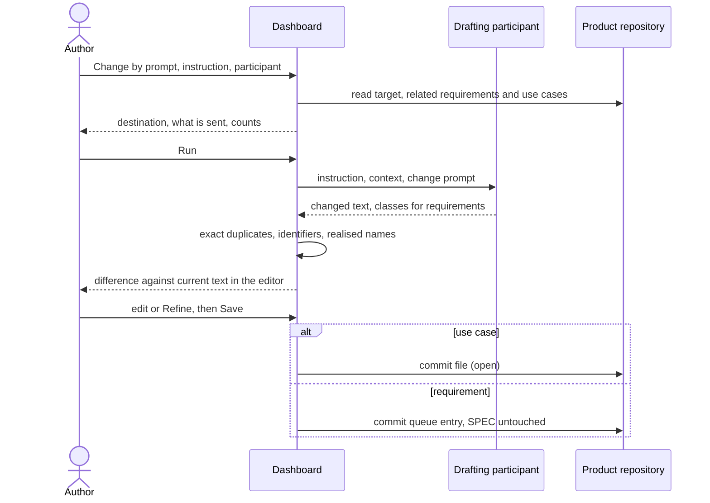

# UC-019 Change a specification or a use case by prompt

**Goal.** The author says in one sentence what should change — "split this requirement", "add error
handling to UC-007" — and a participant of their choice drafts the change. The author sees the draft
as a difference against the current text, corrects it in the editor of UC-018, and saves: a use case
is committed as open, a requirement becomes a proposal for UC-006. The book's advice to pair text
with models "for agents" (Vibe Coding, ch. 9 §1) is what makes this work: the participant reads the
same Markdown the author does.

## Actors

- **Author** — writes the instruction and decides on the result.
- **Drafting participant** — a model endpoint, CI agent, CLI agent or sandboxed agent from the
  instance's list (UC-017) that can *draft text*.
- **GitHub** — hosts the product repository (a GitLab server for a GitLab product).

## Precondition

- The product is managed by the instance (UC-001).
- At least one participant with the capability *draft text* is configured (UC-017).
- A token that can write to the product repository is stored in this browser (otherwise UC-018 4a,
  4b apply at saving).

## Main flow

1. On a requirement in the specification browser (UC-020), on a group of requirements, or on a use
   case, the author presses **Change by prompt**.
2. The author writes the instruction. A folded **What is this?** gives examples: split a requirement,
   make a rule checkable, add an alternative flow, align a use case with a changed requirement.
3. The author chooses the participant. Agent M offers only participants that can draft text, and
   shows for each where it processes data.
4. Agent M assembles what the participant must see:
   - **requirements:** the requirements to change, and every requirement of the product — in its
     SPEC and in its open queues;
   - **use case:** the use case, every requirement it realises, and every other use case of the
     product.

   It checks that the instruction and all of this fit into the participant's context.
5. The run panel shows the destination, what exactly is sent and how many requirements and use cases
   are included. The author presses **Run** — that click is the decision to send.
6. Agent M sends the instruction and the context with the change prompt from the repository's single
   definition. The participant returns the changed text; for requirements, each resulting requirement
   is classified as new, a change to a named requirement, a duplicate of one, or a conflict with one.
7. Before showing anything, Agent M checks without a model:
   - a returned requirement whose name or normalised rule equals an existing one is a duplicate,
     whatever the participant said;
   - a returned use case keeps its `id`; every name under `realises` matches a requirement;
   - a requirement whose name changed is marked as withdrawal plus new requirement.
8. The dashboard opens the editor of UC-018 with the draft, showing the difference against the
   current text line by line; for requirements, each one carries its class and stands beside the
   existing requirement it refers to. The author edits freely, or presses **Refine** with a
   follow-up instruction, which repeats steps 5–7 on the current draft.
9. The author presses **Save** — one click — and UC-018 continues at step 5: the use case is
   committed as open, or a queue entry is written and the SPEC stays unchanged. The commit, or the
   queue entry, records the instruction, the participant, the model, the Agent M version and the
   date.

## Alternative flows

- **3a. No participant can draft text.** Agent M says so and links to UC-017.
- **4a. The context does not fit into the chosen participant.** Nothing is sent. Agent M says how
  many requirements or use cases there are and how much fits, and offers a participant with a larger
  context; it never leaves any of them out silently.
- **5a. The author does not press Run.** Nothing is sent.
- **6a. The participant is a CLI or sandboxed agent** (UC-011). The request goes through the local
  bridge; the agent returns the draft to the dashboard and the flow continues at step 7.
- **6b. The participant is a CI agent** (UC-010). The workflow commits the draft to the default
  branch as an open use case or an open queue entry; the author reviews it in UC-008 or UC-006
  instead of step 8. *(Open question for the PO — queue 2026-09-24g, rationale of entry 05, question 6.)*
- **6c. The participant returns nothing usable** — no text, the unchanged text, or text that cannot
  be read as the artifact. The dashboard says which, shows the raw answer folded, and writes nothing.
- **7a. The participant changed a use case's `id`.** Agent M restores the original identifier and
  marks the place; a use case that should become two is split by keeping this one and adding another.
- **7b. The participant dropped a name from `realises`** or added one that matches no requirement.
  The difference highlights it; an unknown name is removed and marked, never turned into a
  requirement (as in UC-007 4a).
- **8a. A returned requirement conflicts with an existing one.** It is shown beside it, with both
  sources and their authority. It is not written until the author decides; undecided conflicts stay
  in the panel.
- **8b. The instruction touched several use cases** ("align UC-007 and UC-008 with the new rule").
  Each file is shown with its own difference; *Save* commits all of them in one commit, and each is
  accepted on its own (UC-008).
- **8c. The author discards the draft.** Nothing is written.
- **9a. The target changed while the participant was drafting.** UC-018 5a: nothing is written, the
  draft stays in the editor beside the newer version.

## Postcondition

- Only what the author saved was written: a use case as open, or a queue entry beside the current
  SPEC section; the SPEC itself is unchanged.
- No requirement was duplicated: a restated rule became a duplicate, a changed rule kept its name.
- The record of the change names the instruction and the participant that drafted it.
