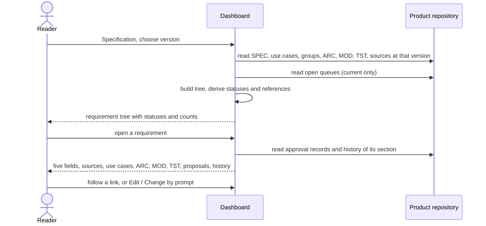

# UC-020 Browse the specification

**Goal.** The reader finds their way through a product's requirements — by chapter, by version, by
status — and sees for each one where it comes from, what realises and checks it, what is about to
change it, and how it got to its current wording. The browser is the "higher-level view" a reader
looks for before reading details (Vibe Coding, ch. 9 §1), applied to the specification.

## Actors

- **Reader** — anyone who can open the instance's dashboard: author, reviewer, developer, auditor.
- **GitHub** — hosts the product repository with its tags and history (a GitLab server for a GitLab
  product).

## Precondition

- The product is managed by the instance (UC-001) and has a SPEC.
- For a private repository, a token that can read it is stored in this browser.

## Main flow

1. The reader selects a product and opens **Specification**. A version selector at the top is preset
   to *current (default branch)* and lists every release tag `vYYYY.MINOR.PATCH` of the product
   (UC-013), newest first.
2. Agent M reads, at the chosen version, the SPEC, the use cases, the requirement group file `docs/groups/requirements.md`, the architecture
   elements, modules and tests, and the product's source links; for *current*, also the open queues
   under `docs/spec-freigaben/`.
3. The browser shows the requirements as a tree: the groups of `docs/groups/requirements.md`, nested,
   each requirement once under its group by its name, or at the top level if no group names it. Each group shows how many
   requirements it holds and how many of them no use case realises. Each requirement carries a status:
   - *in SPEC* — accepted;
   - *change proposed* or *withdrawal proposed* — an open queue entry would change it;
   - *proposed* — an open queue entry would add it, shown at the top level until a group names it;
   - *withdrawn* — kept with its withdrawal note.
4. The reader narrows the tree by typing part of a name or rule, or by filter: status, source,
   constrains product or process, realised or not.
5. The reader opens a requirement. The browser shows its five fields and, beside them:
   - **Sources** — each with the version and the part the product links (UC-015);
   - **Use cases** that realise it, with their review status (UC-008);
   - **Architecture elements**, **modules** and **tests** that name it;
   - **Open proposals** touching it, with a link to each in the approval view (UC-006);
   - **History** — every accepted change to its text: date, accepting person, commit, and the text
     before and after.

   All lists are computed from the artifacts of the chosen version; nothing is read from a stored
   matrix.
6. The reader follows a link — to a use case, a proposal, a source, another requirement — or, on the
   current version, presses **Edit** (UC-018) or **Change by prompt** (UC-019).

A folded **What is this?** explains the statuses, why a requirement has a history of approvals, and
what a release tag is.

## Alternative flows

- **1a. The reader chooses a released version.** The browser is read-only and says *as of
  vYYYY.MINOR.PATCH*; open proposals, *Edit* and *Change by prompt* are hidden, because they concern
  the current text only.
- **1b. The reader compares two versions.** The reader picks a second version; the tree marks
  requirements added, changed and withdrawn between them, and a changed one opens with the difference.
- **1c. The product has no release yet.** Only *current* is offered, with a pointer to UC-013.
- **2a. The repository is private and no token reaches it.** As UC-008 1a: the browser says so and
  shows nothing.
- **2b. The product has no architecture elements, modules or tests yet.** Those lists read *none
  yet*, with a folded note on which phase produces them; nothing is hidden.
- **3a. A requirement has been withdrawn.** It stays in its group, greyed, with its note; its
  history and everything that still names it remain visible.
- **5a. Nothing realises or checks the requirement.** The lists say *none*; the gap is reported, as in
  UC-009, and blocks nothing.
- **5b. An artifact names a requirement that does not exist in the chosen version.** It is listed
  under *unknown names*, with the note that the name was withdrawn, if it was.
- **5c. Two open proposals touch the same requirement.** Both are listed; the browser notes that
  accepting one makes the other stale.
- **5d. The section was written before any approval record existed** (for example, the initial SPEC).
  The history shows the commit that introduced it and says that no record names it.

## Postcondition

- Nothing is written; the browser is a view.
- Every reference the reader saw was derived from the artifacts of the version shown.
