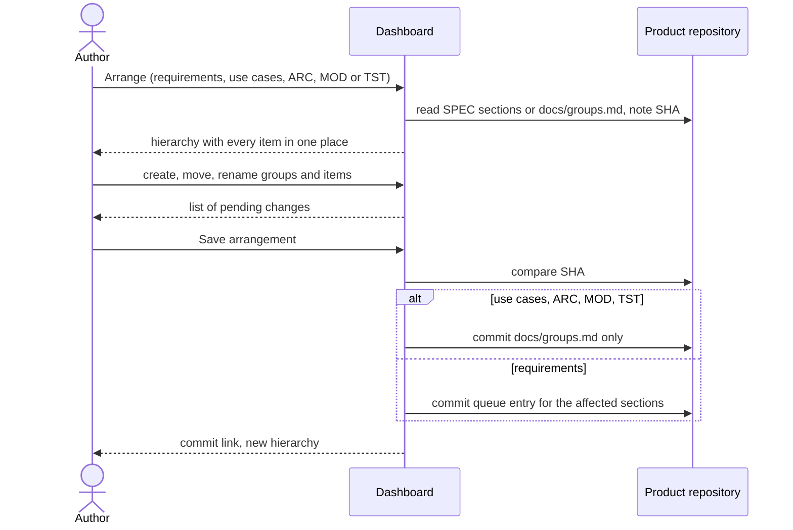

# UC-021 Group artifacts into a hierarchy

**Goal.** The author arranges a product's requirements, use cases, architecture elements, modules
and tests into nested groups, so that a hundred items read as a few chapters. The book asks for
exactly this twice: requirements at different levels of detail for different readers (Vibe Coding,
ch. 8 §1.1), and a backlog with "more structure than a pile of wishes" (ch. 8 §3.2). Grouping only
arranges; it never renames, renumbers or reopens anything.

| Kind | Where its groups live | What saving a regrouping does |
|---|---|---|
| Requirements | the nested section headings of the SPEC | writes a SPEC proposal, accepted in UC-006 |
| Use cases, architecture elements, modules, tests | `docs/groups.md` of the product repository | commits `docs/groups.md` directly; no artifact file changes |

## Actors

- **Author** — decides how the product's artifacts are arranged.
- **GitHub** — hosts the product repository (a GitLab server for a GitLab product).

## Precondition

- The product is managed by the instance (UC-001) and has artifacts of the kind to be arranged.
- A token that can write to the product repository is stored in this browser (otherwise 5c).

## Main flow

1. In the specification browser (UC-020), or in the list of use cases, architecture elements,
   modules or tests, the author presses **Arrange**. The list turns into the hierarchy of that kind:
   its groups, nested, with every item under exactly one of them or at the top level.
2. The author shapes the hierarchy:
   - **+ Group** creates a group with a title, inside the selected group or at the top;
   - an item or a group is moved by dragging it, or with **Move to …** (keyboard and screen reader
     reachable);
   - a group is renamed in place.
3. Agent M lists the pending changes beside the tree — *moved UC-007 from "Review" to "Approval"*,
   *new group "Derivation" under "Requirements"* — and keeps each rule of the hierarchy: a group
   holds one kind of artifact, an item has one place.
4. The author presses **Save arrangement** — one click.
5. **Use cases, architecture elements, modules, tests:** Agent M checks that `docs/groups.md` still
   has the blob SHA it read in step 1, and commits the new version under the author's own account.
   The file is Markdown: one heading per kind, groups as a nested list, each member by its
   identifier. No use-case, architecture, module or test file is touched, so every status and every
   approval stays as it was.
   **Requirements:** a new group is a new sub-heading, a move is a requirement leaving one section and
   entering another. Agent M writes one queue entry covering the affected sections, with every moved
   requirement byte for byte and an impact list stating that references name identifiers, not
   sections. The SPEC is unchanged until the entry is accepted (UC-006).
6. The dashboard shows the commit as a link and the new hierarchy — for requirements, marked as
   proposed until accepted.

A folded **What is this?** explains that a group is only a heading: it has no identifier, nothing
realises or tests it, and moving an item never changes the item.

## Alternative flows

- **1a. The product has no `docs/groups.md` yet.** Every item is shown at the top level; the first
  *Save arrangement* creates the file.
- **1b. The author asks a participant to propose an arrangement** (**Propose groups**). As in UC-019:
  the author chooses a participant, sees what is sent — titles and identifiers of the items, with
  their text for requirements — and presses *Run*. The proposal arrives as a list of pending changes
  in step 3, where the author edits it before saving.
- **2a. The author tries to put an item into a group of another kind** — a use case into a
  requirement section. The move is refused and the reason shown; relations across kinds are
  traceability (UC-009, UC-020), not grouping.
- **2b. The author deletes a group.** Only an empty group can be deleted; otherwise the author first
  moves its content, or chooses *move content up one level*. Grouping never deletes an item.
- **2c. The author renames a group.** Only its title changes; no artifact refers to it, so nothing
  else has to change. For a requirement section, the rename is part of the SPEC proposal.
- **3a. `docs/groups.md` names an identifier that no longer exists.** The tree shows it as *unknown
  member*, with the note that it was withdrawn, if it was; the author removes it or leaves it.
- **3b. An item appears in no group** — for example, a use case just written by UC-007. It is shown
  at the top level, marked *not yet placed*.
- **3c. `docs/groups.md` names an item twice.** The tree shows both places and asks the author to
  keep one; nothing is saved until the item has one place.
- **5a. `docs/groups.md` or a SPEC section changed since step 1.** Nothing is written. The dashboard
  shows the newer hierarchy with the author's pending changes applied where they still apply, and
  names those that no longer apply; the author saves again.
- **5b. A move of requirements spans sections that another open proposal also replaces.** The
  dashboard names that proposal; whichever is accepted first makes the other stale.
- **5c. No token is stored (GitHub).** *Save arrangement* puts the new `docs/groups.md` — or the
  queue entry — on the clipboard and opens GitHub's editor at its path, as in UC-018 4a. On a GitLab
  product without a token, there is no save.

## Postcondition

- Every item of the arranged kind has exactly one place in its hierarchy; no identifier, no artifact
  file and no approval status has changed.
- Use cases, architecture elements, modules and tests: `docs/groups.md` holds the new arrangement.
- Requirements: a queue entry holds the rearranged sections; the SPEC changes only when it is
  accepted (UC-006).
