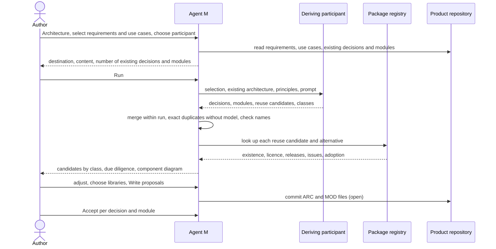

# UC-022 Derive the system architecture from requirements and use cases

**Goal.** Agent M turns the product's accepted requirements and use cases into architecture
decisions (`ARC-<nnn>`) and modules (`MOD-<slug>`), each naming what forces it, with reused libraries
chosen after a due diligence built on fetched facts — for the author to accept decision by decision.

Architecture is "the fundamental organization of a system, embodied in its components, their
relationships … and the principles guiding its design and evolution" (book ch. 10 §1, after IEEE
1471). In Agent M it has two kinds of artifact:

| | **Architecture decision** `ARC-<nnn>` | **Module** `MOD-<slug>` |
|---|---|---|
| file | `docs/architecture/ARC-<nnn>-<slug>.md` | `docs/architecture/MOD-<slug>.md` |
| says | context, decision, alternatives considered, consequences | one responsibility, interfaces provided, interfaces used |
| names | the requirements and use cases that force it | the requirements or use cases it realises, the decisions it follows |
| example | *ARC-003 The dashboard is a static client that talks to the Git server's API* | *MOD-review-core — derives status from approval records* |

## Actors

- **Author** — decides which decisions and modules are proposed, and which library is chosen.
- **Deriving participant** — a model endpoint or agent from the instance's list (UC-017) that drafts
  the candidates.
- **Package registry** — npm, PyPI, crates.io, Maven Central or the candidate's source repository;
  supplies the facts for the due diligence.
- **Product repository** — receives the proposals.

## Precondition

- The product has accepted requirements and accepted use cases (UC-006, UC-008).
- At least one participant that can *draft text* is configured (UC-017).

## Main flow

1. The author opens **Architecture** for the product. Agent M lists the accepted requirements and use
   cases, the existing decisions and modules, and — preselected — the requirements and use cases that
   no decision or module names yet. A folded **What is this?** explains decisions and modules with
   the table above and points to book ch. 10.
2. The author adjusts the selection and chooses the deriving participant. Agent M offers only
   participants that can *draft text*, shows where each processes data, and leaves out any whose
   place a linked source forbids for content that would be sent.
3. Agent M assembles the input: the selected requirements and use cases, **every existing decision and
   module of the product** — accepted and open —, the product's process requirements, and, from the
   single definition, the architecture prompt with the book's principles (ch. 10 §3: divide and
   conquer, design to test, KISS, YAGNI, DRY, least astonishment, open-closed, interfaces before
   implementations) and pattern families (ch. 10: layers, pipe-and-filter, repository, plug-in,
   client-server, broker, service orientation). It checks that the input fits the participant's
   context.
4. The run panel shows the destination, what is sent, and how many existing decisions and modules are
   included; the author presses **Run** — that click is the decision.
5. The participant returns candidates:
   - **decisions**, each with context, decision, alternatives, consequences, the requirements and use
     cases that force it, and Mermaid diagrams where a view helps (a layered view, a deployment
     view — ch. 10 §2, 4+1 views);
   - **modules**, each with responsibility, interfaces provided and used, what it realises and which
     decisions it follows;
   - for every decision that adopts an external library, service or API: the candidate and its
     alternatives, by name and ecosystem;
   - for each candidate a class: **new**, **change** of a named existing decision or module,
     **duplicate** of one, **conflict** with one.
6. **The deduplication pass**, as for requirements (UC-005 step 6): candidates of this run that say the
   same are merged; a candidate whose name or normalised text equals an existing one is a duplicate
   without a model; Agent M checks every named requirement, use case, decision and module against the
   product and assigns `ARC-<nnn>` to new decisions.
7. **The due diligence.** For every reuse candidate and each alternative, Agent M reads from the
   package registry and the source repository: whether the package exists, its licence, the dates of
   its releases, its open and closed issues, and its adoption (dependents or downloads). Each fact is
   stored with the address it was read from and the date (book ch. 6 §5). Beside each candidate's
   licence stands the product's own, read from its `LICENSE` file; a candidate whose licence is not
   known to be compatible with it is marked.
8. The review panel shows the candidates grouped by class, each beside the existing artifact it
   refers to; the reuse candidates side by side in a due-diligence table; and a component diagram
   computed from the existing and proposed modules' interfaces. The author may move a candidate to
   another class, resolve conflicts, pick a different alternative for a reuse decision, or drop a
   candidate.
9. The author presses **Write proposals** — one click. Agent M commits to the product's default
   branch, where each file is open:
   - one file per new decision and per new module under `docs/architecture/`;
   - a change to an existing decision or module in its own file, under its identifier, with the
     current text beside it and its impact list (UC-023, step 4);
   - a duplicate adds its forcing requirements or use cases to the existing decision.

   Every file records Agent M version, participant, model and date.
10. The author accepts each decision and module on its own, as a use case is accepted (UC-008). **Accept**
    is enabled only when every requirement and use case the file names is accepted.

## Alternative flows

- **1a. The product has no accepted requirements or no accepted use cases.** Agent M says which, and
  links to UC-006 and UC-008; nothing is derived from open artifacts.
- **3a. The input does not fit into the participant's context.** Nothing is sent. Agent M says how many
  decisions and modules exist and how much fits, and offers a participant with a larger context or a
  smaller selection; it never leaves existing architecture out silently.
- **4a. The author does not press Run.** Nothing is sent.
- **5a. A candidate names a requirement or use case that does not exist, or one that is not accepted.**
  Agent M removes the unknown name and marks the candidate; it does not invent a requirement.
- **5b. A module realises no requirement.** It is proposed and marked as speculative — the case YAGNI
  warns against (ch. 10 §3); the author decides.
- **7a. A reuse candidate is not found in its registry.** It is not proposed. The panel lists it as
  "not found — the name may be invented", with the address that was queried.
- **7b. The registry cannot be read from the browser.** Agent M names the reason and offers a
  participant that can *reach the web* — a CI, CLI or sandboxed agent — to fetch the facts; until
  then the reuse decision is shown without due diligence and cannot be written.
- **7d. The product has no `LICENSE` file.** Every candidate's licence is marked *not checked*, and
  the panel says that the product's licence decides which libraries it may reuse; the author adds the
  file by a commit of their own.
- **7c. The licence is missing, unknown or restrictive.** The table says so in the candidate's row; the
  author decides, with a folded explanation of what a licence permits.
- **8a. The author rejects every alternative of a reuse decision.** The decision is rewritten as
  *develop the component* (book ch. 6 §5: configure, adapt or develop), and a module for it is
  proposed.
- **10a. A requirement or use case the file names is still open.** *Accept* stays disabled and names
  it; the file stays open.

## Postcondition

- The product repository holds one open file per proposed decision and per proposed module under
  `docs/architecture/`; nothing counts as accepted before a person accepts it.
- No proposal duplicates an existing decision or module: changes stand under their existing
  identifiers.
- Every reuse decision carries a due diligence whose facts name where and when they were read.
