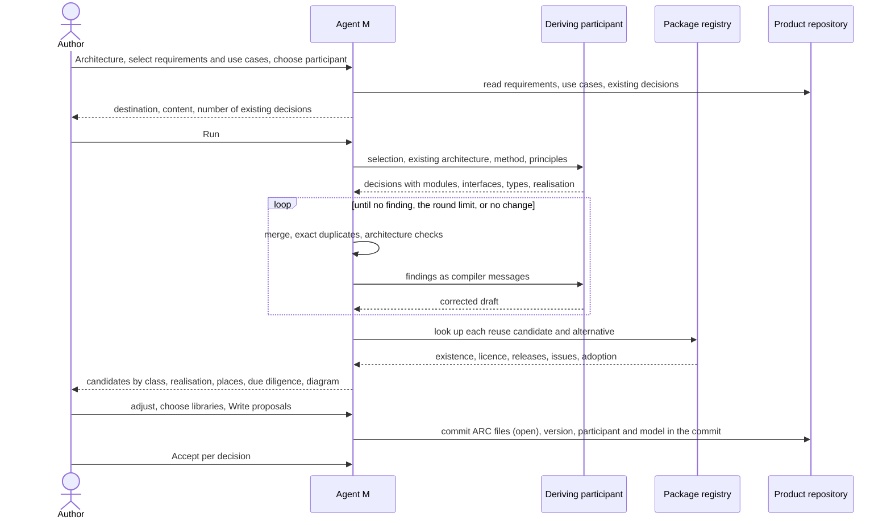

# UC-022 Derive the system architecture from requirements and use cases

**Goal.** Agent M turns the product's accepted requirements and use cases into architecture decisions so precise that
module skeletons, interface documentation, sample input files and one failing test per example can be generated from
them without a model. The deriving participant corrects every finding of the architecture checks before the author
sees a draft; the author accepts decision by decision.

Architecture is "the fundamental organization of a system, embodied in its components, their relationships … and the
principles guiding its design and evolution" (book ch. 10 §1, after IEEE 1471). In Agent M every part of it stands in
an architecture decision, one file `docs/architecture/ARC-<nnn>-<slug>.md`:

| Part | What it states |
|---|---|
| Context, decision, alternatives, consequences | why a decision is needed, what is decided, what else was weighed, what follows |
| Forced by | the requirements and use cases that force the decision |
| Modules | for each module the decision designs: its identifier `MOD-<slug>`, its folder, its responsibility, the requirements it realises |
| Interfaces | for each interface of a module: its parameters, result and refusals with their types, and at least one example |
| Types | every data structure and file format the modules use, defined once in machine-readable form, each with a sample |
| Realisation | for every step of every use case the decision covers, the interfaces that carry the step out |

## Actors

- **Author** — decides which decisions are proposed, and which library is chosen.
- **Deriving participant** — a model endpoint or agent from the instance's list (UC-017) that drafts the decisions and
  corrects them until the checks pass.
- **Package registry** — npm, PyPI, crates.io, Maven Central or the candidate's source repository; supplies the facts
  for the due diligence.
- **Product repository** — receives the proposals.

## Precondition

- The product has accepted requirements and accepted use cases (UC-006, UC-008).
- At least one participant that can *draft text* is configured (UC-017).

## Main flow

1. The author opens **Architecture** for the product. Agent M lists the accepted requirements and use cases, the
   existing decisions with the modules they design, and — preselected — the requirements and use cases that no decision
   covers yet. A folded **What is this?** explains decisions, modules, interfaces and types with the table above and
   points to book ch. 10.
2. The author adjusts the selection and chooses the deriving participant. Agent M offers only participants that can
   *draft text*, shows where each processes data, and leaves out any whose place a linked source forbids for content
   that would be sent.
3. Agent M assembles the input: the selected requirements and use cases, **every existing decision of the product** —
   accepted and open —, the product's process requirements, and, from the single definition, the architecture prompt
   with the method of step 5, the book's principles (ch. 10 §3: divide and conquer, design to test, KISS, YAGNI, DRY,
   least astonishment, open-closed, interfaces before implementations) and its pattern families (ch. 10: layers,
   pipe-and-filter, repository, plug-in, client-server, broker, service orientation). It checks that the input fits
   the participant's context.
4. The run panel shows the destination, what is sent, and how many existing decisions are included; the author presses
   **Run** — that click is the decision.
5. The participant drafts by this method:
   1. **Operations from use cases.** For every step of every selected use case — main flow and alternative flows — it
      names the operation that carries the step out, the data the step reads and writes, and the actor's action that
      starts it.
   2. **Types.** Every piece of data from 5.1 becomes a type: a data structure passed between operations, or a file
      format read or written in a repository. Each type is defined once, in machine-readable form, with a sample.
   3. **Modules and interfaces.** The operations are grouped into modules by responsibility, each module one folder.
      Every operation becomes an interface of its module, with typed parameters, result and refusals and at least one
      example: an input and the result or refusal it gives.
   4. **Placement.** Every selected requirement is placed: realised by the module whose interface keeps it, or named by
      the decision it forces as a rule that no single module keeps.
   5. **Decisions.** Every structural choice — a layering, a pattern, a format, a library — is a decision with context,
      decision, alternatives and consequences, naming what forces it; a decision that adopts a library names the
      candidate and its alternatives by name and ecosystem.
   6. **Realisation.** For every use-case step of 5.1, the decision names the interfaces that carry it out.

   It returns the decisions with the modules, interfaces, types and realisation they hold, each classed **new**,
   **change** of a named existing decision, **duplicate** of one, or **conflict** with one.
6. **Checks and corrections, before the author sees anything.** Candidates of this run that say the same are merged,
   and a candidate whose name or normalised text equals an existing decision is a duplicate without a model (as in
   UC-005 step 6). Agent M then runs the architecture checks on every candidate, without a model:
   - errors — a parameter, result or refusal without a type; a type used but defined nowhere, or defined twice; a type
     without a sample, or a sample that does not conform to it; an interface without an example, or an example that
     does not conform to its types; a requirement, use case, decision, module, interface or type that does not
     resolve; a dependency cycle between modules;
   - warnings — a use-case step that no interface carries; a requirement without a place.

   Each finding goes back to the participant as a compiler-like message; the participant fixes every error and fixes or
   justifies every warning, until no finding is left, the round limit is reached, or a round leaves the findings
   unchanged. Conflicts are not sent back. Agent M then assigns `ARC-<nnn>` to new decisions.
7. **The due diligence.** For every reuse candidate and each alternative, Agent M reads from the package registry and the
   source repository: whether the package exists, its licence, the dates of its releases, its open and closed issues,
   and its adoption (dependents or downloads). Each fact is stored with the address it was read from and the date
   (book ch. 6 §5). Beside each candidate's licence stands the product's own, read from its `LICENSE` file; a candidate
   whose licence is not known to be compatible with it is marked.
8. The review panel shows the candidates grouped by class, each beside the existing decision it refers to; the
   realisation — every use-case step with the interfaces that carry it; the place of every requirement; the reuse
   candidates side by side in a due-diligence table; a component diagram computed from the modules' dependencies; and
   the rounds, with any finding left after the last one. The author may move a candidate to another class, resolve
   conflicts, pick a different alternative for a reuse decision, or drop a candidate.
9. The author presses **Write proposals** — one click. Agent M commits to the product's default branch, where each
   file is open:
   - one file per new decision under `docs/architecture/`;
   - a change to an existing decision in its own file, under its identifier, with the current text beside it and its
     impact list (UC-023, step 4);
   - a duplicate adds its forcing requirements or use cases to the existing decision.

   The commit names the Agent M version, the participant and the model; the files name none of them.
10. The author accepts each decision on its own, as a use case is accepted (UC-008), or all of them at once on the
    architecture's review page (UC-008 3e). **Accept** is enabled only when every requirement and use case the file
    names is accepted; on the review page, a file for which that does not hold is shown, left out of **Accept all N
    shown**, and named with what is still open.

```mermaid
sequenceDiagram
    actor A as Author
    participant M as Agent M
    participant P as Deriving participant
    participant R as Package registry
    participant G as Product repository
    A->>M: Architecture, select requirements and use cases, choose participant
    M->>G: read requirements, use cases, existing decisions
    M-->>A: destination, content, number of existing decisions
    A->>M: Run
    M->>P: selection, existing architecture, method, principles
    P-->>M: decisions with modules, interfaces, types, realisation
    loop until no finding, the round limit, or no change
        M->>M: merge, exact duplicates, architecture checks
        M->>P: findings as compiler messages
        P-->>M: corrected draft
    end
    M->>R: look up each reuse candidate and alternative
    R-->>M: existence, licence, releases, issues, adoption
    M-->>A: candidates by class, realisation, places, due diligence, diagram
    A->>M: adjust, choose libraries, Write proposals
    M->>G: commit ARC files (open), version, participant and model in the commit
    A->>M: Accept per decision
```

## Alternative flows

- **1a. The product has no accepted requirements or no accepted use cases.** Agent M says which, and links to UC-006
  and UC-008; nothing is derived from open artifacts.
- **3a. The input does not fit into the participant's context.** Nothing is sent. Agent M says how many decisions exist
  and how much fits, and offers a participant with a larger context or a smaller selection; it never leaves existing
  architecture out silently.
- **4a. The author does not press Run.** Nothing is sent.
- **5a. A candidate names a requirement or use case that does not exist, or one that is not accepted.** The check of
  step 6 sends it back; a name still unresolved after the last round is removed and the candidate marked. Agent M does
  not invent a requirement.
- **5b. A module realises no requirement.** It is proposed and marked as speculative — the case YAGNI warns against
  (ch. 10 §3); the author decides.
- **6a. Findings are left after the last round.** The draft is shown with each finding left, in the compiler form; the
  author decides whether to write it, change it on the dashboard, or drop it.
- **7a. A reuse candidate is not found in its registry.** It is not proposed. The panel lists it as "not found — the
  name may be invented", with the address that was queried.
- **7b. The registry cannot be read from the browser.** Agent M names the reason and offers a participant that can
  *reach the web* — a CI, CLI or sandboxed agent — to fetch the facts; until then the reuse decision is shown without due
  diligence and cannot be written.
- **7c. The licence is missing, unknown or restrictive.** The table says so in the candidate's row; the author decides,
  with a folded explanation of what a licence permits.
- **7d. The product has no `LICENSE` file.** Every candidate's licence is marked *not checked*, and the panel says that
  the product's licence decides which libraries it may reuse; the author adds the file by a commit of their own.
- **8a. The author rejects every alternative of a reuse decision.** The decision is rewritten as *develop the
  component* (book ch. 6 §5: configure, adapt or develop), and a module for it is proposed.
- **10a. A requirement or use case the file names is still open.** *Accept* stays disabled and names it; the file stays
  open.

## Postcondition

- The product repository holds one open file per proposed decision under `docs/architecture/`; nothing counts as
  accepted before a person accepts it.
- Every proposed decision passed the architecture checks, or is shown with the findings left after the last round.
- No proposal duplicates an existing decision: changes stand under their existing identifiers.
- Every reuse decision carries a due diligence whose facts name where and when they were read.
