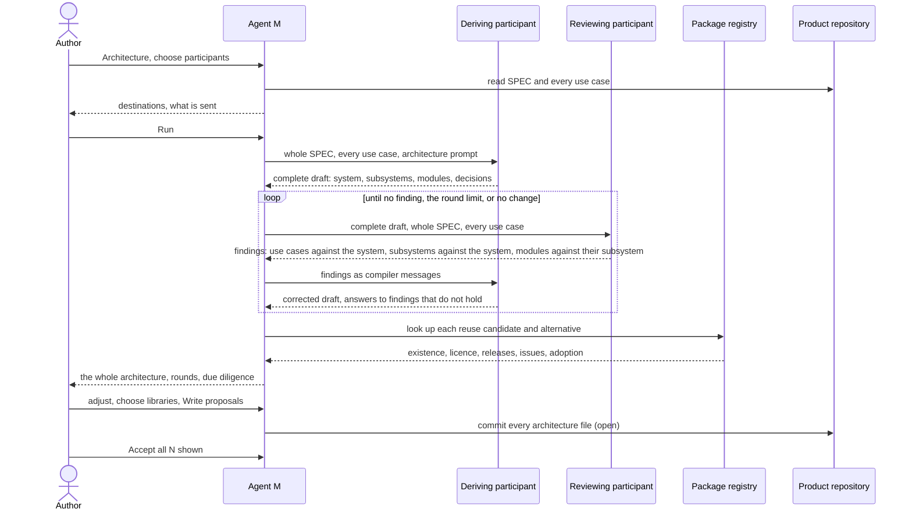

# UC-022 Derive the system architecture from requirements and use cases

**Goal.** Agent M turns all of a product's requirements and use cases, at once, into the product's first architecture
as a whole: the patterns it combines, the system decomposed into subsystems and each subsystem into modules, the four
views, a scenario for every use case, and the decisions behind them — designed by the principles that the SPEC takes
from book ch. 10. Once the draft is complete, a second participant that knows the entire project checks it as a whole —
every use case against the system, every subsystem against the system, every module against its subsystem —; the
deriving participant weighs every finding and corrects or answers it; the author reviews and accepts the architecture as
a whole.

An architecture is "the fundamental organization of a system, embodied in its components, their relationships to each
other and to the environment, and the principles guiding its design and evolution" (book ch. 10, after IEEE 1471). It
describes the system down to its modules and their interfaces; what only an implementation can answer is left to the
implementation (UC-024). Its files in the product repository:

| File | What it states |
|---|---|
| `docs/architecture/ARC-<nnn>-<slug>.md` — the system | the architecture as a whole: the system and its environment, the patterns, the subsystems and their relationships, the logical, process, development and physical views, one scenario per use case, and how the system, each subsystem and each module are tested |
| `docs/architecture/ARC-<nnn>-<slug>.md` — one per subsystem | the subsystem: its responsibility within the system, the interface it offers, and its modules, with context, decision, alternatives and consequences |
| `docs/architecture/ARC-<nnn>-<slug>.md` — further decisions | one significant choice each — a format, a library — with context, decision, alternatives and consequences |
| `docs/architecture/MOD-<slug>.md` — one per module | the subsystem it belongs to, its responsibility, what it implements — its parts, the data it keeps —, the interface it provides, the files it reads or writes, and the interfaces of other modules it uses |

## Actors

- **Author** — starts the derivation, chooses the participants and the libraries, accepts the architecture.
- **Deriving participant** — a model endpoint or agent from the instance's list (UC-017) that drafts the architecture
  and corrects it.
- **Reviewing participant** — another model endpoint or agent from the instance's list, using another model, that checks
  the complete draft against the entire project.
- **Package registry** — npm, PyPI, crates.io, Maven Central or the candidate's source repository; supplies the facts for
  the due diligence.
- **Product repository** — holds the SPEC and the use cases, and receives the architecture.

## Precondition

- Every use case of the product is accepted (UC-008).
- The product has no architecture yet; a product that has one changes it through UC-023.
- At least two participants that can *draft text* and use different models are configured (UC-017).

## Main flow

1. The author opens **Architecture** for the product. Agent M shows what the derivation covers — every requirement of the
   SPEC and every use case — and offers no selection: a product's first architecture is drafted in one piece. A folded
   **What is this?** explains what an architecture is, the system, its subsystems and modules, the four views, the
   pattern families and the design principles, with the table above, and points to book ch. 10.
2. The author chooses the deriving and the reviewing participant. Agent M offers only participants that can *draft text*,
   shows where each processes data, and leaves out any whose place a linked source forbids for content that would be
   sent; as reviewer it offers only participants that are not the deriving one and use another model.
3. Agent M assembles the input for the deriving participant: the whole SPEC — its definition of an architecture and its
   design principles included —, every use case, and, from the single definition, the architecture prompt with the order
   of step 5. It checks that the input fits the participant's context.
4. The run panel shows the destinations and what is sent to each; the author presses **Run** — that click is the
   decision.
5. The deriving participant drafts the architecture from the whole to its modules:
   1. **Context.** The system and its environment: the people, repositories, services and machines it works with, as the
      SPEC and the actors of the use cases name them.
   2. **Patterns.** The architectural patterns the system combines — structuring, adaptable-system and distributed-system
      patterns —, each with the part of the system it organises and why it was chosen.
   3. **Subsystems.** The system decomposed top-down into subsystems, each with one responsibility, cut by the functions
      and data that make the use cases possible, not by the steps of the use cases; their relationships to each other
      and to the environment, and the interface each offers.
   4. **Views.** The logical view of the subsystems and their abstractions, the process view of their interaction at
      runtime, the development view of the subsystems' modules and their folders, and the physical view of where each
      part runs — each with a Mermaid diagram.
   5. **Scenarios.** For every use case, a short scenario through the views: which subsystems take part and how they
      interact. A use case that the subsystems cannot make possible sends the participant back to 5.3; no use case is
      restated step by step.
   6. **Testing.** How the system, each subsystem and each module will be tested.
   7. **Subsystems' decisions.** For every subsystem, its decision: its responsibility within the system, the interface it
      offers, and its decomposition into modules, with the alternatives weighed.
   8. **Modules.** For every module, its file: the subsystem it belongs to; its single responsibility; what it implements
      — its parts and the data it keeps; the interface it provides — no larger than the other modules need, extensible
      without changing what it already offers, with the types of every function's parameters and result, the errors a
      caller must handle and, for a call that crosses a network, how it fails —; the files it reads or writes, each data
      format defined once; and the interfaces of other modules it uses, without a cycle.
   9. **Further decisions.** Every other significant choice — a format, a library — as a decision with context,
      decision, alternatives and consequences; a decision that adopts a library names the candidate and its
      alternatives by name and ecosystem.

   Every decision — the system's, a subsystem's or a further one — names the requirements or use cases that force it.
   The participant returns the decision that states the system, the subsystems' decisions, the module files and the
   further decisions.
6. **The check of the whole, before the author sees anything.** Once the draft is complete, Agent M sends it to the
   reviewing participant together with the whole SPEC and every use case. The reviewer checks the whole draft against the
   whole SPEC — its definition of an architecture and its design principles included —, and checks, level by level:
   - every use case against the system: whether its scenario is possible with the subsystems and their interfaces;
   - every subsystem against the system: whether it fulfils the responsibility and offers the interface that the
     decision stating the system gives it;
   - every module against its subsystem: whether it fulfils the part of the subsystem's responsibility and interface that
     the subsystem's decision gives it.

   It does not check the modules against the use cases. Each finding names the file and line, the requirement it concerns
   by name, and what does not fit; it is a warning. The findings go back to the deriving participant, which weighs each
   against the SPEC, the use cases and the draft, since a reviewer can be wrong: it corrects what holds and answers what
   does not hold with the reason. A corrected draft is checked again as a whole, until no finding is left, the round
   limit is reached, or a round leaves the findings unchanged. A finding that only the author can decide — a requirement
   the architecture cannot keep — is not sent back but shown to the author. No test and no CI run checks the draft.
7. **The due diligence.** For every reuse candidate and each alternative, Agent M reads from the package registry and the
   source repository: whether the package exists, its licence, the dates of its releases, its open and closed issues,
   and its adoption (dependents or downloads). Each fact is stored with the address it was read from and the date
   (book ch. 6 §5). Beside each candidate's licence stands the product's own, read from its `LICENSE` file; a candidate
   whose licence is not known to be compatible with it is marked.
8. The review page shows the architecture as a whole: the decision that states the system, with its views and
   scenarios; every subsystem's decision; every module file; every further decision; the reuse candidates side by side in
   a due-diligence table; and the rounds — each finding with the correction or the answer it got, and every finding left
   after the last round. The author may change any file, pick a different alternative for a reuse decision, or start the
   derivation again.
9. The author presses **Write proposals** — one click. Agent M commits every file of the architecture to the product's
   default branch, where each is open. The commit names the Agent M version, the participant and the model; the files
   name none of them.
10. The author reviews the architecture as a whole on its review page and accepts it with **Accept all N shown** — one
    click, one approval record per file (UC-008 3e).

```mermaid
sequenceDiagram
    actor A as Author
    participant M as Agent M
    participant P as Deriving participant
    participant V as Reviewing participant
    participant R as Package registry
    participant G as Product repository
    A->>M: Architecture, choose participants
    M->>G: read SPEC and every use case
    M-->>A: destinations, what is sent
    A->>M: Run
    M->>P: whole SPEC, every use case, architecture prompt
    P-->>M: complete draft: system, subsystems, modules, decisions
    loop until no finding, the round limit, or no change
        M->>V: complete draft, whole SPEC, every use case
        V-->>M: findings: use cases against the system, subsystems against the system, modules against their subsystem
        M->>P: findings as compiler messages
        P-->>M: corrected draft, answers to findings that do not hold
    end
    M->>R: look up each reuse candidate and alternative
    R-->>M: existence, licence, releases, issues, adoption
    M-->>A: the whole architecture, rounds, due diligence
    A->>M: adjust, choose libraries, Write proposals
    M->>G: commit every architecture file (open)
    A->>M: Accept all N shown
```

## Alternative flows

- **1a. A use case of the product is open.** Agent M names it and links to UC-008; nothing is derived until it is
  accepted, since the first architecture covers every use case and is designed only against accepted ones.
- **1b. A SPEC change is open.** Agent M names it and says that the architecture will be derived from the SPEC as it
  stands; the author may decide the change first (UC-006).
- **1c. The product already has an architecture.** Agent M opens UC-023 instead; a first architecture is not drafted
  beside an existing one.
- **2a. No participant qualifies as reviewer.** **Run** stays disabled and names the reason: no other participant that
  can *draft text*, none with another model, or none whose place the content may go to.
- **3a. The input does not fit into a participant's context.** Nothing is sent. Agent M says what does not fit and offers
  a participant with a larger context; it never leaves part of the SPEC, a use case or part of the draft out. The same
  holds for the reviewer in step 6.
- **4a. The author does not press Run.** Nothing is sent.
- **5a. The draft names a requirement or use case that does not exist.** The reviewer's check finds it, and it goes back
  as every finding does; Agent M does not invent a requirement.
- **6a. Findings are left after the last round.** The draft is shown with each finding left, in the compiler form; the
  author decides whether to write it, change it on the dashboard, or start again.
- **6b. The reviewer's answer cannot be read.** It counts as a check not done, never as one without findings; Agent M
  asks again within the round limit, and if no answer can be read the draft is shown marked *not checked*.
- **6c. The deriving participant answers a finding instead of correcting it.** The finding and the answer stand side by
  side on the review page; the author decides which holds.
- **7a. A reuse candidate is not found in its registry.** It is not proposed. The panel lists it as "not found — the
  name may be invented", with the address that was queried.
- **7b. The registry cannot be read from the browser.** Agent M names the reason and offers a participant that can
  *reach the web* — a CI, CLI or sandboxed agent — to fetch the facts; until then the reuse decision is shown without due
  diligence and cannot be written.
- **7c. The licence is missing, unknown or restrictive.** The table says so in the candidate's row; the author decides,
  with a folded explanation of what a licence permits.
- **7d. The product has no `LICENSE` file.** Every candidate's licence is marked *not checked*, and the panel says that
  the product's licence decides which libraries it may reuse; the author adds the file by a commit of their own.
- **8a. The author rejects every alternative of a reuse decision.** The decision is rewritten as *develop the
  component* (book ch. 6 §5: configure, adapt or develop), and a module for it is proposed in its subsystem; the changed
  draft is checked again as a whole, as in step 6.
- **10a. A requirement or use case a file names is not accepted.** The file is shown, left out of **Accept all N shown**,
  and named with what is still open.

## Postcondition

- The product repository holds the first architecture as a whole — the decision that states the system, the
  subsystems' decisions, the module files and the further decisions — as open files; nothing counts as accepted before
  the author accepts it.
- The draft was checked once complete, as a whole, by a participant that received the entire project — every use case
  against the system, every subsystem against the system, every module against its subsystem —; every finding was
  corrected, answered, or is shown as left.
- No test and no CI run checked the architecture.
- Every reuse decision carries a due diligence whose facts name where and when they were read.
