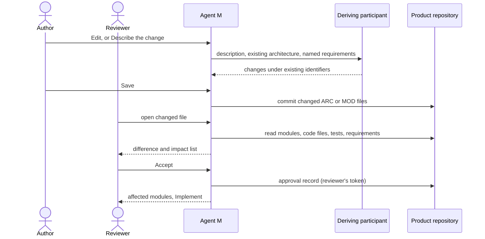

# UC-023 Modify the architecture

**Goal.** The author changes an architecture decision or a module — by editing it, or by describing
the change to a participant — and the reviewer accepts the change only after seeing which modules,
code files, tests and requirements it touches.

Architecture decisions "can be revisited later" (book ch. 10 §2); revisiting one is cheap on paper
and expensive in code. The impact list is what makes the price visible before the decision, not
after.

## Actors

- **Author** — proposes the change.
- **Reviewer** — accepts it; may be the author.
- **Deriving participant** — drafts the change when the author describes it in words (UC-017).
- **Product repository** — holds the architecture, the code and the tests.

## Precondition

- The product has at least one decision or module under `docs/architecture/` (UC-022).

## Main flow

1. The author opens a decision or module on the **Architecture** view and chooses one of two routes:
   - **Edit** — the dashboard's editor with live preview, Mermaid included;
   - **Describe the change** — a text field, for example *"Split MOD-sync into a reader and a writer"*
     or *"Replace the charting library; it has had no release in two years"*.
2. **Describe the change:** the author chooses a deriving participant and presses **Run**. Agent M
   sends the description with the whole existing architecture and the requirements and use cases it
   names, under the rules of UC-022 steps 3–6. The participant returns changes under the existing
   identifiers, and new decisions or modules only where something new is needed. A new or replaced
   library goes through the due diligence of UC-022 step 7.
3. The author reviews the draft or finishes the edit and presses **Save** — one click. Agent M commits
   the changed files to the default branch. They are now *changed since acceptance*, because no
   approval record names their new text.
4. **The impact list.** When a reviewer opens a changed decision or module, Agent M derives from the
   default branch, beside the difference between the accepted and the changed text:
   - the modules that follow the decision, or use an interface the change alters or removes;
   - the code files that name each affected module;
   - the tests that exercise each affected module, and the requirements they guard;
   - the requirements and use cases the changed file names — and those it no longer names.
5. The reviewer presses **Accept** — one click. The dashboard commits the approval record under the
   reviewer's own account (UC-008 step 4). Accepting a change to the architecture does not change any
   code.
6. Agent M lists the affected modules with **Implement** next to each, which starts UC-024 with the
   module preselected.

## Alternative flows

- **1a. The author withdraws a decision or module.** The file stays, marked *withdrawn* with the
  reason and, where there is one, the identifier that replaces it; the identifier is never reused.
  The impact list shows every code file and test that still names it.
- **1b. The author splits or merges modules.** The new modules get new identifiers; the old ones are
  withdrawn as in 1a. Moving code files to the new modules is an implementation job (UC-024).
- **2a. The participant proposes a new identifier for something that exists.** The deduplication of
  UC-022 step 6 turns it into a change under the existing identifier, or the author does so in the
  panel.
- **4a. The change removes an interface that another module uses.** The impact list shows that module
  first, marked *breaks*; accepting stays possible — the author may intend to change both.
- **4b. The changed file names a requirement or use case that is not accepted.** *Accept* stays
  disabled and names it.
- **4c. Code or tests name the module but the module has no code yet.** The list says "no code yet" —
  the change costs nothing in code.
- **5a. The reviewer edits before accepting.** The edit is saved as in step 3, and the impact list is
  derived again for the new text.

## Postcondition

- The accepted text of every changed decision and module is named by an approval record; its old text
  stays reachable in the git history.
- The reviewer saw, before accepting, every module, code file, test and requirement the change
  touches.
- Code still reflects the old architecture until an implementation job changes it.
