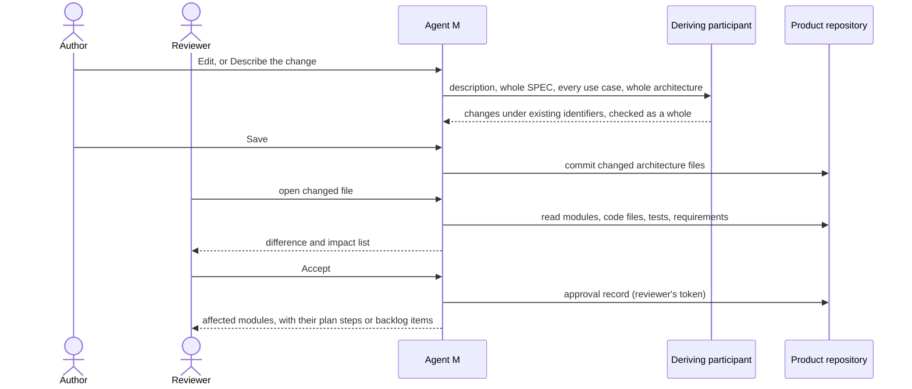

# UC-023 Modify the architecture

**Goal.** The author changes the architecture — a decision or a module's file — by editing it, or by describing the
change to a participant, and the reviewer accepts the change only after seeing which modules, code files, tests and
requirements it touches.

Architecture decisions "can be revisited later" (book ch. 10 §2); revisiting one is cheap on paper
and expensive in code. The impact list is what makes the price visible before the decision, not
after.

## Actors

- **Author** — proposes the change.
- **Reviewer** — accepts it; may be the author.
- **Deriving participant** — drafts the change when the author describes it in words (UC-017).
- **Reviewing participant** — another participant, using another model, that checks the complete change against the
  entire project (UC-022, step 6).
- **Product repository** — holds the architecture, the code and the tests.

## Precondition

- The product has an architecture (UC-022).
- The use cases the change concerns are accepted (UC-008).

## Main flow

1. The author opens a decision or a module's file on the **Architecture** view and chooses one of two routes:
   - **Edit** — the dashboard's editor with live preview, Mermaid included;
   - **Describe the change** — a text field, for example *"Split MOD-sync into a reader and a writer"*
     or *"Replace the charting library; it has had no release in two years"*.
2. **Describe the change:** the author chooses a deriving and a reviewing participant and presses **Run**. Agent M
   sends the description with the entire project — the whole SPEC, every use case and the whole architecture. The
   participant returns changes under the existing identifiers, and new decisions or modules only where something new
   is needed. Once the change is complete, it is checked as in UC-022 step 6 before the author sees it — a change that
   concerns more than one module together with the whole architecture; every finding is weighed before anything is
   changed for it. A new or replaced library goes through the due diligence of UC-022 step 7.
3. The author reviews the draft or finishes the edit and presses **Save** — one click. Before saving an edit, the author
   may have it checked in the same way. Agent M commits the changed files to the default branch. They are now *changed
   since acceptance*, because no approval record names their new text.
4. **The impact list.** When a reviewer opens a changed decision, Agent M derives from the
   default branch, beside the difference between the accepted and the changed text:
   - the modules the change concerns, and the modules that use an interface it alters or removes;
   - the code files in each affected module's folder;
   - the tests that exercise each affected module, and the requirements they guard;
   - the requirements and use cases the changed file names — and those it no longer names;
   - the backlog items (UC-032) and the steps of the implementation plan (UC-045) that name an affected module,
     which then need to be looked at again.
5. The reviewer presses **Accept** — one click. The dashboard commits the approval record under the
   reviewer's own account (UC-008 step 4). Accepting a change to the architecture does not change any
   code. A change that touches many files — a restructuring — is accepted on the architecture's review
   page instead (UC-008 3e): every changed file with its difference and its impact list, every new file in
   full, every removed decision with its impact list, and **Accept all N shown** for all of them in one commit.
6. Agent M lists the affected modules, each with the steps of the implementation plan or the backlog items that
   name it. Once the planner or the Product Owner has looked at them again (UC-045, UC-032), the change is
   implemented as the product's process model prescribes (UC-024).

```mermaid
sequenceDiagram
    actor A as Author
    actor R as Reviewer
    participant M as Agent M
    participant P as Deriving participant
    participant G as Product repository
    A->>M: Edit, or Describe the change
    M->>P: description, whole SPEC, every use case, whole architecture
    P-->>M: changes under existing identifiers, checked as a whole
    A->>M: Save
    M->>G: commit changed architecture files
    R->>M: open changed file
    M->>G: read modules, code files, tests, requirements
    M-->>R: difference and impact list
    R->>M: Accept
    M->>G: approval record (reviewer's token)
    M-->>R: affected modules, with their plan steps or backlog items
```

## Alternative flows

- **1a. The author removes a decision or a module.** The decision's or the module's file leaves the working tree; the
  version history keeps it, and its identifier is never given to anything else. The impact list
  shows every code file in the module's folder and every test that still names it.
- **1b. The author splits or merges modules.** The new modules get new identifiers and folders; the old ones are
  removed as in 1a. Moving code files into the new folders is an implementation job (UC-024).
- **2a. The participant proposes a new identifier for something that exists.** Agent M classes it as a change under
  the existing identifier, as a derivation classes its candidates (`THE DERIVATION RULES HOLD FOR ARCHITECTURE`), or
  the author does so in the panel.
- **4a. The change removes an interface that another module uses.** The impact list shows that module
  first, marked *breaks*; accepting stays possible — the author may intend to change both.
- **4b. The changed file names a requirement or use case that is not accepted.** *Accept* stays
  disabled and names it.
- **4c. The module's folder holds no code yet.** The list says "no code yet" — the change costs nothing in code.
- **5a. The reviewer edits before accepting.** The edit is saved as in step 3, and the impact list is
  derived again for the new text.

## Postcondition

- The accepted text of every changed decision is named by an approval record; its old text
  stays reachable in the git history.
- The reviewer saw, before accepting, every module, code file, test and requirement the change
  touches.
- Code still reflects the old architecture until an implementation job changes it.
