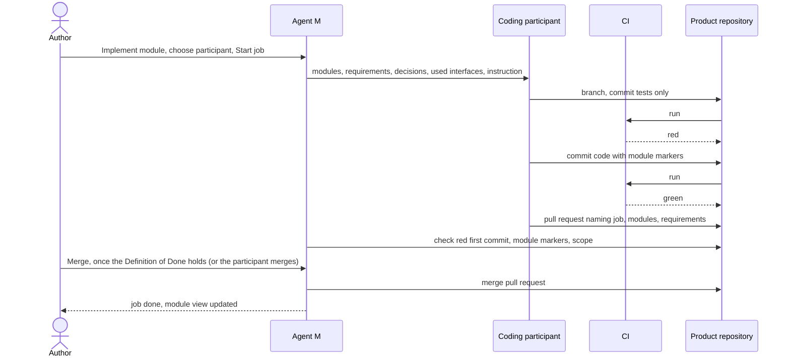

# UC-024 Implement modules from the architecture

**Goal.** An accepted module becomes code: Agent M hands an implementation job to a coding
participant, which writes failing tests first, then the code, on a branch; the pull request is merged
once the product's Definition of Done holds (UC-002, step 8). Every code file and every test says which module it belongs to.

The job follows test-driven development as an agent process (book ch. 13 §5): red — a failing test for
the specified behaviour; green — the minimal code that passes it; refactor — with the tests kept green.
CI is the gate that keeps unstable code out of the default branch (ch. 12 §5), and the pull request is
the review point (ch. 12 §10).

## Actors

- **Author** — starts the job and chooses the participant.
- **Coding participant** — a CLI agent reached through the local bridge, a sandboxed agent reached
  through a tunnel (UC-011), or a CI agent in a workflow on a self-hosted runner on that agent's
  machine (UC-010, UC-017).
- **CI** — the product's GitHub Actions or GitLab CI, which runs the test suite on every push.
- **Product repository** — holds architecture, code, tests, branch and pull request.

## Precondition

- The modules to implement and the decisions they follow are accepted (UC-022, UC-023).
- The product's CI runs its tests on pull requests.
- At least one participant declares *write to the repository* and *run code and tests* (UC-017).

## Main flow

1. The author presses **Implement** on one module — on the **Architecture** view, in the module view
   (UC-025), or after an architecture change (UC-023 step 6). The author may add further modules to
   the same job.
2. Agent M assembles the job:
   - the modules' files, and the requirements and use cases they realise;
   - the decisions they follow;
   - the **interfaces** — not the code — of the modules they use (ch. 10 §3: develop against
     interfaces);
   - the existing code files and tests that name these modules;
   - the product's coding standards file, if it has one (ch. 12 §1);
   - the job instruction from the single definition: the test-first cycle, the module marker every
     new file must carry, and the list of files the job may change.
3. Agent M offers the participants that declare *write to the repository* and *run code and tests*,
   each with where it processes data. A folded **What is this?** explains the three kinds and what
   each costs in setup, speed and isolation.
4. The author chooses the participant, the attempt limit for the fix cycle, and whether the
   participant merges its pull request itself once the Definition of Done holds, or leaves it for a
   person. The panel names the target branch: the default branch, or the branch of the current phase
   or sprint if the product set one (UC-002, step 5). The run panel shows the destination and what is
   sent; the author presses **Start job** — one click.
5. Agent M commits the job's start record `docs/jobs/JOB-<id>.md` — part of the author's click — and
   hands the job over: through the local bridge with its session token, or by starting the workflow
   on the self-hosted runner. The job writes its end record when it ends. The participant creates a branch named after the job.
6. **Red.** The participant writes tests for the modules' specified behaviour. Each test names the
   requirement it guards and the module it exercises. It commits them — tests only — and pushes; CI
   runs and must be **red**.
7. **Green, refactor.** The participant writes the code. Every new code file names its module in a
   header line such as `Module: MOD-review-core`. It runs the tests locally, refactors with them green,
   and pushes; CI runs.
8. The participant opens a pull request naming the job, the modules, the requirements they realise,
   and the participant, model, Agent M version and date. Agent M's job check — a step in the
   product's CI, so that it holds whoever merges — confirms the product's Definition of Done: by
   default, the first commit contained only tests and its CI run was red; every changed file names one
   of the job's modules; every new test names a requirement and a module; every gate before the merge
   is recorded.
9. CI is green and the Definition of Done holds. The pull request is merged — by the participant if
   the author allowed it in step 4, otherwise by a person with **Merge** on the dashboard, one click.
   Until every condition holds, neither can merge.
10. The dashboard shows the job as done, with branch, the red run, the green run and the merge; the
    module view (UC-025) now shows the module's code files and tests.

## Alternative flows

- **1a. The product is on a GitLab server.** Pull request means merge request, CI means GitLab CI;
  the flow is the same.
- **3a. No participant can write and run tests.** Agent M says so and links to UC-017; a model endpoint
  can draft a module file, not implement it.
- **3b. A source whose content the job would include forbids the participant's processing place.**
  That content is left out and the panel says so; if the job cannot be done without it, Agent M offers
  only participants in permitted places.
- **5a. The bridge or the runner does not answer.** Agent M names the reason — bridge not running, token
  wrong, runner offline — and nothing is started.
- **5b. The dashboard's token may not start workflows.** Agent M opens the workflow's *Run workflow*
  page on GitHub with the job's inputs named, and the author starts it there.
- **1b. The author starts a refactoring job** — structure changes, behaviour does not. The author ticks
  *refactoring*; there is no red step: the participant changes the code with the existing tests, CI
  must be green on every commit, and no test's expected result may change. Agent M's job check
  verifies both; a refactoring that needs a changed expectation is an ordinary implementation job.
- **6a. CI is green on the tests-only commit.** The tests pass before any code exists, so they check
  nothing new. The job stops and reports it; the participant rewrites the tests, or the author closes
  the job because the behaviour already exists.
- **7a. The participant needs to change code of a module outside the job.** It stops and reports which
  module and why — it does not work around the other module in its own code (ch. 10 §3). The author
  either adds that module to the job or changes the architecture first (UC-023).
- **7b. CI stays red.** The participant repeats the fix cycle (ch. 12 §5) up to the attempt limit
  stated when the job started; then the pull request stays open as a draft, and the job reports the
  failing tests.
- **8a. Agent M's check finds a file outside the job's modules, or a file without a module marker.**
  The check fails and names the files; the participant corrects the pull request.
- **9a. The repository has no branch protection.** Agent M says that the server does not enforce
  "merge only on green" and links to the setting; the job still merges only on green.

## Postcondition

- The code reached the default branch only through a pull request whose CI run was green.
- The job's first commit was a failing test; the module's tests guard named requirements from now on.
- Every file the job created or changed names the module it belongs to; no file outside the job's
  modules was changed.
- The pull request records who implemented it, with which model and Agent M version, and when.
