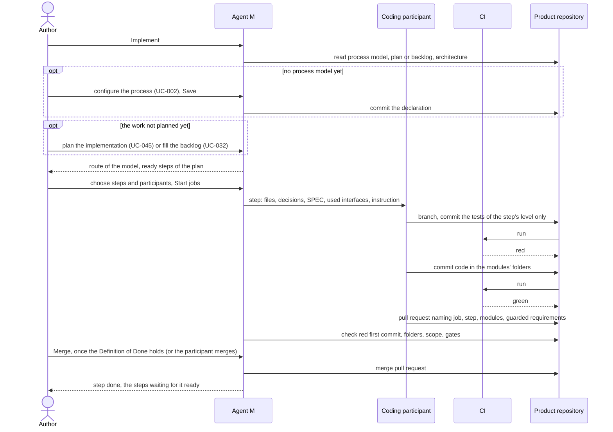

# UC-024 Implement the architecture

**Goal.** The accepted architecture becomes software the way the product's process model prescribes. The process is
configured here, in the first step of implementing (UC-002), because the model decides how the software is assembled —
what one implementation job is, where the work comes from, in which order it is done and where it stops at a gate:

| Process model | The work comes from | One job implements | Order |
|---|---|---|---|
| plan-driven — V-model, waterfall, reuse-oriented | the implementation plan (UC-045) | one step of the plan: a module, a subsystem's integration, or the system | the plan's order; a phase's jobs start after the gate that closes the phase before |
| Scrum | the team's sprint selection from the backlog (UC-032) | one backlog item (UC-034) | after the items it builds on, within the sprint |
| Kanban | the ready items of the backlog (UC-032) | one backlog item (UC-034) | pulled as the team chooses, after the items it builds on, under the work-in-progress limit |

Every job is the same at its core: a coding participant writes failing tests first, then the code, on a branch, and the
pull request is merged once the product's Definition of Done holds (UC-002, step 8). The questions the architecture leaves
to the implementation are answered here. Every code file lies in its module's folder, and every test names the module it
exercises. In a product that works from a backlog, the items' jobs are those of UC-034; the steps below are those of a
product that plans its work.

The job follows test-driven development as an agent process (book ch. 13 §5): red — a failing test for the specified
behaviour; green — the minimal code that passes it; refactor — with the tests kept green. CI is the gate that keeps
unstable code out of the default branch (ch. 12 §5), and the pull request is the review point (ch. 12 §10). Started here,
it is one job per step the author picks; in a run (UC-043), the steps' jobs start by themselves, in the plan's order.

## Actors

- **Author** — starts the jobs and chooses the participants.
- **Coding participant** — a participant assigned to the role that implements (UC-048): a CLI agent reached through the
  local bridge, a sandboxed agent reached through a tunnel (UC-011), or a CI agent in a workflow on a self-hosted runner
  on that agent's machine (UC-010, UC-017).
- **CI** — the product's GitHub Actions or GitLab CI, which runs the test suite on every push.
- **Gate decider** — whoever a gate of the model names: a person or an agent holding its role, or an automated check
  (UC-031).
- **Product repository** — holds the architecture, the plan or the backlog, the code, the tests, the branch and the pull
  request.

## Precondition

- The architecture is accepted (UC-022, UC-023).
- The product's CI runs its tests on pull requests.
- At least one holder of the implementing role declares *write to the repository* and *run code and tests* (UC-017).

## Main flow

1. The author opens **Implement** for the product. The process comes first, because it decides how the software is
   assembled:
   - if the product has no process model yet, the author configures it here, as UC-002 describes — the model, its roles,
     the branches, the Definition of Done, the practices — and saves it, then sets up the team that holds the roles
     (UC-048); a model configured before is shown, and may be changed here (UC-002, 3b);
   - Agent M shows the route the model prescribes, with the table above and a folded **What is this?** pointing to book
     ch. 6 and 7;
   - where the work is not planned yet, it is planned next: the implementation plan for a model that plans its work
     (UC-045), the backlog for Scrum or Kanban (UC-032).

   For Scrum or Kanban, implementation continues with the backlog's items (UC-034); the steps below are those of a model
   that plans its work.
2. Agent M shows the steps of the implementation plan in their order, each with its derived state — *waiting* for a step
   it depends on, *ready*, *in progress*, *done* — and the phase it belongs to. It preselects the ready steps of the
   current phase.
3. The author keeps the selection or narrows it, down to one step.
4. Agent M assembles each step's job:
   - **a module:** its file; the decision of its subsystem and the one that states the system; the SPEC; the
     **interfaces** — not the code — of the modules it uses, as their files state them (ch. 10 §3: develop against
     interfaces); the code in its folder and the tests that name it;
   - **a subsystem's integration:** its decision, the files of its modules, and their code and tests;
   - **the system:** the decision that states it, the subsystems' decisions and the use cases;
   - for every step: the product's coding standards file, if it has one (ch. 12 §1), and the job instruction from the
     single definition — the test-first cycle, the tests of the step's level, and the folders the job may change.
5. Agent M offers, for each step, the holders of the implementing role that declare *write to the repository* and *run
   code and tests*, each with where it processes data. A folded **What is this?** explains the three kinds and what each
   costs in setup, speed and isolation.
6. The author chooses the participants, the attempt limit for the fix cycle, and whether a participant merges its pull
   request itself once the Definition of Done holds, or leaves it for a person. The panel names the target branch — the
   default branch, or the phase's branch if the product set one (UC-002, step 5) —, every gate the jobs will meet and
   who decides it, and what is sent where; the author presses **Start jobs** — one click.
7. Agent M commits each job's start record `docs/jobs/JOB-<id>.md` — part of the author's click — and hands the job over:
   through the local bridge with its bridge token, or by starting the workflow on the self-hosted runner. The job writes
   its end record when it ends. The participant creates a branch named after the job.
8. **Red.** The participant writes the tests of the step's level, for the behaviour the step's files describe — unit
   tests for a module, component tests for a subsystem's integration, system tests for the system —; each test names the
   requirement it guards and the module it exercises. The release tests of the use cases are written by a participant
   other than the implementer (UC-026). The job's first commit holds these tests only; the participant pushes, CI runs
   and must be **red**.
9. **Green, refactor.** The participant writes the code in the folders of the step's modules — for a subsystem's
   integration, in the folders of the subsystem's modules —, as their files describe it. It runs the tests locally,
   refactors with them green, and pushes; CI runs.
10. When a job reaches a gate of the model — for example the gate that closes the implementation phase of a V-model, or a
    gate a process requirement adds —, it stops in the state *waiting at a gate*, and the gate's decider decides as in
    UC-034, step 7; Agent M commits the gate record.
11. The participant opens a pull request naming the job, the step, its modules, the requirements its tests guard, and the
    participant, model, Agent M version and date. Agent M's job check — a step in the product's CI, so that it holds
    whoever merges — confirms the product's Definition of Done: by default, the first commit contained only tests and its
    CI run was red; every changed code file lies in the folder of one of the job's modules; every new test names a
    requirement and a module; every gate before the merge is recorded.
12. CI is green and the Definition of Done holds. The pull request is merged — by the participant if the author allowed it
    in step 6, otherwise by a person with **Merge** on the dashboard, one click. Until every condition holds, neither can
    merge.
13. The dashboard shows the step as done, with branch, the red run, the green run and the merge; the steps that waited for
    it become ready, and the module view (UC-025) shows the module's code files and tests.

```mermaid
sequenceDiagram
    actor A as Author
    participant M as Agent M
    participant P as Coding participant
    participant C as CI
    participant G as Product repository
    A->>M: Implement
    M->>G: read process model, plan or backlog, architecture
    opt no process model yet
        A->>M: configure the process (UC-002), Save
        M->>G: commit the declaration
    end
    opt the work not planned yet
        A->>M: plan the implementation (UC-045) or fill the backlog (UC-032)
    end
    M-->>A: route of the model, ready steps of the plan
    A->>M: choose steps and participants, Start jobs
    M->>P: step: files, decisions, SPEC, used interfaces, instruction
    P->>G: branch, commit the tests of the step's level only
    G->>C: run
    C-->>G: red
    P->>G: commit code in the modules' folders
    G->>C: run
    C-->>G: green
    P->>G: pull request naming job, step, modules, guarded requirements
    M->>G: check red first commit, folders, scope, gates
    A->>M: Merge, once the Definition of Done holds (or the participant merges)
    M->>G: merge pull request
    M-->>A: step done, the steps waiting for it ready
```

## Alternative flows

- **1a. The product works from a backlog (Scrum, Kanban).** The work is backlog items: the ready items of the current
  sprint, or the next ones under the work-in-progress limit. Each item's job is that of UC-034; if the backlog has no
  ready item, Agent M links to UC-032 to plan and fill it.
- **1b. The author leaves the process unconfigured, or the work unplanned.** Nothing starts, and no model is assumed;
  the page says what is missing.
- **1c. The product is on a GitLab server.** Pull request means merge request, CI means GitLab CI; the flow is the same.
- **2a. A step waits for a step that is not done.** It is shown as *waiting*, with the step it waits for, and cannot be
  selected.
- **2b. The current phase's gate is not recorded.** The steps of the next phase are shown but cannot be selected; Agent M
  names the gate and its decider.
- **5a. No participant can write and run tests.** Agent M says so and links to UC-017; a model endpoint can draft a
  decision, not implement it.
- **5b. A source whose content the job would include forbids the participant's processing place.** That content is left
  out and the panel says so; if the job cannot be done without it, Agent M offers only participants in permitted places.
- **7a. The bridge or the runner does not answer.** Agent M names the reason — bridge not running, token wrong, runner
  offline — and nothing is started.
- **7b. The dashboard's token may not start workflows.** Agent M opens the workflow's *Run workflow* page on GitHub with
  the job's inputs named, and the author starts it there.
- **3a. The author starts a refactoring job** — structure changes, behaviour does not. The author ticks *refactoring*;
  there is no red step: the participant changes the code with the existing tests, CI must be green on every commit, and
  no test's expected result may change. Agent M's job check verifies both; a refactoring that needs a changed
  expectation is an ordinary implementation job.
- **8a. CI is green on the tests-only commit.** The tests pass before any code exists, so they check nothing new. The job
  stops and reports it; the participant rewrites the tests, or the author closes the job because the behaviour already
  exists.
- **9a. The participant needs to change code of a module outside the job.** It stops and reports which module and why —
  it does not work around the other module in its own code (ch. 10 §3). The author either adds that module's step to the
  jobs, or changes the architecture first (UC-023) and then the plan (UC-045).
- **9b. CI stays red.** The participant repeats the fix cycle (ch. 12 §5) up to the attempt limit stated when the job
  started; then the pull request stays open as a draft, and the job reports the failing tests.
- **10a. The gate's decider rejects.** The gate record states the rejection and its reason; the job ends, and the step
  returns to *ready* with the reason attached.
- **11a. Agent M's check finds a code file outside the folders of the job's modules.** The check fails and names the
  files; the participant corrects the pull request.
- **12a. The repository has no branch protection.** Agent M says that the server does not enforce "merge only on green"
  and links to the setting; the job still merges only on green.

## Postcondition

- Every selected step has code and tests merged through a pull request whose CI run was green and whose Definition of
  Done held, or is listed with the job that failed or the gate that waits.
- Each job's first commit held only failing tests of the step's level; the module's tests guard named requirements from
  now on.
- Every code file a job created or changed lies in the folder of one of its modules; no code file outside them was
  changed.
- The pull request records who implemented it, with which model and Agent M version, and when.
- The plan's progress is derived from the job records and pull requests; nothing about it is stored.
