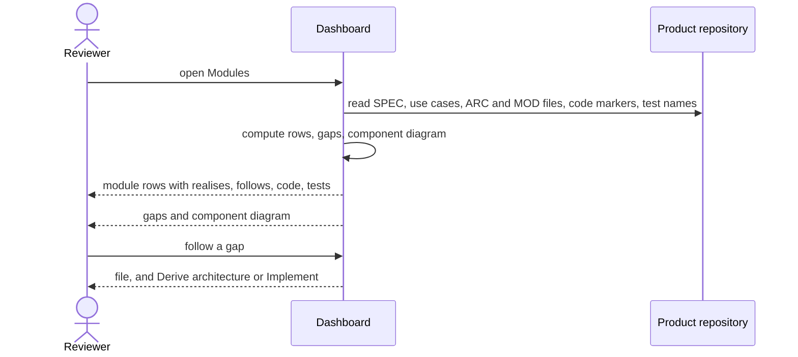

# UC-025 Validate modules against specification and tests

**Goal.** The reviewer sees, for every module, which requirements and use cases it realises, which
architecture decisions it follows, which code files belong to it and which tests guard it — and where
any of these links is missing. Everything is computed from the repository; nothing is stored.

This is the V-model's pairing (book ch. 6 §4) one level below UC-009: UC-009 pairs requirements with
use cases; this view pairs modules with the specification above them and the tests beside them.

## Actors

- **Reviewer** — anyone reading the dashboard.
- **Product repository** — holds the SPEC, use cases, architecture, code and tests.

## Precondition

- The product has at least one module under `docs/architecture/` (UC-022).

## Main flow

1. The reviewer opens **Modules** for the product.
2. Agent M reads from the default branch: the requirements in the SPEC, the use cases, the decisions
   and modules under `docs/architecture/`, the module marker of every code file, and the requirement
   and module names in every test.
3. Agent M computes one row per module:
   - **realises** — the requirements and use cases it names, each with its status (accepted, open,
     changed since acceptance, withdrawn);
   - **follows** — the decisions it names, with their status;
   - **code** — the files that name it;
   - **tests** — the tests that exercise it, and the requirements those tests guard.
4. Agent M lists the gaps, each with the artifact it concerns:
   - a module that realises no requirement or use case;
   - an accepted requirement that no module realises;
   - a module that no test exercises, or that has no code yet;
   - a code file that names no module, or a module that does not exist;
   - a test of a module that guards a requirement the module does not realise;
   - a name that matches no requirement, use case, decision or module.
5. Agent M draws the component diagram from the modules' declared interfaces as Mermaid: one box per
   module, one arrow per used interface; modules with a gap are marked.
6. The reviewer follows a row or a gap to the file it concerns. From a gap, the dashboard offers the
   next step: **Derive architecture** for a requirement without module (UC-022), **Implement** for a
   module without code or tests (UC-024).

## Alternative flows

- **2a. The product repository is private.** The dashboard reads it with the token stored in the
  reviewer's browser; without one that reaches it, it says so and shows nothing.
- **2b. The product has code from before Agent M, without module markers.** Every such file is listed
  as a gap; nothing blocks. Adding the markers is an implementation job (UC-024).
- **3a. A code file names two modules.** It is listed as a gap: a file belongs to one module.
- **4a. There are no gaps.** The list says so; the view does not hide.
- **4b. A module names a requirement that was withdrawn.** It appears among the gaps with the note that
  the name was withdrawn, not renamed.
- **5a. A module uses an interface that no module provides.** The diagram shows the arrow ending in a
  box marked *missing*.

## Postcondition

- Nothing is written; the module view and its diagram are computed each time, never stored.
- Every gap is shown, and none of them blocks a job.
