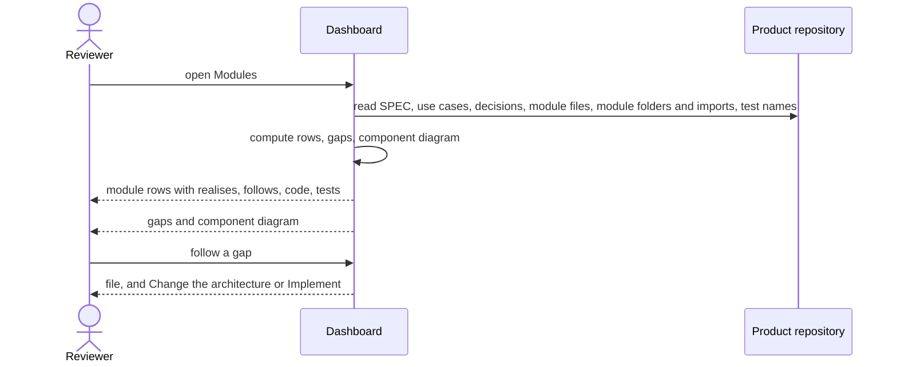

# UC-025 Validate modules against specification and tests

**Goal.** The reviewer sees, for every module, the subsystem it belongs to, which requirements its tests guard, which
code files belong to it and which tests exercise it — and where any of these links is missing. Everything is computed
from the repository; nothing is stored.
A run (UC-043) ends with this view for the modules it built.

This is the V-model's pairing (book ch. 6 §4) one level below UC-020: UC-020 pairs requirements with
use cases; this view pairs modules with the specification above them and the tests beside them.

## Actors

- **Reviewer** — anyone reading the dashboard.
- **Product repository** — holds the SPEC, use cases, architecture, code and tests.

## Precondition

- The product has an architecture with at least one module file (UC-022).

## Main flow

1. The reviewer opens **Modules** for the product.
2. Agent M reads from the default branch: the requirements in the SPEC, the use cases, the architecture under
   `docs/architecture/` — its decisions, the subsystems' among them, and the module files with the subsystem each
   belongs to and the interfaces of other modules each uses —, the files in every module's folder and the imports between
   them, and the requirement and module names in every test.
3. Agent M computes one row per module:
   - **belongs to** — its subsystem, by the decision that states it, with its status;
   - **realises** — the requirements its tests guard, each with its status (accepted, open, changed since acceptance,
     not in the SPEC);
   - **described by** — its file, with its status;
   - **code** — the files in its folder;
   - **tests** — the tests that exercise it.
4. Agent M lists the gaps, each with the artifact it concerns:
   - a module that belongs to no subsystem, or whose subsystem's decision does not name it;
   - a module that realises no requirement: no test of it guards one;
   - an accepted requirement that no module realises: no test of a module guards it;
   - a module that no test exercises, or that has no code yet;
   - a code file outside every module's folder, or a folder that no module file names;
   - an import between modules that the module's file does not name among the interfaces it uses;
   - a name that matches no requirement, use case, decision or module.
5. Agent M draws the component diagram from the modules' declared uses as Mermaid: one box per
   module inside the box of its subsystem, one arrow per used module; modules with a gap are marked.
6. The reviewer follows a row or a gap to the file it concerns. From a gap, the dashboard offers the
   next step: **Change the architecture** for a requirement without module (UC-023), **Implement** for a
   module without code or tests (UC-024).

```mermaid
sequenceDiagram
    actor R as Reviewer
    participant D as Dashboard
    participant G as Product repository
    R->>D: open Modules
    D->>G: read SPEC, use cases, decisions, module files, module folders and imports, test names
    D->>D: compute rows, gaps, component diagram
    D-->>R: module rows with realises, follows, code, tests
    D-->>R: gaps and component diagram
    R->>D: follow a gap
    D-->>R: file, and Change the architecture or Implement
```

## Alternative flows

- **2a. The product repository is private.** The dashboard reads it with the token stored in the
  reviewer's browser; without one that reaches it, it says so and shows nothing.
- **2b. The product has code from before Agent M, outside any module's folder.** Every such file is listed as a gap;
  nothing blocks. Moving it into module folders is an implementation job (UC-024).
- **3a. A module's folder lies inside another module's folder.** It is listed as a gap: a file belongs to one module.
- **4a. There are no gaps.** The list says so; the view does not hide.
- **4b. A test names a requirement the SPEC no longer has.** It appears among the gaps, named as not in the SPEC.
- **5a. A module uses an interface that no module provides.** The diagram shows the arrow ending in a
  box marked *missing*.

## Postcondition

- Nothing is written; the module view and its diagram are computed each time, never stored.
- Every gap is shown, and none of them blocks a job.
