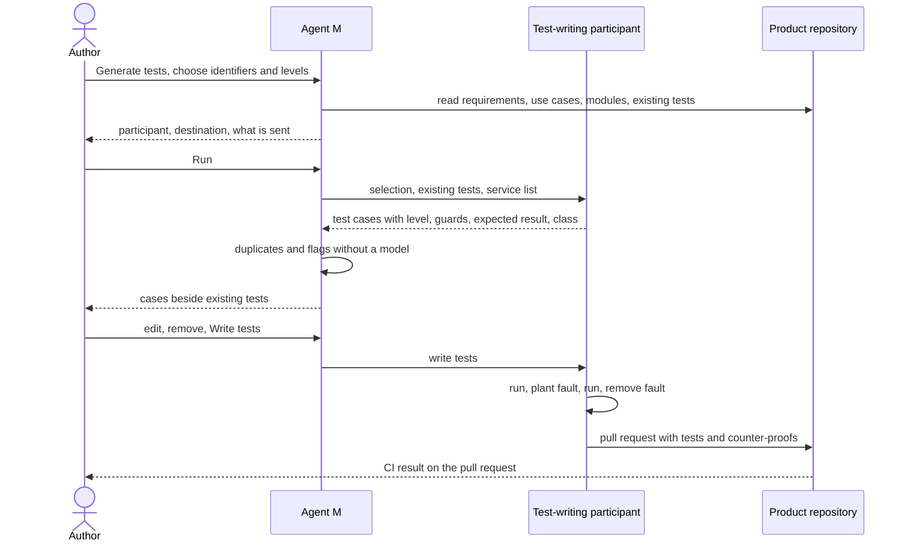

# UC-026 Generate a multi-level test battery

**Goal.** For accepted requirements, use cases and modules of a product, Agent M produces tests at
the level that fits each of them — unit, component, system, release, user — each with its expected
result written down before it runs, each shown to fail on a planted fault, and none duplicating a
test the product already has.

Which level checks what follows the book (ch. 13 §4, §6, §7):

| Level | Checks | Derived from | Typical form |
|---|---|---|---|
| **unit** | one function, class or small module in isolation | a module (`MOD-`) | automated, external services mocked |
| **component** | the interface between units that work together | an architecture element (`ARC-`) and its modules | automated, misuse, misunderstanding and timing cases |
| **system** | the integrated product along a use case | a use case (`UC-`) | automated, end to end |
| **release** | a release candidate against the specification | a requirement (by its name) | automated or manual, written by someone other than the implementer |
| **user** | the product in real use: alpha, beta, acceptance | a requirement or acceptance criterion | manual, outcome entered by a person |

Test-driven development (ch. 13 §5) is the way the implementing job uses these tests, not a level of
its own.

## Actors

- **Author** — chooses what to cover and decides on the proposed test cases.
- **Test-writing participant** — a CI agent, CLI agent or sandboxed agent (UC-017) that drafts the
  test cases, writes the test code and runs it; it needs *read the repository*, *write to the
  repository* and *run code and tests*.
- **Product repository** — on GitHub or a GitLab server; receives the pull request.

## Precondition

- The product has accepted requirements and, for system tests, accepted use cases (UC-006, UC-008).
- The product declares a process model with a role for writing tests, assigned to at least one
  participant with the three capabilities above (UC-002).

## Main flow

1. The author opens **Tests** for the product and chooses **Generate tests**. Agent M lists the
   accepted requirements, use cases and modules, each with the levels at which tests already guard
   it; uncovered combinations are preselected.
2. The author narrows the selection — for example *UC-005, system and release* — and confirms the
   levels. A folded **What is this?** explains each level with the table above and names the book
   chapter.
3. Agent M collects the input for the job: the text of each selected requirement, use case and
   module; **every existing test that guards any of them**, with its description and code; and the
   product's list of external services, marked paid or free. It checks that all of it fits into the
   participant's context.
4. Agent M offers the participants that fill the test-writing role. For the *release* level it
   leaves out the participant recorded as implementer of the behaviour under test, and says so. The
   run panel names the participant, where it processes data, and what is sent; the author presses
   **Run** — one click.
5. The participant returns proposed test cases. Each one carries a `TST-` identifier, its level,
   the identifiers it guards, its precondition, its input and its **expected result**, and a class:
   - **new** — nothing existing covers this case;
   - **extends** a named existing test — for example a boundary value it lacks;
   - **duplicate** of a named existing test.

   A case whose result depends on a model's answer is marked *model-dependent*: it carries several
   phrasings of the same question and the number of runs, fixed now (`SOFTWARE_MAINTENANCE.md`
   §4.0a rules 2 and 4). A case that would call a paid service carries the recorded or constructed
   response it uses instead, and is marked for the nightly run if it also needs the real call.
6. Agent M checks the proposal without a model: a case with the same guarded identifier, input and
   expected result as an existing test is a duplicate, whatever the participant said; flagged are
   cases without an expected result, model-dependent cases judged on a single run, commit-level
   cases that reach a paid service, and cases that guard nothing.
7. The review panel shows the cases grouped by level and by what they guard, each beside the
   existing tests of the same identifier. The author reads the expected results — the book's point
   that a person checks the assertions reflect the requirement, not the code (ch. 13 §4) — and
   removes, edits or reclassifies cases.
8. The author presses **Write tests** — one click. The participant, on a new branch:
   1. writes the test code, each test naming its `TST-` identifier, level, guarded identifiers and
      expected result where they can be read without running it;
   2. runs each new test on the current code and records the outcome;
   3. for each new test, plants a fault in the code it guards, runs the test, records that it
      failed, and removes the fault — the **counter-proof**;
   4. opens a pull request containing the tests and the counter-proof records, naming the Agent M
      version, the participant, the model and the date.
9. CI runs on the pull request (UC-027); once the product's Definition of Done holds (UC-002,
   step 8), the pull request is merged — by the author or by the agent.

## Alternative flows

- **3a. The existing tests do not fit into the participant's context.** Nothing is sent. Agent M
  names how many tests guard the selection and offers a smaller selection or a participant with a
  larger context; it never leaves tests out silently.
- **4a. The only participant that fills the role is the implementer, and release tests are
  selected.** Agent M says that release tests need a different participant, and links to UC-017 and
  UC-002; the other levels can still be generated.
- **6a. Every proposed case is a duplicate.** The panel says so; nothing is written.
- **8a. A new test fails on the current code because the behaviour is not implemented yet.** This is
  the red step of test-driven development. The test stays on its branch, marked *awaiting
  implementation*; the counter-proof is taken after the implementing job has turned it green. The
  pull request is merged only when CI is green.
- **8b. A test stays green with the planted fault.** It checks nothing. The participant reports it,
  it is not written, and the review panel shows it again for the author to sharpen or drop.
- **5a. A case would need a real call to a paid service to decide its outcome.** It is proposed for
  the nightly or release run only, never for every commit (UC-027).
- **1a. The level is `user`.** The cases are written as manual test instructions with expected
  results; a person carries them out and enters the outcome (UC-028). No code is written and no
  counter-proof is taken; the panel says why.

## Postcondition

- Every new test has a `TST-` identifier, one level, the identifiers it guards and an expected
  result readable without running it.
- Every new automated test has a recorded counter-proof, or is marked as awaiting implementation.
- No new test duplicates an existing one; extensions name the test they extend.
- The tests reach the default branch only through a pull request with green CI.
