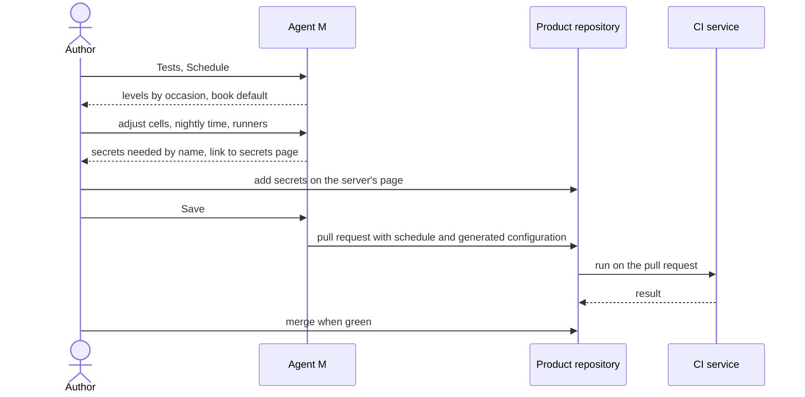

# UC-027 Configure continuous integration

**Goal.** The author decides, per product, which test levels run on which occasion, and Agent M
turns that decision into the CI configuration of the product's own server — a GitHub Actions
workflow or a GitLab CI pipeline — so that every commit is checked the way the book describes
(ch. 12 §5) and a release candidate is checked completely.

## Actors

- **Author** — decides the schedule and merges the configuration.
- **Product repository** — on GitHub or a GitLab server; holds the schedule and the CI configuration.
- **CI service** — GitHub Actions or GitLab CI, on hosted runners or on a self-hosted runner on a
  machine where a CLI or sandboxed agent runs (UC-017).

## Precondition

- The product is managed by Agent M (UC-001) and the author's token for it is stored in this browser.
- The product has tests with declared levels (UC-026), or the author sets up CI before the first
  test.

## Main flow

1. The author opens **Tests → Schedule**. Agent M shows a table: one row per level (*unit,
   component, system, release, user*), one column per occasion (*every commit*, *pull request*,
   *nightly*, *release candidate*, *on demand*). Without a saved schedule, the table shows the
   book's default, marked as such:

   | Level | every commit | pull request | nightly | release candidate | on demand |
   |---|:-:|:-:|:-:|:-:|:-:|
   | unit | ✓ | ✓ | ✓ | ✓ | ✓ |
   | component | ✓ | ✓ | ✓ | ✓ | ✓ |
   | system (with recorded responses) | ✓ | ✓ | ✓ | ✓ | ✓ |
   | tests that call a paid service or a model | | | ✓ | ✓ | ✓ |
   | release | | | | ✓ | ✓ |
   | user (manual) | | | | ✓ | ✓ |

   Each row names how many tests it holds; a folded **What is this?** per row and column explains
   the level or occasion and names the book chapter (ch. 12 §5 for every commit, ch. 13 §4 for
   mocking and the nightly integration test, ch. 13 §6 for release testing).
2. The author changes cells — for example runs system tests nightly only, because they take twenty
   minutes. The *release candidate* column stays ticked for every row and cannot be cleared; its
   explanation says why. The cells *every commit* and *pull request* cannot be ticked for tests that
   call a paid service; the explanation says why and points to recorded responses.
3. The author sets the time of the nightly run and, per row, where it runs: a hosted runner of the
   server, or a self-hosted runner on a machine of a CLI or sandboxed agent participant. Agent M
   offers only participants with *run code and tests*.
4. Agent M lists the secrets the scheduled tests need — for example the model endpoint key of the
   nightly rate tests — by name only, with a button that opens the server's secrets page for the
   product, and a folded explanation of how to add one there. It never asks for a secret's value.
5. The author presses **Save** — one click. Agent M generates the CI configuration from the schedule
   — `.github/workflows/agent-m-tests.yml` on GitHub, `.gitlab-ci.yml` on GitLab — and opens one
   pull request that contains the schedule file and the generated configuration together, so the
   two never disagree on the default branch.
6. CI runs on that pull request with the new configuration. The dashboard shows the pull request
   and its CI outcome; once green, the author merges it with one click.
7. From then on, every run the configuration starts leaves a result record (UC-028); the schedule
   page shows the last run per occasion. A commit that only records a job (`docs/jobs/`) starts no
   run.

## Alternative flows

- **1a. The product already has a CI configuration Agent M did not generate.** Agent M shows which
  of its triggers run which tests, as far as it can tell, and adds its own file beside it; the pull
  request says so. Removing the old configuration is the author's decision in that pull request.
- **1b. The generated configuration was edited by hand after merging.** The schedule page shows that
  the configuration no longer matches the schedule and what differs; *Save* offers to regenerate it.
- **3a. The product is on a GitLab server.** The nightly run is a pipeline schedule of the project,
  not a line in `.gitlab-ci.yml`. After the merge, Agent M creates or updates it with the project's
  token and shows it; the schedule page links to the project's *Build → Pipeline schedules*.
- **3b. A self-hosted runner is chosen but not registered.** Agent M shows the runner registration
  page of the server and the command to run on that machine, with a folded explanation; runs for
  that row wait until a runner is online, and the dashboard shows them as queued.
- **4a. A named secret is missing when a run starts.** The run fails with a message naming the
  secret; its result record says *not run: secret missing*, not *failed*.
- **6a. CI on the configuration pull request is red.** It is not merged. The dashboard shows the
  failing tests (UC-028); the author fixes the tests or the schedule first.
- **7a. The nightly run has not run.** The schedule page shows the date of the last nightly run
  beside the expected one. On GitHub, scheduled workflows of a public repository are disabled after a
  period without activity; the page names that possibility and links to the workflow's page.

## Postcondition

- The product's repository holds the schedule and a CI configuration generated from it.
- Every commit and pull request runs the levels ticked for them, without calls to paid services.
- A release candidate runs every test at every level.
- No secret value is in the repository or in Agent M; the needed secrets are named.
