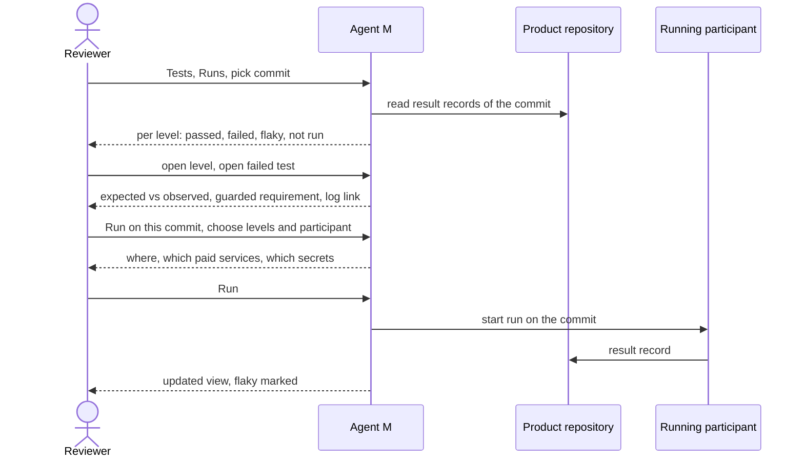

# UC-028 Run and review the tests of a commit

**Goal.** The reviewer picks one commit — on the default branch, in a pull request, or a release
candidate — and sees what the tests say about exactly that commit: per level and per test, failed
apart from flaky, model-dependent tests as rates, each test linked to what it guards. What has not
run yet can be run from the same page.

## Actors

- **Reviewer** — a person who reads results and decides whether to run more; for a release, the
  person who accepts the release test report.
- **Running participant** — the CI service of the product, or a CLI or sandboxed agent with *run code
  and tests* (UC-017).
- **Product repository** — on GitHub or a GitLab server; holds the commit and, for releases, the
  report.

## Precondition

- The product has tests with declared levels (UC-026) and a CI configuration (UC-027).

## Main flow

1. The reviewer opens **Tests → Runs** and picks a commit: from the default branch's history, from an
   open pull request, or a release tag. The commit is shown by its SHA, message and date.
2. Agent M reads every result record of that commit and shows one line per level: tests passed,
   failed, flaky, not run. A level that has no record for this commit reads **not run on this
   commit**, with the occasion that would run it (UC-027) — never *passed*.
3. The reviewer opens a level. Each test shows its `TST-` identifier, its outcome, the requirement,
   use case or module it guards as a link, and the participant and date of the run. Model-dependent
   tests show a rate — for example *17 of 20 runs (last release: 18 of 20)* — with the number of runs
   that was fixed in advance.
4. The reviewer opens a failed test: its expected result beside the observed one, the log excerpt,
   and a link to the full run on the server.
5. The reviewer presses **Run on this commit** to fill a gap. Agent M presets the levels that have no
   record, and offers the participants that can run them. The panel states where the run happens,
   which paid services it will call and which secrets it uses by name. The reviewer presses **Run** —
   one click.
6. Agent M starts the run on that commit — a workflow run on GitHub, a pipeline on GitLab, or a job
   through the local bridge — and shows its progress.
7. The run's result record arrives; the view updates. A deterministic test that now has a passing
   and a failing outcome on this commit is shown as **flaky**, not as passed, with both runs linked;
   its explanation says that a flaky test is repaired or removed, not retried until green.

## Alternative flows

- **1a. The commit is a release candidate** (started from UC-013). Agent M runs **every test at every
  level** on it, whatever the schedule's other columns say; model-dependent tests run their fixed
  number of times. User-level tests appear as a checklist for the people assigned to them, who enter
  each outcome. No tag is set while any test has not run.
- **1b. The release candidate's complete run has finished.** Agent M writes the release test report —
  every test, its level, its outcome or rate, the guarded identifiers, the commit — to
  `docs/tests/releases/v<version>.md`, and shows it to the reviewer with **Accept**. Accepting commits
  an approval record naming the report's blob SHA (UC-008 mechanics) and lets UC-013 set the tag. If
  tests failed or a rate is worse than the last release's, the report says so first; how the release
  continues then is an open question for the PO.
- **2a. The CI server no longer keeps the results of this commit.** Agent M says so and offers *Run on
  this commit*; a new run is a new record, not a replacement of the lost one.
- **2b. The records cannot be read from the browser** — for example a private repository without a
  stored token, or results the server does not hand to other origins. Agent M says which, and links
  to the run on the server.
- **5a. No participant can run the chosen levels.** Agent M names the missing capability and links
  to UC-017.
- **5b. The run is started without a token** — Agent M opens the workflow's page on GitHub with the
  commit named, and the reviewer starts it there.
- **6a. A run through the local bridge has uncommitted changes in its working tree.** Its record is
  marked *uncommitted changes*: it is shown, but does not count as a result of this commit.
- **7a. A model-dependent test's rate is lower than the last release's.** It is shown as *worse than
  the last release*, with both rates; there is no pass or fail on a single run.

## Postcondition

- Every run started here left a result record naming the commit, the levels, the participant, the
  date and each test's outcome.
- The reviewer has seen, for this commit, which tests passed, failed, flipped or have not run.
- For a release candidate, every test at every level has run, and the release test report is in the
  product repository, open or accepted.
