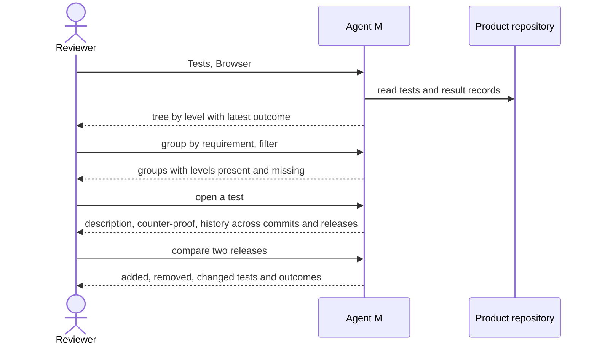

# UC-029 Browse the tests of a product

**Goal.** The reviewer finds any test of a product, sees what it guards and what it expects, and
follows its results across commits and releases — or starts from a requirement and sees which levels
guard it. Nothing on this page is stored; it is computed from the repository and the result records.

## Actors

- **Reviewer** — anyone who can read the product: author, colleague, auditor.

## Precondition

- The product has tests (UC-026). Result records exist once CI has run (UC-027, UC-028).

## Main flow

1. The reviewer opens **Tests → Browser**. Agent M shows a tree grouped by **level**, then by test
   file, then by test case; each test shows its `TST-` identifier, a one-line title and its outcome on
   the latest commit of the default branch.
2. The reviewer switches the grouping to **by requirement**, **by use case** or **by module**. Each
   group shows which levels guard it; a missing level is shown as empty, not hidden — for example a
   requirement with unit tests and no release test.
3. The reviewer filters: failed, flaky, not run, model-dependent, calls a paid service, without
   counter-proof, guards nothing.
4. The reviewer opens a test. Agent M shows its description as the test declares it — level,
   guarded identifiers, precondition, input, expected result —, when the schedule runs it, the
   participant that wrote it, its counter-proof record, and a link to its code.
5. Below, the test's **history**: one mark per commit of the default branch where it ran, and one row
   per release tag. A flaky commit is marked as such. A model-dependent test shows its rate per
   release as a line, with the number of runs behind each point.
6. The reviewer picks two releases to **compare**: tests added, removed, changed in what they guard or
   expect, and changed in outcome.

## Alternative flows

- **1a. A test declares no `TST-` identifier, no level or no guarded identifier.** It is listed under
  **Incomplete**, with what is missing; the page still works for all others.
- **2a. A test guards an identifier that does not exist, or was withdrawn.** The link is shown as
  broken, with the identifier; the test is not moved to another group.
- **5a. A test was removed.** It stays in the history of the commits where it existed, marked as
  removed at the commit that removed it; its identifier is not given to another test.
- **5b. The CI server no longer keeps the logs of older runs.** The outcomes stay in the history —
  they are read from the result records on the branch `test-results` (UC-028) — and only the link to
  the full log is marked *no longer available*.
- **1b. The product repository is private and no token reaching it is stored.** The page says so and
  shows nothing.

## Postcondition

- Nothing was written; the reviewer knows for any test what it guards, what it expects and how its
  results developed, and for any requirement which levels guard it.
