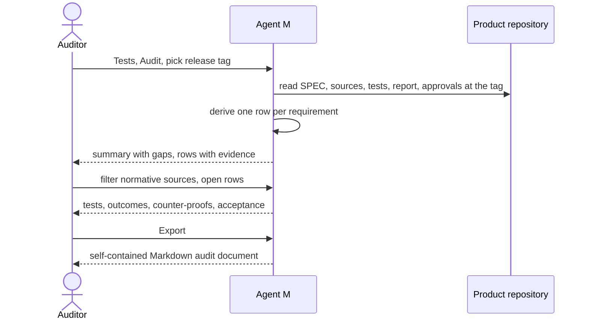

# UC-030 Audit the tests of a release

**Goal.** For one release, the auditor sees for every requirement valid at that release the evidence
that it was verified — which tests guard it, what they showed on the release commit, and who
accepted that result — with the gaps in plain sight, and takes it away as one self-contained
Markdown document. The book's reason: in certified and safety-critical software "regulators may
demand evidence that each requirement was verified" (ch. 13 §6).

## Actors

- **Auditor** — reads the evidence; needs no write access. May be external, for example for an
  IEC 62304 assessment.
- **Release approver** — the person who accepts the release test report (UC-028, 1b).
- **Product repository** — on GitHub or a GitLab server; holds the SPEC at the release tag, the tests,
  the release test report and the approval records.

## Precondition

- The release is tagged (UC-013) after its complete run (UC-028, 1a), and its release test report is
  in the product repository.

## Main flow

1. The auditor opens **Tests → Audit** and picks a release tag.
2. Agent M reads, at the tag's commit, the SPEC, the linked sources with their versions and hashes,
   the tests, the release test report and the approval records, and derives one row per requirement
   valid at that release:
   - the requirement's name, what it constrains (product or process), and its sources with their
     authority and version — for example `IEC 62304:2006+AMD1:2015`, class B;
   - the tests guarding it, by level, each with its outcome or rate on the release commit and its
     counter-proof;
   - for a process requirement, also the gate records and artifacts it added to the workflow (UC-002,
     step 7);
   - the acceptance of the release test report: who, when, and the blob SHA of the accepted text.
3. At the top, Agent M summarises: requirements with passing evidence, requirements without a test,
   with a test that did not pass, with a flaky test, with a rate worse than the previous release,
   and release tests written by the implementer. Each number opens the rows it counts.
4. The auditor filters — only normative sources, one source, one level, only gaps — and opens a row
   to follow the links to the test, its run on the server, and the approval commit.
5. The auditor presses **Export** — one click. Agent M produces one Markdown document with the summary
   and every row, naming the tag, the commit SHA, the source versions with their hashes, and the
   blob SHAs of report and approvals, so that anyone with the repository can check each statement
   without Agent M. The browser saves it; printing it gives a PDF.

## Alternative flows

- **2a. The release test report has not been accepted.** Every row shows *evidence not accepted*,
  and the summary says so first. If the viewer is a person who may accept, Agent M offers the report
  with **Accept** (UC-028, 1b).
- **2b. The release was accepted with known limitations.** The limitations stand at the top of the
  summary, each linked to the rows it concerns, with the reason recorded in the approval.
- **2c. A requirement has no test at any level.** Its row says *no test*; it is counted, not hidden.
- **2d. The CI server no longer keeps the logs cited by the report.** The result records on the
  branch `test-results` still hold each outcome; only the link to the server's log is marked
  unavailable.
- **1a. The release predates Agent M's test records.** Agent M says which parts cannot be derived
  for this tag and shows the rest.
- **5a. The auditor wants the export in the repository.** A person with write access presses **Commit
  export**; Agent M commits the document to `docs/audits/<tag>.md`.

## Postcondition

- The auditor holds, for one release, the evidence per requirement and every gap, as one Markdown
  document that can be checked against the repository without Agent M.
- Nothing was written, unless the export was committed on a person's click.
