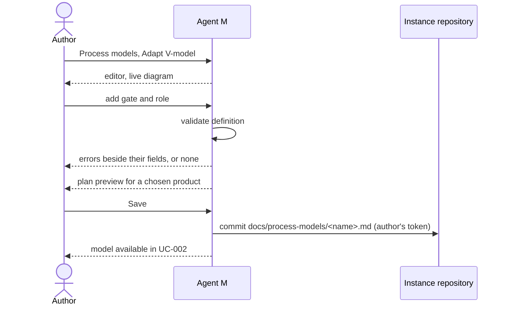

# UC-031 Configure a process model

**Goal.** The author creates a process model, or adapts one from the catalogue, as a data file. They
set its phases, gates and roles, and whether it works from a plan or a backlog. Agent M validates the
definition before any product can use it (UC-002).

What a definition contains:

| Part | Content | Example (V-model, book ch. 6 §4) |
|---|---|---|
| **Kind of work** | *planned*: the whole accepted SPEC runs through every phase; or *pulled*: items are pulled from a backlog | planned |
| **Phases** | name, the role that does the phase, the artifacts it produces (`REQ-` `UC-` `ARC-` `MOD-` `TST-`) | Concept, Requirements, Design, Implementation, Testing, Validation & Verification, Operation & Maintenance |
| **Transitions** | which phase follows which: in sequence, as alternatives, or back to an earlier phase | Concept → Requirements → Design → Implementation → Testing → Validation & Verification → Operation & Maintenance |
| **Verification pairs** | which later phase checks which earlier one | Concept ↔ Operation & Maintenance; Requirements ↔ Validation & Verification; Design ↔ Testing |
| **Gates** | between which phases; which artifacts must exist; which condition must hold | before Implementation: every `REQ-` has an `ARC-`, and the design is accepted |
| **Roles** | name; person, agent or either; capabilities needed | Tester: agent or person; *read the repository*, *run code and tests* |
| **Flow control** (pulled only) | a time box with its length, or a work-in-progress limit | Scrum: sprint of 2 weeks; Kanban: WIP 3 |
| **Progress measure** | plan entries per phase, remaining items per time box, or items per state over time | plan entries per phase |

The transitions carry the shapes of the other catalogue models (book ch. 6, ch. 7): waterfall is a
single sequence of five phases; the reuse-oriented model runs discovery and evaluation side by side,
returns from requirements refinement to the specification, and then chooses between *configure*,
*adapt* and *develop* before integration; in Kanban, the phases are the board's columns — Backlog,
Doing, Review, Done.

## Actors

- **Author**: runs the instance and designs how its products are developed.
- **GitHub**: holds the instance repository, where the author's definitions are committed.

## Precondition

- The author has an instance with its token stored in this browser (UC-014).

## Main flow

1. The author opens **How products are developed → Process models**. Agent M lists the shipped
   catalogue (waterfall, V-model, reuse-oriented, Scrum, Kanban) and the instance's own definitions.
   For each model it shows the kind of work and the products that use it.
2. The author chooses **Adapt** on the V-model. Agent M opens an editor on a copy with a new name, for
   example *V-model with security review*. The editor has one form section per part of the table
   above, and next to it a live Mermaid diagram of the phases, pairs and gates.
3. The author edits the model. In this example they add a gate *Security review* between
   Implementation and Testing. The gate checks that a person has accepted the threat model `ARC-`
   artifact. The gate is filled by the role *Security reviewer*: a person, with *read the
   repository*.
4. While the author types, Agent M validates the definition and lists each error beside the field
   that causes it, for example:
   - a transition naming a phase that is not defined, or a phase no transition reaches;
   - a verification pair naming a missing phase;
   - a gate without artifacts or without a condition;
   - a role without capabilities, or a phase without a role;
   - a gate that checks an artifact kind no earlier phase produces;
   - for *pulled* work, neither a time box nor a WIP limit, or both;
   - a progress measure that does not fit the kind of work.
5. For a *planned* model, Agent M shows a preview of the plan the definition would produce for a
   product the author picks. Every accepted requirement of that product appears once in every phase.
   The preview shows the count: for example *42 requirements × 7 phases = 294 plan entries*.
6. When the list of errors is empty, **Save** becomes available. The author presses it: one click.
   Agent M commits the definition as a Markdown data file under `docs/process-models/` of the
   instance. The file records the definition it was adapted from.
7. The model now appears in UC-002's catalogue for every product of the instance.

Every part carries a folded **What is this?**. It explains, for someone new to software processes,
what a phase, a verification pair and a gate are, with a pointer to book ch. 6 (plan-driven) or ch. 7
(Scrum, Kanban).

## Alternative flows

- **2a. The author starts from nothing.** They choose **+ New model**, and the editor opens empty.
  The author first picks the kind of work (*planned* or *pulled*), and Agent M adapts the form to it.
- **2b. The author wants to change a shipped model itself.** Shipped models cannot be edited in an
  instance. Agent M offers **Adapt** instead and explains that the shipped catalogue follows the book
  (`AGENT M CARRIES THE BOOK'S CATALOGUE`).
- **4a. The definition stays invalid.** **Save** stays unavailable, and the errors are named. The
  author can discard the draft, or keep it in this browser to finish later. An invalid definition is
  never committed.
- **5a. The chosen product has no accepted requirements yet.** The preview says so, and shows the
  plan's structure as empty phases.
- **6a. The adapted model is already used by products.** Agent M lists them. Each product keeps the
  version of the definition it declared, until its author opens UC-002 and saves the product's
  declaration again. There, Agent M shows what the new version changes for the product: phases,
  gates, roles, and assignments that become invalid.
- **6b. The file was changed in the repository since the editor opened it.** Nothing is written.
  Agent M shows both versions and asks the author to decide.

## Postcondition

- The instance holds a valid process model definition as data. Agent M's code is unchanged
  (`THE CATALOGUE IS DATA`).
- Products can choose the model in UC-002. For a *planned* model, their plan covers every accepted
  requirement in every phase (UC-035). For a *pulled* model, their work comes from a backlog
  (UC-032).
