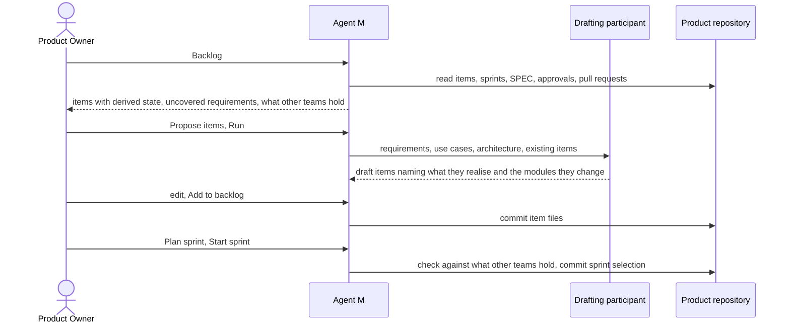

# UC-032 Maintain the backlog

**Goal.** In a product whose model pulls its work from a backlog (Scrum, Kanban), whoever plans the
work — a person or an agent — fills a backlog before it is implemented (UC-024, UC-034).
Its items come from accepted requirements and use cases, and from issues (UC-033); each names the modules of
the accepted architecture that its implementation changes, since agile work, too, needs to know "where the
system runs, which interfaces exist" (book ch. 7). They choose what is worked on next: a sprint selection in
Scrum, a pull under the work-in-progress limit in Kanban (book ch. 7 §4–5). In a model that plans its work in
advance, the implementation plan takes the backlog's place (UC-045).

Filled from the architecture, the backlog builds the system bottom-up, as the implementation plan does: first the
items that implement modules, then the items that integrate a subsystem, then the items for the system as a whole.
An item **builds on** the items that implement the interfaces its modules use; an item that integrates a subsystem
builds on the items of that subsystem's modules; an item for the system builds on the subsystems' integration. The
backlog keeps no order of its own: what comes first follows from what the items build on, and what is worth doing next is
decided where the work is taken on — in a team's sprint planning, or when a team pulls an item.

Several teams can work from one backlog at the same time (UC-002). Each plans sprints of its own and sees, when it
plans, what the other teams' sprints hold: no item is in two sprints, and no team changes a module that another team's
sprint changes or uses, or uses one that it changes — so the teams' work does not collide.

## Actors

- **Product Owner**: the person or agent the product assigned to the role that fills the backlog and selects
  from it (UC-002), as the model's role allows. In Scrum, this is the Product Owner role; in a product with several
  teams, each team's Product Owner fills the one backlog and plans the sprints of their own team.
- **Drafting participant**: a model endpoint or agent (UC-017) that can *draft text*; optionally drafts
  items from accepted requirements and use cases.
- **GitHub**: holds the product repository (or the product's GitLab server).

## Precondition

- The product declares a model that pulls its work from a backlog, with a holder of the ordering
  role (UC-002).
- The product has accepted requirements or use cases (UC-006, UC-008).
- The architecture is accepted (UC-022, UC-023).

## Main flow

1. The Product Owner opens **Backlog** for the product. Agent M shows the items, each after the items it builds on.
   Each item has its identifier, title, what it realises, where it came from, and a derived state:
   - *waiting for acceptance*: it names a requirement that is not yet accepted;
   - *waiting for an item it builds on*: an item it builds on is not done;
   - *ready*;
   - *in progress*: a job is running, or a pull request is open;
   - *blocked*: a job failed or waits for a person;
   - *done*.
   An item that another team's sprint holds (step 5) names that sprint and its team.
   The top of the page shows accepted requirements and use cases that no item realises yet.
2. The Product Owner chooses **Propose items for uncovered requirements**. The run panel names the
   participant and what is sent: the requirements, the use cases, the architecture and the existing items.
   The Product Owner presses **Run**.
3. The participant drafts items bottom-up: items that implement modules, a module's after those of the
   modules whose interfaces it uses; then one item per subsystem that integrates its modules; then the
   items for the system. Each item has a title, a description of the outcome, the requirements and use
   cases it realises, the modules of the architecture its implementation changes — for an integration,
   the subsystem's modules —, and the items it builds on. Its acceptance criteria name the tests of its
   level — unit tests for a module, component tests for a subsystem, system and release tests for the
   system — and, where the item was drafted from a use case, that use case's postcondition. Agent M
   rejects a draft that realises nothing, names no module the architecture describes, or builds on an
   item that does not exist or that builds on it in turn, and flags a draft that restates an existing item.
4. The Product Owner edits or discards drafts and presses **Add to backlog**: one click. Agent M
   commits one Markdown file per item under `docs/backlog/`, for example
   `docs/backlog/ITM-014-export-thesis-as-pdf.md`.
5. **What the other teams hold.** In a product with several teams (UC-002), Agent M lists beside the backlog every
   item that another team's sprint holds — from its selection until its change is merged into the default branch or it
   returns to the backlog —, each with its sprint, its team, the modules it changes and the modules whose interfaces
   they use. It marks every item that cannot be selected because of one of them, naming the sprint, the held item and
   the module: an item another team's sprint holds; an item that changes a module that a held item changes or uses; an
   item whose modules use a module that a held item changes. With one team, there is nothing to list.
6. **A model with sprints (Scrum):** the Product Owner chooses **Plan sprint** for their team. Agent M shows the
   ready items, each after the items it builds on, with the marks of step 5. Items that are *waiting for acceptance* or
   marked are shown but cannot be selected; an item is selected only together with, or after, the items it builds on,
   and its job starts once they are done (UC-034). The
   Product Owner sets the sprint goal, the start date and — where the model has a time box — the end
   date its length gives, the selection, and who closes the
   sprint — themselves by default, or a participant such as an agent (UC-041) —, and presses
   **Start sprint**: one click. Agent M checks the selection once more against what the other teams' sprints hold
   in the default branch at that moment, and commits the sprint to `docs/backlog/sprints/` — in a product with several
   teams as `docs/backlog/sprints/<team>/<nn>.md`, numbered within the team, on the branch `sprint/<team>/<nn>` where
   sprints have a branch of their own (UC-002). From now on, the team's implementation jobs start only for the items
   selected for its sprint (UC-034), and the sprint holds them.
7. **A model with a WIP limit (Kanban):** the board shows the columns of the model, for example Backlog,
   Doing, Review, Done (book ch. 7 §4). A ready item — the one the team chooses — can be pulled only while fewer items are
   in progress than the WIP limit allows. Items in *Review* count as in progress. Without sprints there is
   no selection; in a model with sprints and a WIP limit, both hold — only selected items are pulled, and
   only below the limit.

Every step carries a folded **What is this?**: what a backlog is for, why an item comes after the items it builds on,
what a sprint, a WIP limit or a held item is, and a pointer to book ch. 7.

```mermaid
sequenceDiagram
    actor O as Product Owner
    participant M as Agent M
    participant E as Drafting participant
    participant G as Product repository
    O->>M: Backlog
    M->>G: read items, sprints, SPEC, approvals, pull requests
    M-->>O: items with derived state, uncovered requirements, what other teams hold
    O->>M: Propose items, Run
    M->>E: requirements, use cases, architecture, existing items
    E-->>M: draft items naming what they realise and the modules they change
    O->>M: edit, Add to backlog
    M->>G: commit item files
    O->>M: Plan sprint, Start sprint
    M->>G: check against what other teams hold, commit sprint selection
```

## Alternative flows

- **2a. The Product Owner writes an item by hand.** They choose **+ Item**, fill in the title, the
  outcome, what it realises, the modules it changes and the items it builds on, and press **Add**. The item is committed as their
  own input.
- **3b. An item needs a module the architecture does not have.** The draft names the gap instead of
  inventing a module; the item waits until the architecture is changed (UC-023).
- **3a. A requirement is too large for one item.** The participant proposes several items that each
  realise it. The requirement counts as covered only when all of them are done.
- **6a. An item is added during a running sprint.** It goes to the product backlog, not into the
  sprint. Changing the sprint selection is a new **Start sprint** decision, and Agent M shows what
  it removes or adds (`SOFTWARE_MAINTENANCE.md`: sprint scope is fixed at planning). An item it adds is checked
  against what the other teams' sprints hold, as in step 6.
- **6c. Another team started a sprint in the meantime.** The selection now collides with what that sprint holds.
  **Start sprint** is refused and names the sprint, the held item and the module; the marks of step 5 are shown anew,
  and the Product Owner changes the selection. Whichever sprint is committed first holds its items.
- **6d. Items of another team's sprint are no longer held** — its increment is merged into the default branch, or an
  item returns to the backlog. The marks they caused disappear; a running sprint may take the items they kept out by a
  new **Start sprint** decision (6a).
- **6b. The sprint ends** — at the end of its time box or, in a sprint without one, when every selected
  item is done or the Product Owner presses **End sprint**, one click, which records the end with the
  sprint. The sprint is closed with the review of its increment and the
  retrospective (UC-041); there the Product Owner also decides, for each unfinished item, whether it
  goes back to the backlog or into the next sprint.
- **7a. The WIP limit is reached.** **Pull** is disabled for the next item, and the panel names the
  items in progress and which of them wait for review. Book ch. 7 §4: with agents, the limit guards
  review capacity, not headcount.
- **1a. A requirement an item realises is withdrawn or changed.** The item is marked. Agent M
  offers to point it at the replacing requirement, or to remove it. Nothing changes until the
  Product Owner decides.
- **1b. The product's model works from a plan.** There is no backlog. Agent M links to the
  implementation plan (UC-045).
- **1c. The Product Owner is an agent.** It does steps 1–6 through its own runtime instead of the
  dashboard — reads the backlog and what the other teams' sprints hold, writes or adds items, plans, starts and ends
  a sprint —,
  and commits each under its name. What the role does not decide — a SPEC change, the acceptance of a use case, a
  change to the process — it proposes to a person; a requirement it finds missing becomes a change request
  (UC-012).

## Postcondition

- The product repository holds its backlog as one Markdown file per item and, in Scrum, the sprint
  selections — per team in a product with several teams. No state is stored in them. State is derived from approvals, jobs
  and pull requests.
- Every item names what it realises, the modules it changes and where it came from.
- The system is built bottom-up: no item is selected or pulled before an item it builds on, other than together
  with it.
- No item is held by two sprints, and no team's sprint changes a module that another team's sprint changes or uses, or
  uses a module that one changes.
