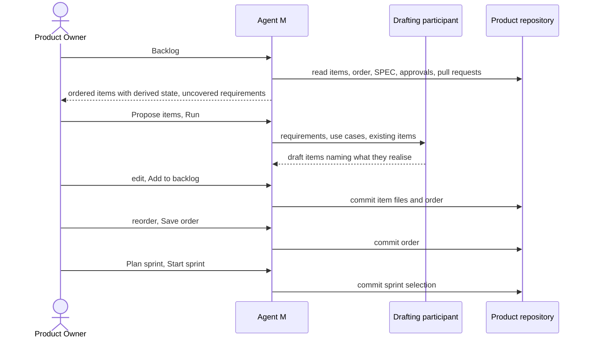

# UC-032 Maintain the backlog

**Goal.** In a product whose model pulls its work from a backlog (Scrum, Kanban), whoever orders the
work — a person or an agent — keeps an ordered backlog. Its items come from accepted requirements and
use cases, and from issues (UC-033). They choose what is worked on next: a sprint selection in Scrum, a pull
under the work-in-progress limit in Kanban (book ch. 7 §4–5).

## Actors

- **Product Owner**: the person or agent the product assigned to the role that orders the backlog
  (UC-002), as the model's role allows. In Scrum, this is the Product Owner role.
- **Drafting participant**: a model endpoint or agent (UC-017) that can *draft text*; optionally drafts
  items from accepted requirements and use cases.
- **GitHub**: holds the product repository (or the product's GitLab server).

## Precondition

- The product declares a model that pulls its work from a backlog, with a holder of the ordering
  role (UC-002).
- The product has accepted requirements or use cases (UC-006, UC-008).

## Main flow

1. The Product Owner opens **Backlog** for the product. Agent M shows the items in their order.
   Each item has its identifier, title, what it realises, where it came from, and a derived state:
   - *waiting for acceptance*: it names a requirement that is not yet accepted;
   - *ready*;
   - *in progress*: a job is running, or a pull request is open;
   - *blocked*: a job failed or waits for a person;
   - *done*.
   The top of the page shows accepted requirements and use cases that no item realises yet.
2. The Product Owner chooses **Propose items for uncovered requirements**. The run panel names the
   participant and what is sent: the requirements, the use cases and the existing items. The
   Product Owner presses **Run**.
3. The participant drafts items. Each item has a title, a description of the outcome, and the
   requirements and use cases it realises. Where the item was drafted from a use case, it also has
   acceptance criteria taken from that use case's postcondition. Agent M rejects a draft that
   realises nothing, and flags a draft that restates an existing item.
4. The Product Owner edits or discards drafts and presses **Add to backlog**: one click. Agent M
   commits one Markdown file per item under `docs/backlog/`, for example
   `docs/backlog/ITM-014-export-thesis-as-pdf.md`, and appends the items to the order.
5. The Product Owner reorders the backlog by dragging items, then presses **Save order**: one click.
   Agent M commits the new order.
6. **A model with sprints (Scrum):** the Product Owner chooses **Plan sprint**. Agent M shows the ready
   items from the top. Items that are *waiting for acceptance* are shown but cannot be selected. The
   Product Owner sets the sprint goal, the start date and — where the model has a time box — the end
   date its length gives, the selection, and who closes the
   sprint — themselves by default, or a participant such as an agent (UC-041) —, and presses
   **Start sprint**: one click. Agent M commits the sprint to `docs/backlog/sprints/`. From now on,
   implementation jobs start only for the selected items (UC-034).
7. **A model with a WIP limit (Kanban):** the board shows the columns of the model, for example Backlog,
   Doing, Review, Done (book ch. 7 §4). The top ready item can be pulled only while fewer items are
   in progress than the WIP limit allows. Items in *Review* count as in progress. Without sprints there is
   no selection; in a model with sprints and a WIP limit, both hold — only selected items are pulled, and
   only below the limit.

Every step carries a folded **What is this?**: what a backlog is for, why its order matters, what a
sprint or a WIP limit is, and a pointer to book ch. 7.

```mermaid
sequenceDiagram
    actor O as Product Owner
    participant M as Agent M
    participant E as Drafting participant
    participant G as Product repository
    O->>M: Backlog
    M->>G: read items, order, SPEC, approvals, pull requests
    M-->>O: ordered items with derived state, uncovered requirements
    O->>M: Propose items, Run
    M->>E: requirements, use cases, existing items
    E-->>M: draft items naming what they realise
    O->>M: edit, Add to backlog
    M->>G: commit item files and order
    O->>M: reorder, Save order
    M->>G: commit order
    O->>M: Plan sprint, Start sprint
    M->>G: commit sprint selection
```

## Alternative flows

- **2a. The Product Owner writes an item by hand.** They choose **+ Item**, fill in the title, the
  outcome and what it realises, and press **Add**. The item is committed as their own input.
- **3a. A requirement is too large for one item.** The participant proposes several items that each
  realise it. The requirement counts as covered only when all of them are done.
- **6a. An item is added during a running sprint.** It goes to the product backlog, not into the
  sprint. Changing the sprint selection is a new **Start sprint** decision, and Agent M shows what
  it removes or adds (`SOFTWARE_MAINTENANCE.md`: sprint scope is fixed at planning).
- **6b. The sprint ends** — at the end of its time box or, in a sprint without one, when every selected
  item is done or the Product Owner presses **End sprint**, one click, which records the end with the
  sprint. The sprint is closed with the review of its increment and the
  retrospective (UC-041); there the Product Owner also decides, for each unfinished item, whether it
  goes back to the backlog or into the next sprint.
- **7a. The WIP limit is reached.** **Pull** is disabled for the next item, and the panel names the
  items in progress and which of them wait for review. Book ch. 7 §4: with agents, the limit guards
  review capacity, not headcount.
- **1a. A requirement an item realises is withdrawn or changed.** The item is marked. Agent M
  offers to point it at the replacing requirement, or to remove it. Nothing changes until the
  Product Owner decides.
- **1b. The product's model works from a plan.** There is no backlog. Agent M links to the plan
  view (UC-035).
- **1c. The Product Owner is an agent.** It does steps 1–6 through its own runtime instead of the
  dashboard — reads the backlog, writes or adds items, saves the order, plans, starts and ends a sprint —,
  and commits each under its name. What the role does not decide — a SPEC change, the acceptance of a use case, a
  change to the process — it proposes to a person; a requirement it finds missing becomes a change request
  (UC-012).

## Postcondition

- The product repository holds its backlog as one Markdown file per item, plus an order and, in
  Scrum, the sprint selections. No state is stored in them. State is derived from approvals, jobs
  and pull requests.
- Every item names what it realises and where it came from.
