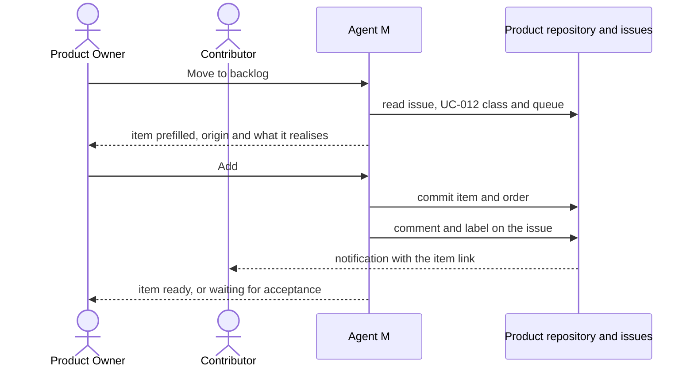

# UC-033 Move an issue into the backlog

**Goal.** An issue that UC-012 has classified becomes a backlog item, with links in both directions,
so that the work is ordered and planned like every other item.

- A **bug** can be started at once. Its item realises the requirement that the code currently
  violates.
- A **change** goes through the specification first (`EVOLUTION ENTERS THROUGH THE SPECIFICATION`).
  Its item may enter the backlog early so that it is not lost, but no job starts until the
  specification change is accepted.

## Actors

- **Product Owner**: orders the backlog (UC-032).
- **Contributor**: filed the issue and follows it.
- **GitHub**: hosts the issue and the product repository (or the product's GitLab server).

## Precondition

- The product works from a backlog (UC-002).
- The issue is classified as *bug* or *change* (UC-012, step 4).

## Main flow

1. On the issue's panel in Agent M, the Product Owner presses **Move to backlog**.
2. Agent M prefills the item:
   - **title** from the issue;
   - **outcome** from the issue's description;
   - **origin**: the issue's address, for example `https://github.com/alice/thesis-tool/issues/57`;
   - **realises**:
     - for a *bug*, the requirement that UC-012's analysis named as violated, for example
       `EXPORT IS A PDF`;
     - for a *change*, the entries of the queue under `docs/spec-freigaben/` that UC-012 wrote for
       this issue, by requirement name.
3. Agent M shows where the item will enter the order. By default this is the top for a bug, and the
   bottom for a change. The Product Owner may move it.
4. The Product Owner presses **Add**: one click. Agent M:
   - commits the item file under `docs/backlog/`, and the new order;
   - adds a comment to the issue with the item's identifier and a link to it on the dashboard;
   - adds the label `backlog` to the issue.
5. The item appears in the backlog (UC-032):
   - A bug item is *ready*.
   - A change item is *waiting for acceptance* until every requirement it names is accepted
     (UC-006). It then becomes *ready* by itself, because its state is derived.
6. When a pull request for the item is merged (UC-034), the issue is closed with a link to the pull
   request and the item.

## Alternative flows

- **1a. The issue is not classified yet.** **Move to backlog** is not offered. Agent M links to
  UC-012, step 2.
- **2a. The change's specification entries are rejected** (UC-006). The item names requirements that
  will never be accepted. Agent M marks it, and offers to remove it and close the issue with a link
  to the rejected entry.
- **2b. The change is accepted under a different name than proposed.** The item follows the
  accepted name, because the approval record names the entry it accepted. Agent M updates the item's
  *realises* when the Product Owner confirms.
- **4a. Several issues describe the same work.** The Product Owner adds a second issue to an
  existing item instead. The item then names both issues as origins, and both issues get the
  comment.
- **4b. No token for the issue tracker is stored, or the token may not comment.** The item is
  committed. Agent M shows the comment text with a copy button and the issue's address.
- **1b. The product works from a plan.** There is no backlog.
  - A bug is fixed directly (UC-012, step 5).
  - An accepted change enters the plan by itself, because the plan covers every accepted requirement
    (`A PLAN COVERS THE WHOLE SPECIFICATION`, UC-035).

## Postcondition

- The backlog holds an item that names the issue as its origin, and what it realises.
- The issue names the item.
- No implementation job can start for a change item before its specification change is accepted.
