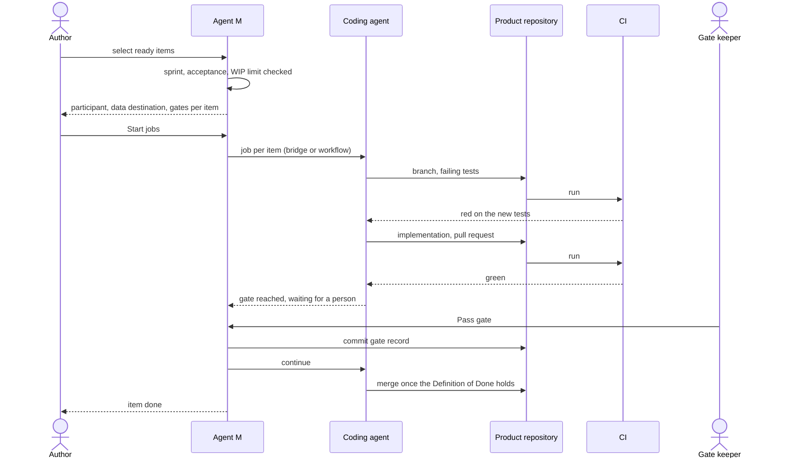

# UC-034 Implement backlog items with a coding agent

**Goal.** Agent M hands ready backlog items to coding agents, one job per item. Each job writes the
failing tests first, then the implementation, and opens a pull request that is merged once the
product's Definition of Done holds.
Every gate of the model, and every gate added by a process requirement, stops the job until a person
decides. This is the book's execution loop, "reason, act, observe", run inside a process with a
person in the loop where the workflow says so (book ch. 11 §2, §8).

## Actors

- **Author**: starts the jobs.
- **Coding agent**: a participant assigned to the role that implements, typically *Developers*
  (UC-002). It needs *read the repository*, *write to the repository* and *run code and tests*. It
  is one of these (UC-017):
  - a CLI agent reached through the local bridge (UC-011);
  - a sandboxed agent reached through the bridge over a tunnel;
  - a CI agent in a workflow, on a self-hosted runner where it needs the CLI.
- **CI**: the product's continuous integration, which runs the tests on every push.
- **Gate keeper**: the person assigned to decide at a gate, for example the *Security reviewer* from
  UC-031.

## Precondition

- The product works from a backlog. There is a current sprint selection (Scrum) or a WIP limit
  (Kanban) (UC-032).
- At least one participant with the needed capabilities is assigned to the implementing role
  (UC-002).
- The product's CI runs the test suite on pull requests.

## Main flow

1. The author opens **Backlog** and selects one or more *ready* items, or presses **Start sprint
   work** to select every ready item of the sprint.
2. Agent M checks each item. It starts no job for an item when:
   - the item is not selected for the current sprint;
   - a requirement or use case the item names is not accepted;
   - the WIP limit would be exceeded.

   For each item it cannot start, Agent M names the reason.
3. For the startable items, Agent M proposes one participant each from the holders of the
   implementing role. The run panel shows, per item:
   - the participant;
   - where the participant processes data;
   - what is sent: the item, the requirements and use cases it realises, their existing tests, and
     the process requirements that apply;
   - the gates the job will meet.

   The author may pick another holder of the role. They press **Start jobs**: one click.
4. Agent M queues one job per item, commits its start record under `docs/jobs/` of the product, and
   hands each to its participant through that participant's
   route: the bridge for CLI and sandboxed agents, a workflow for CI agents. The job definition comes
   from the repository's single definition (`ONE DEFINITION, THREE DRIVERS`).
5. The coding agent works in a branch named after the item:
   1. It writes tests for the item's acceptance criteria. Each test names the requirement it guards.
      The agent commits the tests, and CI records them as **failing**.
   2. It implements until the tests pass, and commits.
   3. It pushes and opens a pull request. The pull request names the item, the requirements it
      realises and, for an item from an issue, the issue (UC-033). It also records the Agent M
      version, the participant, the model and the date.
6. CI runs. On red, the agent reads the failure and repairs it (the book's observe-and-reason step),
   up to the retry limit of the job definition.
7. When the job reaches a gate of the workflow, for example *Security review* before Testing, or a
   *documented unit verification* added by an IEC 62304 process requirement, it stops in the state
   **waiting for a person**. The gate keeper sees the gate on the job dashboard (UC-036), with what
   it checks and the artifacts to look at. They press **Pass gate**: one click. Agent M commits the
   gate record (who, when, on which text), and the job continues.
8. When the product's Definition of Done holds — CI green, no gate left, and whatever the product
   added (UC-002, step 8) — the pull request is merged: by the coding agent, or by a person, as the
   author chose when starting the jobs. It goes into the default branch, or into the sprint's branch
   if the product set one. The item counts as done. For an item
   from an issue, the issue is closed with a link (UC-033, step 6).

## Alternative flows

- **1a. The product works from a plan (V-model, waterfall).** There is no backlog.
  - Agent M offers the open plan entries of the current phase instead, one per accepted requirement
    (`A PLAN COVERS THE WHOLE SPECIFICATION`). In the V-model's Design phase, for example, the
    entries produce the `ARC-` artifacts and the tests of the paired Testing phase.
  - Jobs of the next phase start only after the gate that closes the current phase is recorded.
  - Steps 3–8 apply per plan entry.
- **2a. No item can be started.** Agent M lists each item with its reason, and starts nothing.
- **3a. No holder of the role can receive an item's content.** A source the item depends on permits
  processing only in places no holder uses (`RESTRICTED CONTENT GOES ONLY WHERE ITS SOURCE PERMITS`).
  The item is not started, and Agent M names the source and the permitted places.
- **4a. The bridge or the runner does not answer.** The job stays *queued*. Agent M says which route
  is down, and the author may cancel or reassign the job (UC-036).
- **5a. The tests pass before any implementation.** Either the behaviour already exists or the tests
  check nothing. The job stops in *waiting for a person*, and the author decides whether the item is
  already done or the tests must be rewritten.
- **5b. The agent finds that the item contradicts the specification or leaves a case open.** It
  stops and proposes a specification change instead of guessing (UC-012, change). The item goes back
  to *waiting for acceptance*.
- **6a. CI stays red after the retry limit.** The job ends as *failed*, with the last CI log linked.
  The item is *blocked*, and the author may retry with the same or another participant (UC-036).
- **6b. Two jobs touch the same files.** The later push is rebased onto the default branch. On a
  conflict the job stops in *waiting for a person* and names the other item (book ch. 7, Brooks's
  law: more agents add coordination work).
- **7a. The gate keeper rejects.** The gate record states the rejection and its reason. The job ends,
  and the item returns to *ready* with the reason attached.
- **7b. The coding agent itself writes a gate record.** It does not count. Only a person's decision
  passes a gate (`A JOB STOPS AT EVERY GATE`).
- **8a. The sprint has a branch of its own.** The item's pull request targets that branch. At the
  sprint's end, the Product Owner merges it into the default branch after the review of the increment
  (UC-041).

## Postcondition

- Each started item has a pull request with failing-then-passing tests. It is either merged on green
  CI with every gate recorded, or waits, or failed with a reason.
- No job has continued past a gate without a person's recorded decision.
- The dashboards show the new state without anyone setting it (UC-035, UC-036).
