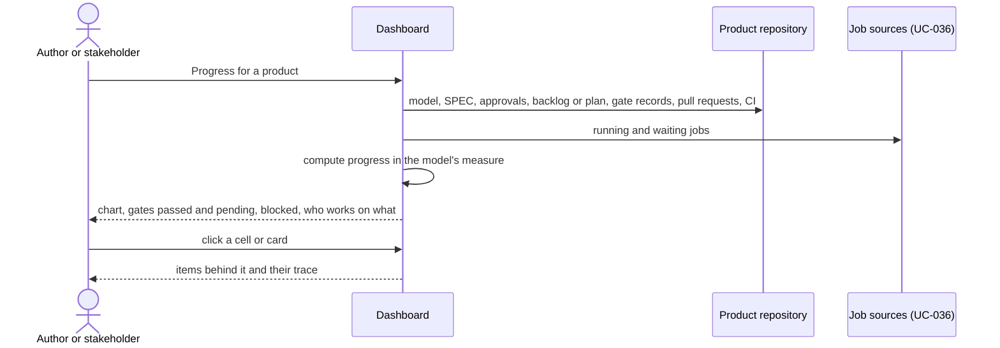

# UC-035 Follow progress on the process dashboard

**Goal.** Anyone who can read the product sees where its development stands, in the terms of its own
process model. They see:

- how far the plan has come, how the current sprint burns down, or how work flows;
- which gates are passed and which are pending;
- what is blocked;
- which participant works on what.

Software progress is invisible unless someone makes it visible. Reporting exists so that drift is
seen early enough to act on (book ch. 15 §2). Scrum calls the same thing transparency and
inspection (ch. 7 §5).

| Model kind | Progress measure | What the dashboard draws |
|---|---|---|
| planned (V-model, waterfall) | plan entries per phase | a grid of requirements × phases, each cell open, in progress or done; phases on a timeline with their gates as milestones (ch. 15 §3) |
| pulled, time boxes (Scrum) | remaining items per time box | the sprint's items, and a burn-down of remaining items per day of the sprint |
| pulled, WIP limit (Kanban) | items per state over time | the board with its columns and WIP limit, and a cumulative flow chart |

## Actors

- **Author**: follows the product and acts on what they see.
- **Stakeholder**: anyone with read access, for example a supervisor, who follows without acting.

## Precondition

- The product declares a process model (UC-002).
- The reader's browser can read the product repository. For a private repository, it needs a stored
  token.

## Main flow

1. The reader opens **Progress** for the product. Agent M reads everything it needs from the product
   repository:
   - the model declaration, the SPEC and the approval records;
   - the backlog and sprint selections, or the plan derived from the SPEC;
   - gate records, branches, pull requests and CI runs;
   - the running jobs, from the job dashboard's sources (UC-036).
2. Agent M computes the progress in the measure the model defines, and draws it as in the table above.
   Every number is computed now. None is read from a stored status.
3. Below the chart, Agent M lists the workflow's gates in order. For each gate it shows:
   - *passed*: who decided, when, and on which text, linked to the gate record;
   - *pending*: what it still needs;
   - *not reached*.

   Gates added by process requirements are marked with their requirement and source.
4. A panel **Blocked** lists every item or plan entry that cannot move, each with its reason:
   - a failed job;
   - a job waiting for a person, with the person or role it waits for;
   - a requirement not yet accepted;
   - the WIP limit.
5. A panel **Who works on what** lists each participant of the product with its role and its current
   jobs, linked to the job dashboard (UC-036).
6. The reader clicks a cell, a card or a point on the chart. Agent M shows the items or requirements
   behind it and their traceability: requirement → use case → item or plan entry → pull request →
   tests (UC-020).

Each chart and panel carries a folded **What is this?** that says how to read it: what a burn-down
that stays flat means, and what a widening band in cumulative flow means. It points to book ch. 7 or
ch. 15.

## Alternative flows

- **1a. The reader has no token that reaches a private product.** The dashboard says so and shows
  nothing, as in UC-008 (1a).
- **1b. A job source cannot be reached**, for example the local bridge of another machine. Progress
  is computed from the repository. The panel **Who works on what** says which source is missing, and
  that jobs running there are not shown.
- **2a. A planned product has no accepted requirements yet.** The grid shows the phases empty and
  says that the plan fills itself as requirements are accepted.
- **2b. A Scrum product has no running sprint.** The dashboard shows the last sprint's final
  burn-down and a link to plan the next one (UC-032).
- **2c. The product changed its model** (UC-002, 3b). The chart starts at the change. Earlier
  progress stays readable in the model it was made under.
- **3a. A gate record names a text that has changed since.** The gate is shown as *passed on an
  earlier text*, with the difference. It does not count as passed for the current text
  (`STATUS IS DERIVED FROM THE RECORDS`).

## Postcondition

- The reader has seen the product's progress in its model's own measure, the state of every gate,
  what is blocked, and who works on what.
- Nothing was written. Everything shown was derived at the moment it was shown.
