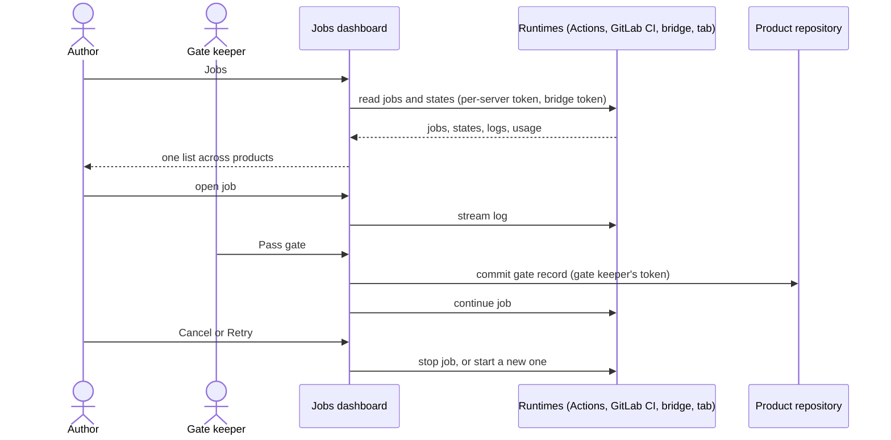

# UC-036 Inspect running jobs

**Goal.** One page shows every job across all products of the instance, so that the author can see
at a glance what runs, what waits, and what failed. From there, the author can:

- inspect any job;
- cancel or retry it;
- make the decision a waiting job needs.

A job is one execution: deriving requirements, generating tests, implementing a backlog item,
running a test battery. A job never continues past a gate without a person. This page is where the
person sees that a gate is waiting. It is the book's human-above-the-loop view (book ch. 11 §8):
agents run on their own, and a person watches the whole and can step in.

| State | Meaning |
|---|---|
| **queued** | handed to a route, not yet picked up |
| **running** | the participant is working |
| **waiting for a person** | stopped at a gate, or at a question only a person may answer |
| **done** | finished; its result is linked |
| **failed** | ended with an error; the reason and log are linked |
| **cancelled** | stopped by a person; wrote nothing afterwards |

## Actors

- **Author**: watches, cancels, retries.
- **Gate keeper**: the person who decides at a gate.
- **Runtimes**: where jobs run, and where their state is read from:
  - the browser tab, for model-endpoint jobs;
  - GitHub Actions or GitLab CI, for CI agents and self-hosted runners;
  - the local bridge, for CLI and sandboxed agents.

## Precondition

- The instance manages at least one product (UC-001).
- The browser has the tokens for the products' servers, and the session tokens of the bridges it
  should read.

## Main flow

1. The author opens **Jobs** on the instance's dashboard. Agent M reads the jobs from every source:
   - the job records `docs/jobs/JOB-<id>.md` of each product and of the instance — every job ever
     started, with its inputs, participant, runtime, start and, once ended, its end state;
   - for the jobs that have not ended, their live state: the Actions runs and GitLab pipelines of Agent M's job workflows in each product, each with the
     token of that product's server only;
   - the job list of each configured bridge, with its session token;
   - the jobs of this browser tab.
2. Agent M shows one list across products, newest first, grouped by state. *Waiting for a person*
   comes first. Each row shows:
   - the job's identifier, for example `JOB-20260924-1432-7f3a`;
   - the product and what the job works on, for example `ITM-014` or *derive requirements from
     SRC-007*;
   - the kind of job and the participant;
   - where it runs, for example *CLI agent on lab-pc-3*, *GitHub Actions, self-hosted runner gpu-1*
     or *this browser*;
   - its state and elapsed time;
   - its cost, where known.
3. The author filters by product, state, participant or runtime.
4. The author opens a job. Agent M shows:
   - the job's inputs, as announced in its run panel;
   - its commits and pull request so far;
   - its CI runs;
   - its log, streamed while it runs, read from the runtime that holds it;
   - its cost, as reported: for example *Actions: 14 min* or *endpoint: 182 k tokens · €0.41 at the
     declared price*, or *unknown*.
5. For a job **waiting for a person**, the detail view shows the gate: what it checks, the artifacts
   to examine, and who may decide. The gate keeper presses **Pass gate** or **Reject** (with a
   reason): one click. Agent M commits the gate record under the gate keeper's account, and the job
   continues or ends (UC-034, step 7).
6. For a **queued**, **running** or **waiting** job, the author may press **Cancel**: one click.
   - Agent M stops the job at its runtime: cancels the workflow run, or tells the bridge to end the
     agent's process.
   - It shows the job as *cancelled* once the runtime confirms.
   - Whatever the job pushed before cancelling stays on its branch. Nothing is pushed afterwards.
7. For a **failed** or **cancelled** job, the author may press **Retry**: one click. Agent M starts a
   new job, with a new identifier and a new record, with the same inputs, and offers the same participant or another holder of the same
   role. The earlier job stays in the list, and the new one names it.

Every state, and every kind of runtime, carries a folded **What is this?**.

## Alternative flows

- **1a. A bridge or a server cannot be reached.** The list shows the source as *not reachable*, with
  the reason (not running, wrong address, token missing), and it says that jobs there are not shown.
  The other sources are listed normally.
- **1b. A job was started in another browser and runs in its tab.** Its record is listed, with the
  note that its live state and log exist only in that tab; the folded explanation recommends a CI or
  bridge route for long jobs.
- **1c. A job has a start record but no end record, and no runtime knows it** — the tab was closed, the
  bridge restarted. It is shown as *ended without record*; **Retry** is offered as for a failed job.
- **4a. The runtime keeps no log for this job any more**, for example an expired Actions log. Agent M
  says so, and links the job's commits and pull request, which remain.
- **4b. The runtime reports usage but the participant declares no price.** The cost shows the usage
  (tokens, minutes) and *price unknown*. No money figure is computed (`NO COST IS GUESSED`).
- **5a. The person at the gate is not allowed to decide it.** The gate requires a role they do not
  hold. **Pass gate** is disabled, and the role and its holders are named.
- **5b. The gate record would be written by an agent.** Not possible: only a person's click writes
  it (`A JOB STOPS AT EVERY GATE`).
- **6a. The runtime does not confirm the cancel in time.** The job is shown as *cancelling* inside
  the running state. If the job later pushes anyway, Agent M flags the commit as written after the
  cancel, and offers to revert it.
- **7a. The retried job's item is no longer startable**, for example because the sprint ended or the
  WIP limit is reached. Agent M names the reason and starts nothing (UC-034, step 2).

## Postcondition

- The author has seen every reachable job of every product in one place, with state, participant,
  runtime, elapsed time, cost where known, and log.
- Every gate passed from this page is recorded with who, when and on which text.
- A cancelled job wrote nothing after its cancel. A retry is a new job that names the one it retries.
