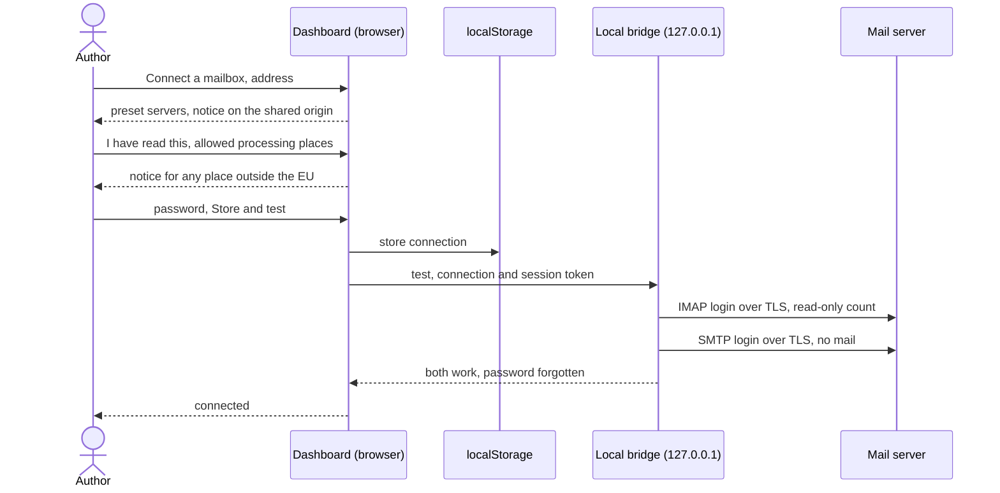

# UC-037 Connect a mailbox

**Goal.** The author connects the mailbox where reports about their products arrive — a personal
account or a functional mailbox — so that Agent M can read mails and turn them into issues (UC-038)
and send the replies the author releases (UC-039). The connection belongs to this browser alone; the
password goes nowhere but to the author's own bridge, which speaks IMAP and SMTP on its behalf,
because a browser cannot.

**The accepted risk, stated plainly** (PO decision 2026-09-24): the password is stored in this
browser's `localStorage` for the instance's Pages address. Browser storage belongs to the origin
`https://<owner>.github.io`, not to the path, so **every GitHub Pages site of the same owner can read
it** — measured 2026-09-23: seven sites share `https://akmaier.github.io`. Whoever can read it can read
all mail of that mailbox and send mail in its name. Agent M says so before storing, and recommends
running the instance under an owner used for nothing else (UC-014, step 1).

## Actors

- **Author** — owns the mailbox and runs the instance.
- **Local bridge** — the loopback program on the author's machine (UC-011); speaks IMAP and SMTP.
- **Mail server** — the IMAP and SMTP servers of the mailbox.

## Precondition

- The author has an instance with its token stored in this browser (UC-014).
- The local bridge runs on the author's machine, bound to loopback, and its session token is stored
  in this browser (UC-011).

## Main flow

1. The author opens **Settings → Mailbox** and presses **Connect a mailbox**. A folded **What is
   this?** explains what the connection is used for (reading reports, sending released replies), why
   it needs the bridge, and what stays where.
2. The author enters the mail address, the IMAP server and the SMTP server with their ports. Agent M
   presets the usual encryption for each port — `993` implicit TLS for IMAP, `587` STARTTLS or `465`
   implicit TLS for SMTP — and the account name as the address; the author corrects what differs. A
   folded explanation says where a mail provider usually lists these settings.
3. **The notice.** Before the password field is enabled, Agent M shows: *"The password is stored in
   this browser. Every GitHub Pages site under `<owner>.github.io` can read it — here: the sites of
   `<owner>`. With it, anyone can read all mail in this mailbox and send mail in its name. It goes to
   no server except your bridge on this machine. Recommended: run this instance under a GitHub owner
   you use for nothing else."* The author ticks **I have read this**.
4. **Where the mail may be processed.** Agent M lists the processing places its participants declare
   (UC-017) — for example *this machine*, *FAU data centre (EU)*, *US cloud provider* — and the
   author ticks those to which this mailbox's mails may be given. Preset is none: until a place is
   ticked, mails are only read, never handed to a participant. When the author ticks a place outside
   the European Union, Agent M states before saving: *"Processing personal data there does not comply
   with the EU's rules — the GDPR for transferring personal data, and the EU AI Act. You can still
   allow it; this connection will record that you did."*
5. The author enters the password and presses **Store and test** — one click. Agent M:
   - stores server, ports, account, the allowed processing places and password in `localStorage`, under the instance's key; no
     cookie, nothing in the URL, nothing in any repository;
   - sends one test request to the bridge with the session token, carrying the connection;
   - the bridge opens an encrypted connection to the IMAP server and logs in, selects `INBOX`
     read-only and counts the mails; then opens an encrypted connection to the SMTP server, logs in and
     disconnects without sending anything; then forgets the password;
   - shows ✓ for IMAP and ✓ for SMTP, the number of mails in `INBOX`, and the encryption used.
6. The mailbox is shown as connected, with its allowed processing places and **Disconnect** beside
   it. Other people who open the same
   instance in their own browsers see no mailbox: the connection exists only here.

## Alternative flows

- **5a. The bridge does not answer.** Agent M names the reason — not running, wrong address, session
  token missing — and links UC-011. The connection is stored (the author decided in step 4) and shown
  as *untested*.
- **5b. A server offers no encryption.** The bridge sends no login to it; Agent M says which server and
  that the password would travel in clear text. The author corrects the port or encryption setting.
- **5c. The login is refused.** Agent M shows the server's answer. It adds that some providers require
  an app password instead of the account password when two-factor login is on, with a folded
  explanation.
- **5d. IMAP works, SMTP does not.** Agent M shows both results separately; reading (UC-038) is
  possible, sending (UC-039) is not, and the dashboard says so where a reply would be sent.
- **4a. The author changes the allowed places later.** Settings → Mailbox → **Processing places**; the
  same list and the same notice as in step 4. A mail already handed to a participant is not recalled.
- **6a. The author presses Disconnect.** Agent M asks once for confirmation, then removes server,
  account and password from `localStorage` — not only from the form — and confirms that nothing is
  stored. The bridge holds nothing to remove. The private tracker (UC-038) is not touched.
- **1a. The author uses another browser or computer.** No mailbox is connected there; the author
  connects it again in that browser.
- **3a. The author does not tick the notice.** The password field stays disabled; nothing is stored.

## Postcondition

- The mailbox connection exists only in this browser's `localStorage`; no repository, cookie or URL
  contains any part of it.
- The password has left the browser only towards the bridge on the author's machine, and from there
  only over encrypted connections to the mailbox's own servers; the bridge keeps no copy.
- The mailbox is unchanged: nothing was read as new, moved, flagged or sent.
- Clicks: *Connect a mailbox*, *I have read this*, *Store and test*.
