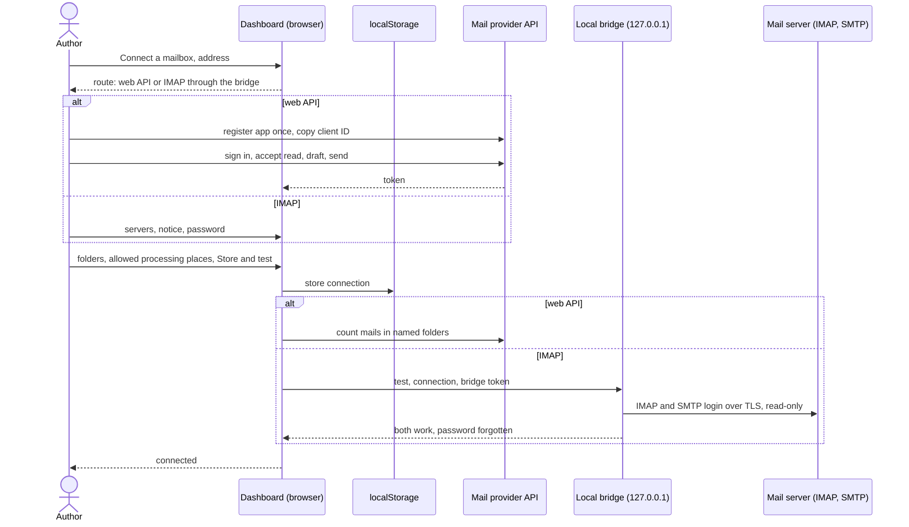

# UC-037 Connect a mailbox

**Goal.** The author connects the mailbox where reports about their products arrive — a personal
account or a functional mailbox — so that Agent M can read mails and turn them into issues (UC-038),
and draft and send the replies the author releases (UC-039). The connection belongs to this browser
alone.

**Two routes, decided by the mailbox's provider:**

| | **Web API** — directly from the dashboard | **IMAP and SMTP** — through the local bridge |
|---|---|---|
| for | Microsoft 365 (Microsoft Graph), Gmail (Gmail API) | every other mail server — FAU's Exchange, a university's IMAP server, a small provider |
| signing in | the provider's own sign-in; Agent M never sees a password | the mailbox password, stored in this browser after a notice |
| needs | a one-time app registration with the provider, whose return address is this dashboard | the local bridge running (UC-011) |
| why | the provider allows web pages to call it (measured 2026-09-29) | browsers let no web page open an IMAP or SMTP connection |

**The accepted risk on the IMAP route, stated plainly** (PO decision 2026-09-24): the password is
stored in this browser's `localStorage` for the instance's Pages address. Browser storage belongs to the
origin `https://<owner>.github.io`, not to the path, so **every GitHub Pages site of the same owner can
read it** — measured 2026-09-23: seven sites share `https://akmaier.github.io`. Agent M says so before
storing, and recommends running the instance under an owner used for nothing else (UC-014, step 1). On
the web-API route the same holds for the sign-in token, which the provider limits to mail and lets the
author withdraw on the provider's page.

## Actors

- **Author** — owns the mailbox and runs the instance.
- **Mail provider** — Microsoft or Google: signs the author in and serves the mail API.
- **Local bridge** — the loopback program on the author's machine (UC-011); speaks IMAP and SMTP.
- **Mail server** — the IMAP and SMTP servers of a mailbox on the bridge route.

## Precondition

- The author has an instance with its token stored in this browser (UC-014).
- For the IMAP route: the local bridge runs on the author's machine and is paired with this browser
  (UC-011).

## Main flow

1. The author opens **Settings → Mailbox** and presses **Connect a mailbox**, then enters the mail
   address. Agent M recognises Microsoft 365 and Gmail from the address's domain and mail servers and
   preselects the route; the author can change it. A folded **What is this?** explains the two routes
   with the table above.
2. **Web-API route, first time only — register the app.** A button opens the provider's page for a new
   app registration; underneath, what to enter there: the name `Agent M`, the kind *single-page
   application*, and the return address `https://<owner>.github.io/agent-m/` — shown with a copy
   button. The author copies the app's client ID back into the field. A folded explanation says that an
   institution may allow this only to its administrators, and whom to ask.
3. **Web-API route — sign in.** The author presses **Sign in with Microsoft** or **Sign in with Google**.
   The provider's own window asks for the account and shows the permissions — reading mail, writing
   drafts, sending mail, nothing else —; the author accepts there. The dashboard keeps the token the
   provider returns in `localStorage`; it is sent only to the provider's API.
4. **IMAP route — servers and password.**
   1. The author enters the IMAP and the SMTP server with their ports. Agent M presets the usual
      encryption for each port — `993` implicit TLS for IMAP, `587` STARTTLS or `465` implicit TLS
      for SMTP — and the account name as the address; the author corrects what differs. A folded
      explanation says where a mail provider usually lists these settings.
   2. **The notice.** Before the password field is enabled, Agent M shows: *"The password is stored in
      this browser. Every GitHub Pages site under `<owner>.github.io` can read it — here: the sites of
      `<owner>`. With it, anyone can read all mail in this mailbox and send mail in its name. It goes
      to no server except your bridge on this machine. Recommended: run this instance under a GitHub
      owner you use for nothing else."* The author ticks **I have read this** and enters the password.
5. **Folders.** The folders Agent M reads are preset to `INBOX`; the author adds the folders into which
   they file reported mails, so that an issue's mails are found again when it is answered (UC-039).
   *Drafts* and *Sent* are recognised by the mailbox's own markings.
6. **Where the mail may be processed.** Agent M lists the processing places its participants declare
   (UC-017) — for example *this machine*, *FAU data centre (EU)*, *US cloud provider* — and the
   author ticks those to which this mailbox's mails may be given. Preset is none: until a place is
   ticked, mails are only read, never handed to a participant. When the author ticks a place outside
   the European Union, Agent M states before saving: *"Processing personal data there does not comply
   with the EU's rules — the GDPR for transferring personal data, and the EU AI Act. You can still
   allow it; this connection will record that you did."*
7. The author presses **Store and test** — one click. Agent M stores the connection in `localStorage`
   under the instance's key — no cookie, nothing in the URL, nothing in any repository — and tests it:
   - **web API:** reads the number of mails in each named folder and finds *Drafts* and *Sent*,
     changing nothing;
   - **IMAP:** sends one test request to the bridge with the bridge token; the bridge logs in to the
     IMAP server over TLS, opens the named folders read-only and counts the mails, logs in to the SMTP
     server over TLS and disconnects without sending, then forgets the password.

   It shows ✓ per part, the number of mails per folder, and the route and encryption used.
8. The mailbox is shown as connected, with its route, folders, allowed processing places and
   **Disconnect**. Other people who open the same instance in their own browsers see no mailbox: the
   connection exists only here.

```mermaid
sequenceDiagram
    actor A as Author
    participant D as Dashboard (browser)
    participant L as localStorage
    participant M as Mail provider API
    participant B as Local bridge (127.0.0.1)
    participant S as Mail server (IMAP, SMTP)
    A->>D: Connect a mailbox, address
    D-->>A: route: web API or IMAP through the bridge
    alt web API
        A->>M: register app once, copy client ID
        A->>M: sign in, accept read, draft, send
        M-->>D: token
    else IMAP
        A->>D: servers, notice, password
    end
    A->>D: folders, allowed processing places, Store and test
    D->>L: store connection
    alt web API
        D->>M: count mails in named folders
    else IMAP
        D->>B: test, connection, bridge token
        B->>S: IMAP and SMTP login over TLS, read-only
        B-->>D: both work, password forgotten
    end
    D-->>A: connected
```

## Alternative flows

- **2a. The app registration is refused** — the institution allows it only to administrators. Agent M
  names what to ask them for (a single-page application with this return address and the three mail
  permissions), and offers the IMAP route in the meantime if the provider also offers IMAP.
- **3a. The author declines a permission in the provider's window.** Nothing is stored; Agent M says
  which permission is missing and what would not work without it.
- **3b. The sign-in expires.** At the next use, the dashboard asks for the provider's sign-in again, in
  the provider's window; nothing else changes.
- **7a. The bridge does not answer.** Agent M names the reason — not running, wrong address, bridge
  token missing — and links UC-011. The connection is stored and shown as *untested*.
- **7b. A server offers no encryption.** The bridge sends no login to it; Agent M says which server and
  that the password would travel in clear text. The author corrects the port or encryption setting.
- **7c. The login is refused.** Agent M shows the server's answer. It adds that some providers require
  an app password instead of the account password when two-factor login is on, with a folded
  explanation.
- **7d. Reading works, sending does not.** Agent M shows both results separately; reading (UC-038) is
  possible, sending (UC-039) is not, and the dashboard says so where a reply would be sent.
- **6a. The author changes the allowed places later.** Settings → Mailbox → **Processing places**; the
  same list and the same notice as in step 6. A mail already handed to a participant is not recalled.
- **8a. The author presses Disconnect.** Agent M asks once for confirmation, then removes the connection
  — password or sign-in token included — from `localStorage`, not only from the form, and confirms that
  nothing is stored. On the web-API route it links the provider's page where the app's access is
  withdrawn. Issues and their mail identifiers are not touched.
- **1a. The author uses another browser or computer.** No mailbox is connected there; *Import settings*
  (UC-042) brings the route, servers and folders, and only the password or the sign-in is needed again.
- **4a. The author does not tick the notice.** The password field stays disabled; nothing is stored.

## Postcondition

- The mailbox connection exists only in this browser's `localStorage`; no repository, cookie or URL
  contains any part of it.
- On the web-API route, Agent M never saw the mailbox password; its token reaches mail only and goes
  only to the provider. On the IMAP route, the password has left the browser only towards the bridge on
  the author's machine, and from there only over encrypted connections; the bridge keeps no copy.
- The mailbox is unchanged: nothing was read as new, moved, flagged or sent.
