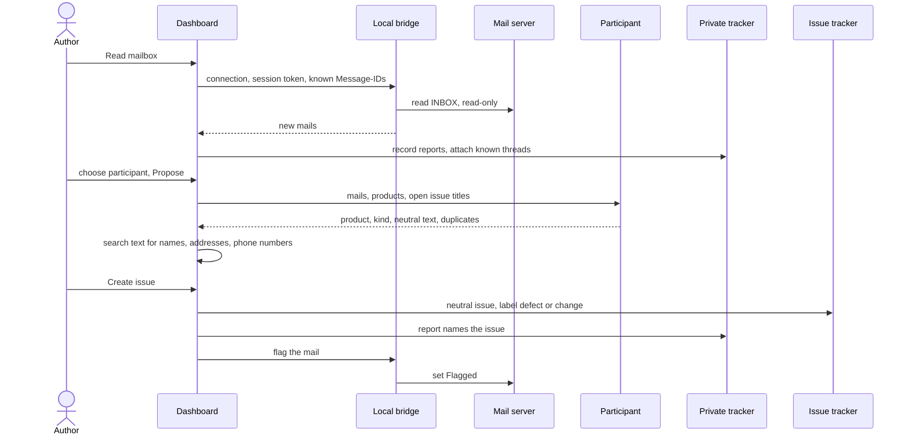

# UC-038 Turn mails into issues

**Goal.** Mails that report a fault or ask for a change become issues of the right product — with
the technical content and nothing personal — while Agent M keeps, in a private place, who wrote,
in which thread, and where to answer. A participant the author chooses proposes; the author decides
each mail with one click.

This is the book's change identification (ch. 14, *Evolution Processes and Change Identification*):
requests arrive in user language, and the work is to filter them into change proposals. The split
into a private record and a neutral issue is taken over from the process repository's support
process, where mails live in a local ticket database (`scripts/ticket_db.py`) and never in git
(`SOFTWARE_MAINTENANCE.md` §0.5).

| Where | What it holds | Who can read it |
|---|---|---|
| **Private tracker** — a private repository, or a folder on the bridge's machine | one **report** per mail: the mail as received, sender, reply address, thread (`Message-ID`, `In-Reply-To`, `References`), attachments, the issue it belongs to, replies sent | the author, and whoever the author gave access to that private place |
| **Product's issue tracker** — GitHub or GitLab issues of the product | one **issue**: neutral title and text, *defect* or *change* | whoever can read the product repository — often everyone |

## Actors

- **Author** — decides which mail becomes which issue.
- **Reporter** — sent the mail; not a user of Agent M.
- **Local bridge** — reads the mailbox (UC-037); hands the mails to a CLI agent if one is chosen.
- **Mail server** — holds the mailbox.
- **Participant** — a model endpoint or CLI agent (UC-017) that proposes the issue.
- **Private tracker** — holds the reports.
- **Issue tracker** — the product's issues on GitHub or on its GitLab server.

## Precondition

- A mailbox is connected in this browser (UC-037), and the bridge runs.
- The instance manages at least one product (UC-001), and the stored token may create issues in it.
- At least one participant that can draft text is configured (UC-017).

## Main flow

1. The author opens **Mail** on the dashboard and presses **Read mailbox**. The first time, Agent M
   first asks where the private tracker is (alternative flow 1a).
2. The dashboard sends the connection, the session token and the `Message-ID`s already recorded to
   the bridge. The bridge reads `INBOX` read-only — nothing is marked as read, moved or flagged — and
   returns the mails whose `Message-ID` is not yet recorded, then forgets the password.
3. Agent M records each new mail as a report in the private tracker. A mail whose `In-Reply-To` or
   `References` names a recorded mail is attached to that report and its issue at once, without a
   participant; it is shown under that issue (UC-039 uses it).
4. The remaining mails are listed with sender, subject and date — visible only in this browser. The
   author picks the participant for the proposals; Agent M offers only participants whose processing
   place the mailbox allows (UC-037, step 4), and marks a place outside the EU as not compliant with
   the GDPR and the EU AI Act. The panel states where that participant processes
   data and exactly what it receives: the mail text, the list of the instance's products with their
   one-line descriptions, and the titles and numbers of their open issues. The author presses
   **Propose** — one click for all listed mails.
5. For each mail, the participant returns a proposal:
   - **product** — which managed product the mail concerns;
   - **kind** — *defect* (the product does not do what its SPEC says) or *change* (the reporter wants
     different behaviour), or *no issue* (a thank-you, an out-of-office reply, spam);
   - **neutral issue** — a title and a text with the technical content: what was done, what happened,
     what was expected, version, error message — no names, addresses, signatures or greetings;
   - **possible duplicates** — open issues that may describe the same thing, each with a reason.
6. Agent M checks every neutral text without a model: each address and name from the mail's headers,
   and each address and phone number in its body, is searched for; a hit is marked in the text.
7. The review panel shows, per mail, the mail in full on the left and the proposal on the right, with
   the text editable. The author decides with one click:
   - **Create issue** — possible only when the check of step 6 finds nothing;
   - **Add to #n** — the mail describes an existing issue;
   - **Not an issue** — the mail stays a report without an issue.
8. On **Create issue**, Agent M creates the issue in the product's tracker with the author's token,
   labelled `defect` or `change`; the issue names no report and no private tracker. It writes the
   issue's address into the report, and asks the bridge to set `\Flagged` on the mail in the mailbox —
   the issue is open.
9. On **Add to #n**, Agent M writes issue #n into the report — the mail is now a further report of that
   issue, whose reporter will also be answered (UC-039) — and flags the mail.
10. For an issue of kind *change*, the dashboard offers **Propose SPEC change** (UC-012); a *defect*
    goes to implementation directly.

## Alternative flows

- **1a. No private tracker is set yet.** Agent M asks for one of two places, each with a folded
  explanation: **a private repository** — the author names or creates one, and Agent M checks with the
  server that its visibility is *private*; or **a folder on the bridge's machine** — the bridge writes
  the reports there and nowhere else. The choice is kept in this browser with the mailbox connection.
- **1b. The named repository is public or internal.** Agent M refuses it, says why — every mail would
  be published, and the history keeps it after deletion — and writes nothing.
- **2a. The bridge does not answer.** Nothing is read; Agent M names the reason (UC-037, 5a).
- **4a. The chosen participant is a CLI agent.** The dashboard hands the job to the bridge; the mails
  go to the agent on the same machine and do not travel further than that agent's own processing
  place, which the panel states.
- **4c. No participant processes data at a place this mailbox allows.** Agent M says so and links to
  the mailbox's processing places (UC-037, 4a); nothing is sent. The author can still decide each
  mail by hand in step 7.
- **4b. The author does not press Propose.** Nothing is sent to any participant; the author can still
  decide each mail by hand in step 7, with an empty proposal.
- **5a. The mail has attachments.** They are stored with the report. Their text is sent to the
  participant only if the author ticks it for that mail in step 4.
- **5b. The participant finds no matching product.** The proposal says so; the author picks the
  product or chooses *Not an issue*.
- **6a. The check finds personal data in the neutral text.** The hit is marked; **Create issue** stays
  disabled until the author has edited it out. The finding also counts towards the measured rate of
  the participant (SPEC `THE PRODUCT ISSUE CARRIES NO PERSONAL DATA`).
- **7a. The author changes the proposal** — another product, another kind, another duplicate. The
  author's choice is what is written; the participant's proposal is not kept as the decision.
- **7b. The mail mixes several concerns.** The author splits it: **Create issue** once per concern,
  each from the same report; the report names all resulting issues.
- **8a. The issue cannot be created** — the token does not reach the product, or lacks the permission
  to create issues. Agent M says which, links the token step of UC-001, and records nothing as an
  issue; the report stays undecided.
- **8b. Setting the flag fails** — the mail was moved or the server refused. The issue and the report
  stand; Agent M notes that the flag is missing and sets it at the next flag sync (UC-039, step 8).
- **3a. A mail in a known thread belongs to a closed issue.** It is attached and shown under that
  issue; the issue stays closed until the author reopens it (UC-039, alternative flow 7a).

## Postcondition

- Every new mail is a report in the private tracker, exactly once; the mailbox itself is unchanged
  except for the flags of mails that became or joined an issue.
- Each created issue carries neutral technical text, a product, and the label `defect` or `change`;
  no name, address or signature from the mail reached the product's tracker, the instance, or any
  repository other than the private tracker.
- Each report names the issue it belongs to, so that the reporter can be answered when it is solved
  (UC-039).
- Clicks per reading: *Read mailbox*, *Propose*, then one decision per mail.
