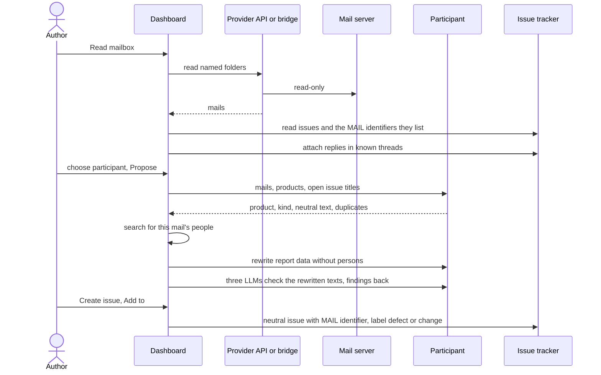

# UC-038 Turn mails into issues

**Goal.** Mails that report a fault or ask for a change become issues of the right product — with the
technical content and nothing personal —, and each issue keeps a pseudonymous link back to its mails,
so that every reporter can be answered once the issue is solved. A participant the author chooses
proposes; the author decides each mail with one click.

This is the book's change identification (ch. 14, *Evolution Processes and Change Identification*):
requests arrive in user language, and the work is to filter them into change proposals.

| Where | What it holds | Who can read it |
|---|---|---|
| **The mailbox** | the mails themselves: text, sender, reply address, attachments — as always | the owner of the mailbox |
| **The product's issue tracker** — GitHub or GitLab issues | one **issue** per concern: neutral title and text, *defect* or *change*, report data rewritten without persons, and the list of `MAIL-` identifiers of its mails | whoever can read the product repository — often everyone |

Nothing else is kept: no copy of a mail, no list of reporters, no flags in the mailbox.

## Actors

- **Author** — decides which mail becomes which issue.
- **Reporter** — sent the mail; not a user of Agent M.
- **Mail provider or local bridge** — the route to the mailbox (UC-037): the provider's web API for
  Microsoft 365, the bridge over IMAP otherwise — Gmail included; the bridge also hands mails to a CLI agent if
  one is chosen.
- **Mail server** — holds the mailbox.
- **Participant** — a model endpoint or CLI agent (UC-017) that proposes the issue.
- **Checking participants** — three LLM participants with three different models (UC-017) that each read
  the rewritten texts for any mention of a person.
- **Issue tracker** — the product's issues on GitHub or on its GitLab server.

## Precondition

- A mailbox is connected in this browser (UC-037); on the IMAP route, the bridge runs.
- The instance manages at least one product (UC-001), and the stored token may create issues in it.
- At least one participant that can draft text is configured (UC-017), and three LLM participants with
  three different models check the rewritten texts.

## Main flow

1. The author opens **Mail** on the dashboard and presses **Read mailbox**.
2. Agent M reads the named folders — through the provider's web API, or on the IMAP route through the
   bridge, which then forgets the password —, read-only: nothing is marked as read, moved or flagged. Agent M gives each mail its identifier `MAIL-` plus the first sixteen hex digits of the
   SHA-256 of its `Message-ID`, and reads the issues of every managed product for the identifiers they
   list.
3. Mails that an issue already lists, or that the author marked *not an issue* in this browser, are
   left out. A mail whose `In-Reply-To` or `References` names a listed mail is attached to that issue
   at once, without a participant — its identifier added to the issue — and shown there (UC-039).
4. The remaining mails are listed with sender, subject and date — visible only in this browser. The
   author picks the participant for the proposals; Agent M offers only participants whose processing
   place the mailbox allows (UC-037, step 6), and marks a place outside the EU as not compliant with
   the GDPR and the EU AI Act. The panel states where that participant processes data and exactly what
   it receives: the mail text, the list of the instance's products with their one-line descriptions,
   and the titles and numbers of their open issues — and the three checking participants, where each
   processes data and that each receives only the rewritten texts. The author presses **Propose** — one
   click for all listed mails.
5. For each mail, the participant returns a proposal:
   - **product** — which managed product the mail concerns;
   - **kind** — *defect* (the product does not do what its SPEC says) or *change* (the reporter wants
     different behaviour), or *no issue* (a thank-you, an out-of-office reply, spam);
   - **neutral issue** — a title and a text with the technical content: what was done, what happened,
     what was expected, version, error message — no names, addresses, signatures or greetings;
   - **possible duplicates** — open issues that may describe the same thing, each with a reason.
6. Agent M checks every neutral text without a model against the people of this mail: each address and
   name from its headers, each name, address, phone number and account in its body and signature is
   searched for; a hit is marked in the text. Attachments, logs and error messages the author wants in the
   issue are rewritten by the participant without any person, keeping their technical content — "the
   user's home folder" instead of a path with a user name — unless the product switched this off
   (UC-042). Then the three checking participants each read the neutral text and the rewritten report
   data for any mention of a person; a finding of any one of them goes back to the rewriting participant
   as a compiler-like message, and it corrects the text, within the round limit (UC-019, step 7). What
   is still found after the last round is marked in the text.
7. The review panel shows, per mail, the mail in full on the left and the proposal on the right, with
   the text editable. The author decides with one click:
   - **Create issue** — possible only when the check of step 6 finds nothing;
   - **Add to #n** — the mail describes an existing issue;
   - **Not an issue** — the mail is marked in this browser by its identifier and not proposed again.
8. On **Create issue**, Agent M creates the issue in the product's tracker with the author's token,
   labelled `defect` or `change`, listing the mail's `MAIL-` identifier; the issue names no reporter.
9. On **Add to #n**, Agent M adds the mail's identifier to the list in issue #n. That reporter will also
   be answered when #n is closed (UC-039).
10. For an issue of kind *change*, the dashboard offers **Propose SPEC change** (UC-012); a *defect*
    goes to implementation directly.

```mermaid
sequenceDiagram
    actor A as Author
    participant D as Dashboard
    participant B as Provider API or bridge
    participant S as Mail server
    participant P as Participant
    participant I as Issue tracker
    A->>D: Read mailbox
    D->>B: read named folders
    B->>S: read-only
    B-->>D: mails
    D->>I: read issues and the MAIL identifiers they list
    D->>I: attach replies in known threads
    A->>D: choose participant, Propose
    D->>P: mails, products, open issue titles
    P-->>D: product, kind, neutral text, duplicates
    D->>D: search for this mail's people
    D->>P: rewrite report data without persons
    D->>P: three LLMs check the rewritten texts, findings back
    A->>D: Create issue, Add to #n, or Not an issue
    D->>I: neutral issue with MAIL identifier, label defect or change
```

## Alternative flows

- **2a. The mailbox cannot be reached** — the bridge does not answer, or the provider's sign-in has
  expired. Nothing is read; Agent M names the reason (UC-037, 7a or 3b).
- **4a. The chosen participant is a CLI agent.** The dashboard hands the job to the bridge; the mails
  go to the agent on the same machine and do not travel further than that agent's own processing
  place, which the panel states.
- **4b. The author does not press Propose.** Nothing is sent to any participant; the author can still
  decide each mail by hand in step 7, with an empty proposal.
- **4c. No participant processes data at a place this mailbox allows.** Agent M says so and links to
  the mailbox's processing places (UC-037, 6a); nothing is sent. The author can still decide each
  mail by hand in step 7.
- **5a. The mail has attachments.** Their text is sent to the participant only if the author ticks it
  for that mail in step 4. An attachment reaches the issue only rewritten without persons (step 6), and only if the
  author adds it there.
- **5b. The participant finds no matching product.** The proposal says so; the author picks the
  product or chooses *Not an issue*.
- **6a. The check finds personal data in the neutral text.** The hit is marked; **Create issue** stays
  disabled until the author has edited it out. The finding also counts towards the measured rate of
  the participant (SPEC `THE PRODUCT ISSUE CARRIES NO PERSONAL DATA`).
- **6b. The product has switched pseudonymisation off** (UC-042). Report data goes into the issue
  unchanged; the panel says so above the data. The issue text itself is still checked and stays
  neutral.
- **6c. Fewer than three LLM participants are at places this mailbox allows.** The participant's texts
  cannot be written; Agent M names what is missing and links UC-017 and the mailbox's places (UC-037, 6a).
  The author may still write the issue text by hand (4b) — covered by the search for the mail's people —
  and adds no report data.
- **7a. The author changes the proposal** — another product, another kind, another duplicate. The
  author's choice is what is written; the participant's proposal is not kept as the decision.
- **7b. The mail mixes several concerns.** The author splits it: **Create issue** once per concern;
  each issue lists the same identifier.
- **8a. The issue cannot be created** — the token does not reach the product, or lacks the permission
  to create issues. Agent M says which and links the token step of UC-001; nothing is written.
- **3a. A mail in a known thread belongs to a closed issue.** It is attached and shown under that
  issue; the issue stays closed until the author reopens it (UC-039, 7a).
- **1a. The author reads from another browser.** Mails that became issues are left out there too — the
  issues say so. Marks *not an issue* made in the first browser move with *Export settings* (UC-042).

## Postcondition

- Every created issue carries neutral technical text, a product, the label `defect` or `change`, and the
  `MAIL-` identifiers of its mails; no name, address or signature from a mail reached any repository or
  issue tracker.
- The mails are unchanged in the mailbox; nothing about them is stored anywhere else.
- Clicks per reading: *Read mailbox*, *Propose*, then one decision per mail.
