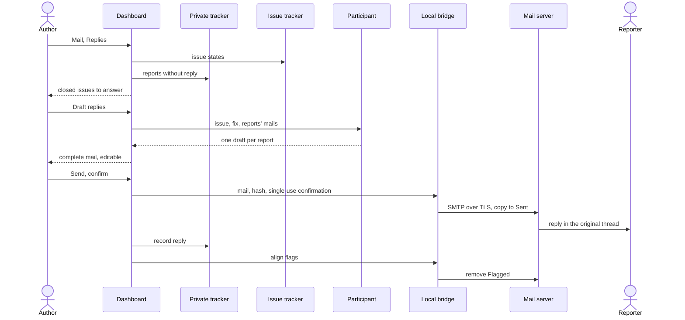

# UC-039 Close or defer an issue and reply

**Goal.** When an issue that came from mail is solved, every person who reported it gets an answer —
drafted by a participant, read in full by the author, and sent only by the author's click. An issue
that needs more information from a reporter can be deferred until the answer arrives. The mailbox
shows at a glance what is still open.

The rules are taken over from the process repository's reply dashboard, which has answered support
mail this way since 2026-08 (`SOFTWARE_MAINTENANCE.md` §0.1 no auto-reply, §6 answer protocol, §6.1
explicit click with confirmation, duplicate guard, no reopening of closed tickets, loopback only, §9
mailbox flags). What changes for Agent M: the sender's details come from the private tracker instead
of a local database, and the neutral issue lives in the product's tracker.

| Issue state | Where it is decided | Mailbox flag on the reports' mails |
|---|---|---|
| **open** | the product's issue tracker | `\Flagged` |
| **deferred** — waiting for a reporter's answer | derived: a deferral in the private tracker, and no mail in the thread since | `\Flagged` |
| **closed** | the product's issue tracker — in Agent M or elsewhere, for example by a merged pull request | none |

## Actors

- **Author** — decides, reads and releases every mail.
- **Reporter** — receives the reply; may answer in the same thread.
- **Participant** — a model endpoint or CLI agent (UC-017) that drafts the reply; it cannot send.
- **Local bridge** — sends through SMTP and sets flags through IMAP (UC-037).
- **Mail server** — delivers the reply and holds the flags.
- **Private tracker** — knows each report's reporter, reply address and thread (UC-038).
- **Issue tracker** — the product's issues on GitHub or its GitLab server.

## Precondition

- The issue has at least one report in the private tracker (UC-038).
- A mailbox is connected in this browser with working SMTP (UC-037), and the bridge runs.

## Main flow

1. The author opens **Mail → Replies**. Agent M reads the state of every issue that has reports and
   lists three groups: **to answer** — closed issues with a report that has no reply yet, whoever
   closed them; **answer received** — deferred issues with a new mail in the thread; **open**.
2. The author opens a closed issue under *to answer*. The panel shows the neutral issue, what solved
   it (the closing pull request or commit and the release that contains it, where known), and one line
   per report with no reply: reporter, date, subject — read from the private tracker.
3. The author picks the participant — Agent M offers only those whose processing place the mailbox
   allows (UC-037, step 4) — and presses **Draft replies** — one click. The panel states where
   the participant processes data and what it receives: the issue, what solved it, and each report's
   mail. The participant returns one draft per report: what the problem was, what was done, from which
   version the fix is live, and the reporter's original mail quoted below it.
4. Agent M builds each mail completely: from the connected mailbox; to the report's reply address —
   and to no other report's reporter; subject `Re:` the report's subject; `In-Reply-To` and
   `References` set to the report's `Message-ID`. The preview shows exactly this mail — every
   recipient, subject, full body, every attachment with name and size — and the text is editable.
5. The author presses **Send** on one draft — one click; the confirmation is part of the button's
   dialog, which repeats recipient and subject. The dashboard computes the SHA-256 of the mail as shown
   and sends it with a single-use confirmation carrying that hash to the bridge.
6. The bridge checks the session token, the confirmation and the hash, logs in over TLS, sends the
   mail, stores a copy in the mailbox's *Sent* folder, forgets the password, and returns the new mail's
   `Message-ID`.
7. Agent M records the reply in the report — `Message-ID`, date, text — and moves the draft out of the
   list. When every report of the issue has a reply, the issue leaves *to answer*.
8. Agent M asks the bridge to align the flags: the original mails of the closed issue's reports lose
   `\Flagged`. One IMAP login, idempotent; a mail that cannot be found is reported, not an error.

## Alternative flows

- **2a. The issue is still open and the author knows it is solved.** From the issue under *open*, the
  author presses **Close and reply**: steps 3–7 run, and the **Send** of the first reply also closes the
  issue in the product's tracker, with the author's token. If sending fails, the issue stays open.
- **2b. Close without a reply.** For a report that already has a reply, or one the author decides not
  to answer, **Close without reply** closes the issue (or marks the report done) and records that no
  mail was sent. Reports never answered are listed first in the confirmation, so none is skipped by
  accident.
- **3a. The author writes the reply without a participant.** An empty draft with the quoted original
  opens; everything from step 4 applies.
- **3b. The participant is a CLI agent.** It receives the job through the bridge and returns drafts;
  its job contains no sending, and the bridge sends nothing without the confirmation of step 5.
- **5a. The report already has a reply.** The dialog names the earlier reply with its date and asks
  for a second, explicit confirmation; without it nothing is sent. The bridge enforces the same.
- **5b. The author edits the text after the preview.** The hash changes; the dialog shows the edited
  mail again before anything is sent.
- **5c. The same request arrives twice** — a reload, a double click. The single-use confirmation is
  spent; the bridge sends nothing the second time.
- **6a. Sending fails** — SMTP refused, bridge not running. Nothing is recorded as sent; the draft stays;
  the issue does not change state. Agent M shows the server's answer.
- **1a. Defer: the author needs more from a reporter.** On an open issue, the author presses **Ask the
  reporter**; a question is drafted (by a participant or by hand), shown complete as in step 4, and
  sent with **Send and defer** — one click. Agent M records the question in the report and a deferral
  with its date; the issue stays open in the product's tracker, and the mail stays flagged.
- **1b. Defer without a mail.** When an answer is already expected in an existing thread, **Defer until
  answered** records only the deferral.
- **1c. The answer arrives.** At the next *Read mailbox* (UC-038, step 3), the reporter's mail is matched
  to its thread without a model. From then on the issue no longer counts as deferred and appears
  under *answer received*, with the new mail shown in full.
- **7a. A mail arrives in the thread of a closed issue** — a thank-you, or "still broken". It is shown
  under the issue as new; the issue stays closed. The author presses **Reopen**, answers with a reply
  from step 3, or **Leave closed**. No mail and no sent question reopens an issue by itself.
- **8a. Aligning the flags fails** — login refused, mail moved. The reply and the issue state stand;
  Agent M reports which mails could not be aligned. **Sync flags** in *Mail* aligns every report of
  the instance again, open and deferred flagged, closed unflagged.
- **4a. A report's reply address is missing or invalid.** The draft is marked *not sendable* and says
  why; the author can only close without reply.

## Postcondition

- Every report of a closed issue has either a reply that the author released by a click on the exact
  mail shown, or a recorded decision not to answer.
- Each reply sits in the reporter's original thread and named no other reporter; a copy is in the
  mailbox's *Sent* folder; the private tracker records it.
- A deferred issue ends its deferral by itself when the reporter answers; a closed issue is open again
  only if the author reopened it.
- In the mailbox, the original mails of open and deferred issues carry the follow-up flag, those of
  closed issues none.
- Clicks for a solved issue with one report: *Draft replies*, *Send* (with its confirmation). For
  deferring: *Ask the reporter*, *Send and defer*.
