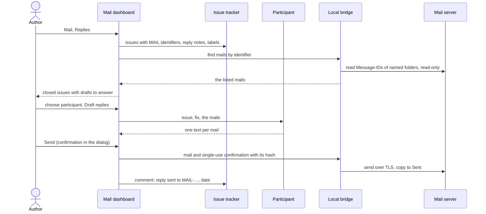

# UC-039 Reply to the mails of an issue

**Goal.** When an issue that came from mail is closed, every person who reported it gets an answer —
drafted by a participant, read in full by the author, and sent only by the author's click from the mail
dashboard. When the author needs more from a reporter, the issue waits, labelled, until the answer
arrives. Everything about the state lives in the issue; everything about the people stays in the
mailbox.

The rules are taken over from the process repository's reply dashboard, which has answered support mail
this way since 2026-08 (`SOFTWARE_MAINTENANCE.md` §0.1 no auto-reply, §6 answer protocol, §6.1 explicit
click with confirmation, no reopening of closed tickets). What changes for Agent M: there is no ticket
database — the issue lists its mails by identifier, and the bridge finds each mail in the mailbox.

| State | Where it is recorded |
|---|---|
| **open** | the product's issue tracker |
| **waiting for a reporter** | the label `waiting-for-reporter` on the issue |
| **closed** | the issue tracker — closed in Agent M or elsewhere, for example by a merged pull request |
| **answered** | a comment on the issue per sent reply: the mail's identifier and the date, nothing else |

## Actors

- **Author** — decides, reads and releases every mail.
- **Reporter** — receives the reply; may answer in the same thread.
- **Participant** — a model endpoint or CLI agent (UC-017) that drafts the reply; it cannot send.
- **Local bridge** — finds mails by identifier and sends through SMTP (UC-037).
- **Mail server** — holds the mails and delivers the reply.
- **Issue tracker** — the product's issues on GitHub or its GitLab server.

## Precondition

- The issue lists at least one `MAIL-` identifier (UC-038).
- A mailbox is connected in this browser with working SMTP (UC-037), and the bridge runs.

## Main flow

1. The author opens **Mail → Replies**. Agent M reads every issue that lists mail identifiers and shows
   three groups: **to answer** — closed issues with a listed mail that has no reply note, whoever closed
   them; **answer received** — issues labelled `waiting-for-reporter` with a new mail in the thread;
   **open**.
2. The author opens a closed issue under *to answer*. Its reply drafts are already there, one per mail
   without a reply note. The panel shows the neutral issue, what solved it (the closing pull request or
   commit and the release that contains it, where known), and per draft the mail — found in the mailbox
   by the bridge through its identifier — with reporter, date and subject.
3. The author picks the participant — Agent M offers only those whose processing place the mailbox
   allows (UC-037, step 4) — and presses **Draft replies**: one click. The panel states what the
   participant receives: the issue, what solved it, and each mail. The participant returns one text per
   mail: what the problem was, what was done, from which version the fix is live, and the reporter's
   original mail quoted below it.
4. Agent M builds each mail completely: from the connected mailbox; to that mail's reply address — and to
   no other reporter; subject `Re:` the mail's subject; `In-Reply-To` and `References` set to its
   `Message-ID`. The preview shows exactly this mail — every recipient, subject, full body, every
   attachment with name and size — and the text is editable.
5. The author presses **Send** on one draft: one click; the confirmation is part of the button's dialog,
   which repeats recipient and subject. The dashboard computes the SHA-256 of the mail as shown and sends
   it with a single-use confirmation carrying that hash to the bridge.
6. The bridge checks the bridge token, the confirmation and the hash, logs in over TLS, sends the mail,
   stores a copy in the mailbox's *Sent* folder, and forgets the password.
7. Agent M comments on the issue: *Reply sent to MAIL-… on 2026-…* — identifier and date only. The draft
   leaves the list; when every listed mail has a note, the issue leaves *to answer*.

```mermaid
sequenceDiagram
    actor A as Author
    participant D as Mail dashboard
    participant I as Issue tracker
    participant P as Participant
    participant B as Local bridge
    participant S as Mail server
    A->>D: Mail, Replies
    D->>I: issues with MAIL identifiers, reply notes, labels
    D->>B: find mails by identifier
    B->>S: read Message-IDs of named folders, read-only
    B-->>D: the listed mails
    D-->>A: closed issues with drafts to answer
    A->>D: choose participant, Draft replies
    D->>P: issue, fix, the mails
    P-->>D: one text per mail
    A->>D: Send (confirmation in the dialog)
    D->>B: mail and single-use confirmation with its hash
    B->>S: send over TLS, copy to Sent
    D->>I: comment: reply sent to MAIL-…, date
```

## Alternative flows

- **2a. The issue is still open and the author knows it is solved.** From the issue under *open*, the
  author presses **Close and reply**: the issue is closed with the author's token, and the drafts appear
  as in step 2.
- **2b. A listed mail is no longer in the mailbox** — deleted, or filed into a folder the connection does
  not name. Its draft says *not found in the mailbox* and cannot be sent; the author names the folder in
  the mailbox connection (UC-037) or chooses **No reply**.
- **2c. No reply for a mail.** **No reply** — for example to an automatic message — comments on the
  issue *No reply to MAIL-…, decided on …*, and the draft leaves the list.
- **3a. The author writes the reply without a participant.** An empty draft with the quoted original
  opens; everything from step 4 applies.
- **3b. The participant is a CLI agent.** It receives the job through the bridge and returns texts; its
  job contains no sending, and the bridge sends nothing without the confirmation of step 5.
- **5a. The author edits the text after the preview.** The hash changes; the dialog shows the edited
  mail again before anything is sent.
- **5b. The same request arrives twice** — a reload, a double click. The single-use confirmation is
  spent; the bridge sends nothing the second time.
- **6a. Sending fails** — SMTP refused, bridge not running. Nothing is noted in the issue; the draft
  stays. Agent M shows the server's answer.
- **1a. Ask the reporter.** On an open issue, the author presses **Ask the reporter**; a question is
  drafted (by a participant or by hand), shown complete as in step 4, and sent with **Send and wait** —
  one click. The issue gets the label `waiting-for-reporter` and a comment *Question sent to MAIL-… on
  …*; it stays open.
- **1b. The answer arrives.** At the next *Read mailbox* (UC-038, step 3) the reporter's mail is matched
  to its thread without a model and its identifier added to the issue. The issue appears under *answer
  received*, with the new mail shown in full; the author removes the label, asks again, or closes.
- **7a. A mail arrives in the thread of a closed issue** — a thank-you, or "still broken". It is shown
  under the issue as new; the issue stays closed. The author presses **Reopen**, answers it from step 3,
  or **Leave closed**. No mail reopens an issue by itself.
- **4a. A mail's reply address is missing or invalid.** The draft is marked *not sendable* and says why;
  the author can only choose **No reply**.

## Postcondition

- Every mail a closed issue lists has either a reply that the author released by a click on the exact
  mail shown, or a recorded decision not to answer — both as comments on the issue, with identifier and
  date only.
- Each reply sits in the reporter's original thread and named no other reporter; a copy is in the
  mailbox's *Sent* folder.
- No mailbox flag, list of reporters or copy of a mail was written anywhere.
- Clicks for a solved issue with one mail: *Draft replies*, *Send* (with its confirmation). For asking:
  *Ask the reporter*, *Send and wait*.
