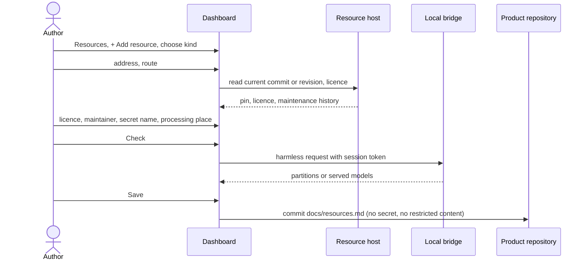

# UC-040 Declare the product's resources

**Goal.** The author writes down, beside the product's code, what the product is **built with and
runs on** — other repositories, data, models, compute and inference endpoints — each pinned to the
exact state the product uses, with its licence, its maintainer and how it is reached. The book's
reuse-oriented process starts from the question whether the thing already exists (ch. 6 §5); this
use case keeps the answer honest: reuse "buys dependencies", and a dependency that is not written
down cannot be checked, updated or handed over.

**Three things this use case keeps apart:**

| | **Resource** — declared here | **Requirement source** — UC-015 | **Participant** — UC-017 |
|---|---|---|---|
| relation to the product | the product or one of its jobs **uses** it | the product must **meet** its rules | it **develops** the product |
| examples | a private repository of DLLs; `meta-llama/Llama-3.1-8B` on Hugging Face at a fixed revision; the SLURM cluster *Alex* at NHR@FAU; a vLLM endpoint on `gpu01` that the product queries | EU AI Act, IEC 62304 class B | a colleague, Claude Code on the author's machine, a CI agent |
| fixed by | commit, revision, file hash, served model | edition, hash of the text | capabilities, processing place |
| file | product: `docs/resources.md` | product: `docs/sources.md` | instance: `docs/participants.md` |

**The instance has resources of its own, too** — the cluster or runner on which it runs its agents, an
endpoint its jobs use. They are declared the same way in `docs/resources.md` of the instance
repository. The two lists are independent: an entry in one has no effect on the other, and the
product's list never inherits from the instance's, so the product still says on its own what it is
built with and runs on.

The same local LLM endpoint can be both: a resource the product queries at runtime, and — as a
coding agent behind the bridge — a participant that works on the product. It is then two entries,
each complete on its own (`ONE SYSTEM IN TWO ROLES IS TWO ENTRIES`).

| Kind | Example | Pinned by | Reached through |
|---|---|---|---|
| **repository** | `https://gitlab.rrze.fau.de/lme/speech-dlls` (private, binaries) | commit | the browser, with the token of its server |
| **data** | a Hugging Face dataset, a folder on a group share | revision or SHA-256 of every file | the browser, or the job that downloads it |
| **model** | a Hugging Face model, a checkpoint file | revision or SHA-256 of every file | the browser, or the job that downloads it |
| **compute** | a SLURM cluster, a GPU workstation | — (open question: queue 2026-09-24g, rationale of entry 10, question 4) | the local bridge, or a self-hosted runner by label |
| **endpoint** | a local vLLM or Ollama server the product calls | identifier of the served model | the product itself at runtime; jobs through bridge or runner |
| **agent** | an agent service the product delegates to at runtime | identifier of the served model or version | as endpoint |

## Actors

- **Author** — decides what the product is built with and runs on.
- **Resource host** — the server that holds a resource: GitHub, a GitLab server, Hugging Face, an
  endpoint.
- **Local bridge** — reaches compute and local endpoints the browser cannot reach (UC-011).

## Precondition

- The product is managed by the instance (UC-001).
- For a private resource, the author has access to it on its host.
- For a compute resource or a local endpoint, the bridge runs on a machine that reaches it (UC-011),
  or a self-hosted runner with a known label is registered for the product repository.

## Main flow

1. In the product's view, the author opens **Resources**. Agent M shows the declared resources
   grouped by kind, each with its pin, licence, maintainer and route. A folded **What is this?**
   explains the three-way difference above with the examples.
2. The author chooses **+ Add resource** and picks the kind; each kind carries one sentence and an
   example.
3. The author pastes the address and Agent M fills in what it can read:
   - **repository:** Agent M reads the current commit with the stored token of that server and pins
     it; it shows the licence file if there is one, the date of the last commit and how many people
     committed in the last year — the due-diligence view of ch. 6 §5.
   - **data / model on Hugging Face:** Agent M reads the current revision and the licence from the
     Hub and pins the revision — where the Hub answers the browser, which is not yet measured (3b).
   - **compute:** the author names it (*Alex, NHR@FAU*), picks what it is (*SLURM cluster*, *GPU
     machine*) and the route: **local bridge** or **self-hosted runner** with its label (`gpu`).
   - **endpoint / agent:** the author enters the base address (`http://gpu01:8000/v1`) and the route
     by which jobs reach it; the identifier of the served model is recorded at the check in step 7.
4. The author confirms or enters the **licence** (for repository, data, model) and the
   **maintainer** (for repository, data, model, agent) — a person, a group, or *unknown*. For a
   licence that does not permit redistribution, Agent M states: "Only the address and the pin are
   written to the product repository; the content stays where it is."
5. If the resource needs a credential, the author says where it is held: as a **CI secret** — the
   author enters only its name (`HF_TOKEN`, `LOCAL_LLM_KEY`) — or as a **key in this browser**,
   stored in `localStorage` and sent only to that resource's server. The folded explanation repeats
   ch. 10's warning that a leaked key is like a published credit-card number.
6. For compute, endpoint and agent, the author states where data given to it is processed. Agent M
   presets *this machine* for a bridge on the author's machine and asks otherwise, with examples
   (*NHR@FAU, Erlangen*).
7. The author presses **Check**. Agent M reaches the resource by its route: a read on the host for a
   repository, data or model; through the bridge, with its session token, a harmless request — for a
   SLURM cluster the partition list, for an endpoint the list of served models — and shows what
   answered. For an endpoint or agent, the served identifier becomes its pin.
8. The author presses **Save** — one click. Agent M commits the entry to `docs/resources.md` of the
   product repository: name, kind, address, pin, licence, maintainer, route, processing place, name
   of the secret — never its value, never restricted content.
9. Later, when a job that needs the resource is started (UC-010, UC-011), Agent M offers only the
   runtimes and participants that reach it by its route, and names the pinned state in the job's
   inputs.

## Alternative flows

- **1a. The author removes a resource.** Agent M lists the jobs and tests that name it; they are
  listed, not changed, and the removal is committed on **Save**.
- **1b. The author declares a resource of the instance.** Settings → **Instance resources** runs the
  same steps 2–8 and commits to `docs/resources.md` of the instance repository; no product's list
  changes.
- **2a. The system also works on the product** — for example the local LLM endpoint is also used as
  a coding agent. The folded explanation says it is declared here as a resource and, separately, as
  a participant in UC-017; a link opens UC-017 with type and address prefilled. The two entries
  share no fields.
- **2b. What the author wants to record is a rule, not a thing used** — a norm, a guideline. A link
  opens UC-015.
- **2c. The resource is already declared by the instance.** Agent M offers **Copy from the instance**:
  the entry is copied into the product's list, where it is edited and saved like any other. The copy
  is not linked; a later change on either side leaves the other unchanged.
- **3a. A private repository is not readable with the stored token.** Agent M says so and shows how
  to add it to the token, as in UC-001 step A, with read access only; nothing is saved until the
  check succeeds or the author saves it unchecked.
- **3b. The Hub does not answer the browser.** The author pastes the revision from the Hub's *Files
  and versions* page; Agent M accepts only a full commit hash, not a branch name such as `main`.
- **3c. The model is gated or private.** Agent M asks for a Hugging Face token at step 5 and uses
  it only for requests to Hugging Face.
- **4a. The licence is unknown.** The resource is treated as restricted until someone records a
  licence.
- **4b. The licence or usage policy imposes rules on the product** — for example no commercial use.
  Agent M points out that the resource entry does not make this a requirement, and links UC-004 to
  register the licence as a source and UC-015 to link it (`A RESOURCE'S TERMS ENTER AS A SOURCE`).
- **4c. The maintainer is a single person.** Agent M shows *bus factor 1* beside the entry, with the
  folded explanation of the PEAKS example from ch. 6 §5; the entry is saved as entered.
- **7a. The bridge does not answer.** Agent M names the reason — not running, wrong address, token
  missing — and saves nothing until the author decides to save unchecked.
- **7b. The route is a self-hosted runner.** The browser cannot reach it; Agent M offers a check job
  on that runner label through the product's workflow and shows its result on the dashboard.
- **7c. The endpoint serves a different model than the one pinned earlier.** Agent M shows both
  identifiers; the pin changes only if the author chooses **Move**.
- **9a. A newer state exists upstream** — a newer commit, revision or served model. The dashboard
  shows it beside the pin with the jobs that use the resource; the pin changes only when the author
  presses **Move** — one click — which commits the new pin to `docs/resources.md`.
- **9b. No runtime reaches the resource.** The job is not offered; Agent M names the resource and
  the missing route (for example "no self-hosted runner with label `gpu`").

## Postcondition

- `docs/resources.md` of the product repository names every resource the product is built with,
  tested on or calls at runtime, each with kind, pin (where the kind has one), licence, maintainer,
  route and processing place as its kind requires.
- The instance's own resources, if any, are in `docs/resources.md` of the instance repository; the
  two lists do not depend on each other.
- No credential and no restricted content is in the product repository.
- Jobs that need a resource run only where it is reachable, against the pinned state.
- Rules a resource imposes are requirements only through a source (UC-015); systems that develop the
  product are participants (UC-017).
