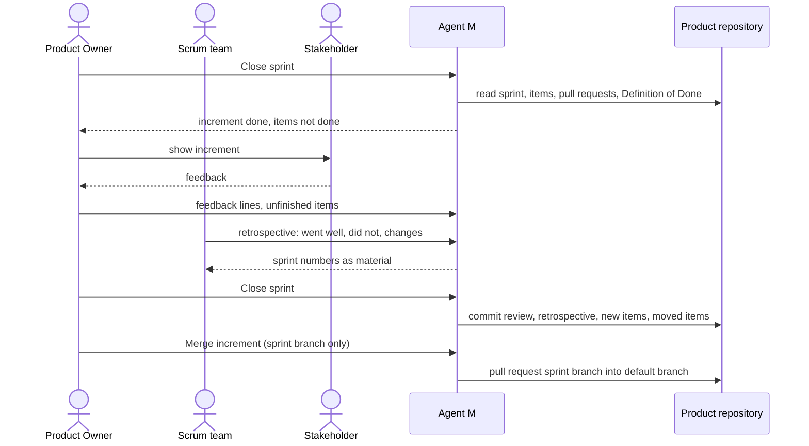

# UC-041 Close a sprint with review and retrospective

**Goal.** At the end of a sprint, the team inspects what it actually delivered and how it worked, and
both results are written down: the review of the increment turns feedback into backlog items, the
retrospective into changes to the way the team — people and agents — works. This is the end of the
book's Scrum loop (ch. 7 §5): "the review checks what was actually achieved, and the retrospective
reflects on how the team itself should improve before the next cycle begins." Without it, Agent M
would run sprint after sprint of jobs with no inspection and no adaptation.

| Event | Question | Result, written to the product repository |
|---|---|---|
| **Sprint review** | what did we deliver, and what do users and stakeholders say about it? | the review record; feedback as new backlog items (UC-032) |
| **Retrospective** | how should we work differently in the next sprint? | the retrospective record; changes to the model (UC-031), the Definition of Done (UC-002) or the agents' instructions |

## Actors

- **Product Owner** — leads the review, decides what happens with unfinished items and, if the sprint
  has a branch of its own, whether its increment is merged into the default branch.
- **Scrum team** — the Developers (people and agents) and the Scrum Master, who keeps both events
  happening and their results precise; the Scrum Master approves nothing.
- **Stakeholder** — anyone the Product Owner invites to the review; needs no write access.
- **Product repository** — holds the sprint selection, the items, the pull requests and the records.

## Precondition

- The product's model works in time boxes, and a sprint is running (UC-032, step 6).

## Main flow

1. On the day the sprint ends, the process dashboard (UC-035) shows **Close sprint** for it. The
   Product Owner opens it.
2. **Review of the increment.** Agent M shows, derived from the repository:
   - the sprint goal and the selected items;
   - the items that are done — merged, with their Definition of Done met — each with its pull request,
     the requirements it realises and the tests that guard them;
   - the items not done, each with its state and reason (UC-034).

   The increment is the set of done items; a folded **What is this?** says that an item that does not
   meet the Definition of Done is not part of it, however close it is.
3. The Product Owner walks the stakeholders through the increment — on a call, in a room, or by
   sending them the dashboard link. Their feedback is entered in the review: one line per point,
   each either *new backlog item*, *change to an existing item*, or *noted*.
4. For each unfinished item, the Product Owner chooses **back to the backlog** or **into the next
   sprint**.
5. **Retrospective.** The team writes what went well, what did not, and what it will change. For each
   change, the entry names where it goes: the process model (UC-031), the product's Definition of Done
   (UC-002, step 8), a participant's instructions or configuration (UC-017), or *team agreement* only.
   Agent M offers, as material, the numbers of the sprint: jobs failed or retried, time items waited
   for a person, flaky tests, cost where known — derived, not typed.
6. The Product Owner presses **Close sprint** — one click. Agent M commits, as the Product Owner's own
   input, the review and the retrospective as one Markdown file under `docs/backlog/sprints/`, the new
   backlog items from the feedback, and the moved items.
7. If the sprint has a branch of its own, the panel then offers **Merge increment** — the Product
   Owner's release decision (`A PHASE OR A TIME BOX MAY HAVE A BRANCH OF ITS OWN`). It merges the
   sprint branch into the default branch, one click, through a pull request whose CI must be green.

## Alternative flows

- **2a. No item is done.** The review still happens and is recorded; the increment is empty, and the
  review says so. The retrospective is where the reason belongs.
- **3a. There are no stakeholders this time.** The review is held by the team and the Product Owner;
  the record says that no stakeholder took part.
- **5a. A retrospective change concerns the process model.** The entry links to UC-031; the model is
  changed there, with its validation, and applies from the next sprint (UC-002).
- **5b. A retrospective change concerns an agent's instructions.** The entry names the participant and
  the change; it takes effect only when its definition is changed (UC-017).
- **6a. The Product Owner closes the sprint without a retrospective.** Not possible: **Close sprint**
  stays disabled until the retrospective has at least one entry, and says why.
- **7a. CI on the merge of the sprint branch is red.** The increment is not merged; the dashboard shows
  the failing tests (UC-028). The Product Owner decides whether the next sprint repairs it first.
- **7b. The Product Owner does not merge the increment now.** The sprint branch stays; the next sprint
  may continue on it or start a new one from the default branch.

## Postcondition

- The product repository holds, for the sprint, one record with the review of its increment and the
  retrospective; feedback is in the backlog as items that name what they realise.
- Every selected item is either done, back in the backlog, or selected for the next sprint.
- With a sprint branch, the increment is in the default branch only if the Product Owner merged it.
