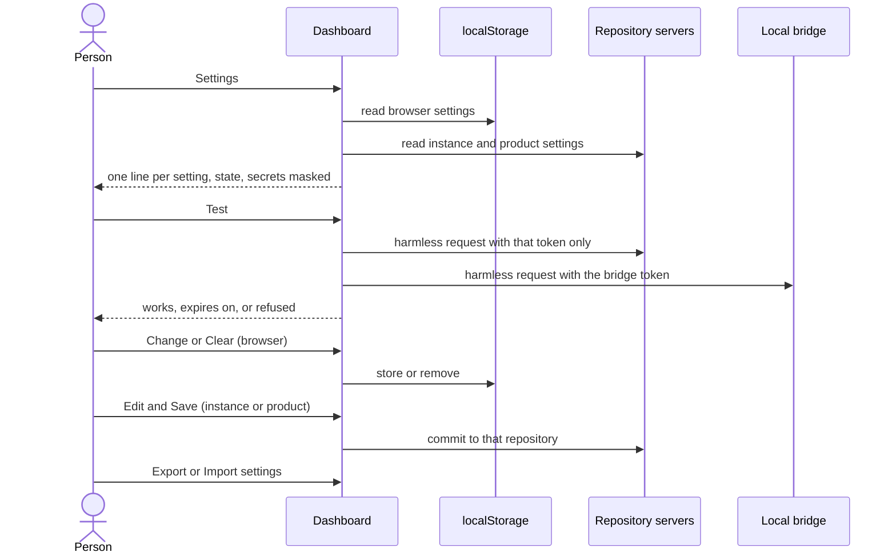

# UC-042 Manage settings in one place

**Goal.** The person sees every setting Agent M uses on one page — what is stored in this browser,
what the instance and each product keep in their repositories — checks whether it still works,
changes it, or removes it, without hunting through the use cases in which it was first set up.

| Kept in | Settings | First set up in |
|---|---|---|
| **this browser** | GitHub token; GitLab project token per product; model endpoints with their keys; bridge address and token; mailbox connection — route, app client ID and sign-in token, or servers and password — with its folders and allowed processing places; mails marked *not an issue* (identifiers only); list of products | UC-014, UC-001, UC-003, UC-011, UC-037, UC-038 |
| **the instance repository** | participants; source library; process models; the instance's resources | UC-017, UC-004, UC-031, UC-040 |
| **each product's repository** | process model and roles; Definition of Done; test schedule; linked sources; resources; **pseudonymisation**; **collaborators** who agreed to be named | UC-002, UC-027, UC-015, UC-040, this use case |

Browser settings belong to this person on this computer; repository settings bind everyone who works
on the instance or product, so they are changed by a commit.

## Actors

- **Person** — the single user of the instance.
- **Repository servers** — GitHub and GitLab; they answer the tests of tokens and receive commits.
- **Local bridge** — answers the tests of the bridge and the mailbox.

## Precondition

- The person has opened their instance's dashboard.

## Main flow

1. The person opens **Settings** — the gear at the top of every dashboard page. The page has three
   sections, as in the table above; each setting is one line with its state:
   - ✓ *works* — with the date of the last successful test;
   - ⚠ *expires on …* — from fourteen days before a token's recorded expiry;
   - ✗ *refused* — the server or the bridge refused it at the last use;
   - — *not set*.

   Secrets are shown masked, with their last four characters only.
2. **This browser.** Each line has **Test**, **Change** and **Clear**:
   - *Test* sends one harmless request — to the token's own server, the endpoint, the bridge — and
     shows the answer;
   - *Change* opens the same fields and the same notice as the use case that set it up, in place;
     storing a token asks for its expiry date, preset to the 90 days of the prefilled link;
   - *Clear* removes it from `localStorage`, after one confirmation, and says what no longer works
     without it.
3. **Instance** and **product** sections show each setting as a short summary with **Edit**, which
   opens the owning use case's form in place. Saving is one click and commits to that repository under
   the person's account.
4. **Pseudonymisation** (per product) shows *on* — the default — or *off*. Switching it off shows, before
   saving: report data from mails will then enter this product's issues and repository unchanged; this
   is advisable only on a protected, non-public data space; and, when the server reports the repository
   as public, that the data will be published. The person ticks *I have read this* and presses **Save**;
   the setting is committed to the product's `docs/settings.md`.
5. **Collaborators** (per product) lists the people who agreed to be named in the repository, each with
   name, account and the date they agreed. **+ Collaborator** takes the three and a tick *this person
   has agreed to be named*; **Save** commits `docs/collaborators.md`.
6. At the bottom, **Export settings** saves a file with every browser setting except tokens, keys and
   passwords; **Import settings** reads such a file; **Clear everything in this browser** removes all of
   Agent M's entries from `localStorage`.

Every section and every line carries a folded **What is this?**: what the setting is for, where it is
kept, who can read it there — for the browser, every Pages site of the same owner (`THE SHARED PAGES
ORIGIN IS DISCLOSED`).

## Alternative flows

- **1a. A token expires within fourteen days.** Every dashboard page shows a line *Your GitHub token
  expires on …* with **Renew**; it opens GitHub's page of that token, where *Regenerate token* keeps its
  permissions and repositories, and the paste field for the new value.
- **1b. A server refused a token.** The line says which token, and **Renew** as in 1a; for a GitLab
  project token, the project's *Access tokens* page.
- **2a. The person clears the bridge token.** Mail on the IMAP route, local agents and compute
  resources stop working in this browser; the page says so before clearing. Pairing anew is UC-011, 1b.
- **2b. The person clears the mailbox connection.** As UC-037, 8a; issues and their mail identifiers are
  not touched.
- **4a. The person switches pseudonymisation back on.** Saved without a notice. Data already written
  while it was off stays in the repository's history; the page says so, and that removing it needs a
  rewrite of that history.
- **5a. A collaborator withdraws their agreement.** **Remove** takes them off the list with one click and
  lists the files on the default branch that still name them, for the person to change; the page says
  that earlier commits keep the name in the history.
- **6a. The imported file names products or endpoints this browser already has.** They are kept;
  only what is missing is added, and the page lists both.
- **3a. The person has no token that can write to the product.** The product section is read-only and
  links to the token step of UC-001.

## Postcondition

- The person has seen every setting Agent M uses, where it is kept, and whether it works.
- Browser settings changed or cleared here are changed or cleared in `localStorage` itself; repository
  settings changed here are commits under the person's account.
- No secret was shown in full, written to a repository, or put into an exported file.
