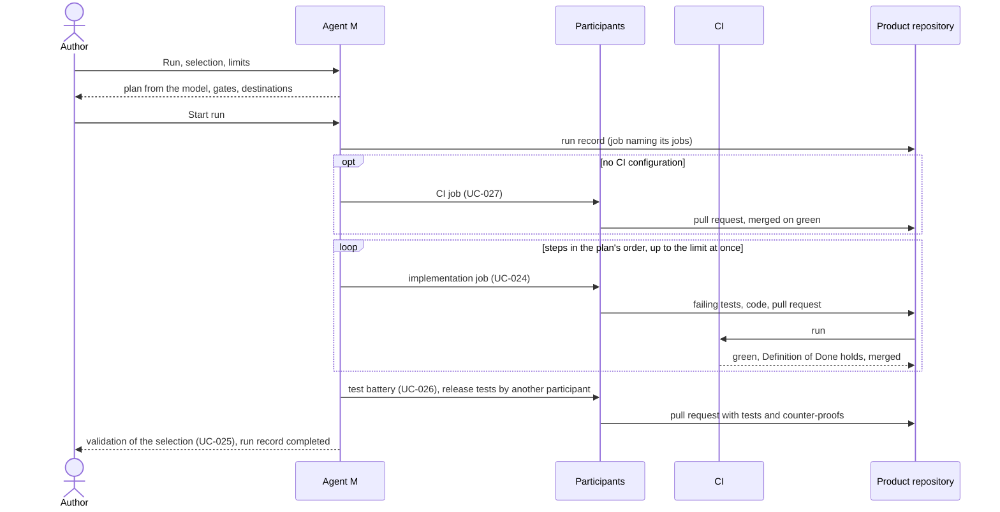

# UC-043 Run the process over a selection

**Goal.** The author selects what to build — steps of the implementation plan in a model that plans its
work (UC-045), backlog items in Scrum or Kanban (UC-032) — and starts one **run**. Agent M carries it out
the way the product's process model (UC-002, UC-031) prescribes: the CI configuration if it is missing, the
steps in the plan's order or the items after those they build on, the test battery, and at the end the validation of
what was built. The author is asked only where the model puts a gate that a person decides, or when a limit
fixed at the start is reached. For a critical step, the single parts remain: UC-024, UC-026 and UC-027 can
each be started on their own.

| Part of the run | What it does | On its own |
|---|---|---|
| CI | generates the CI configuration from the test schedule, if the product has none | UC-027 |
| Implementation | one job per step of the implementation plan, in its order — the modules, then each subsystem's integration, then the system; independent steps side by side | UC-024 |
| Tests | the test battery for the selected modules at every level of the schedule; release tests by a participant other than the implementer | UC-026 |
| Validation | what each module realises, its code and tests, and every gap | UC-025 |

The model decides the details: in a V-model, the Testing phase runs after Implementation and its gate may
belong to a person; in Scrum or Kanban, the selection is the ready backlog items of the sprint or under the
work-in-progress limit (UC-034), and each item's job includes its tests.

## Actors

- **Author** — selects, sets the limits, starts the run, decides where a gate names a person.
- **Participants of the product's roles** — the agents and people assigned in UC-048; each job goes to a
  holder of its role.
- **CI** — the product's continuous integration, which runs the tests of every push.
- **Product repository** — holds architecture, code, tests, job records.

## Precondition

- The product declares a process model (UC-002), and its roles are filled (UC-048).
- The architecture is accepted (UC-022, UC-023).
- The product has an implementation plan (UC-045), or, in Scrum or Kanban, a planned and filled backlog (UC-032).

## Main flow

1. The author opens **Run** for the product. Agent M lists the steps of the implementation plan, each with
   its derived state — waiting, ready, in progress, done —, preselects those not done, and shows their order
   and what each waits for as a Mermaid diagram.
2. The author keeps the selection, narrows it — down to one step — or selects all.
3. Agent M shows the plan from the model: the parts of the run in their order, the jobs they consist of,
   the participant of each role that will do them, every gate on the way and who decides it, and what is
   sent where.
4. The author sets or confirms the **limits**: jobs at once (preset to the model's work-in-progress limit,
   or 3), the cost limit (counted only from costs the runtimes report), and the correction rounds per
   draft (preset 5). A folded **What is this?** explains each.
5. The author presses **Start run** — one click. Agent M writes the run's job record, naming the
   selection and the limits, and starts the first jobs.
6. The run proceeds by itself:
   1. **CI** — if the product has no CI configuration, the job of UC-027 generates it from the schedule
      (the book's default where none is declared) and its pull request is merged once green;
   2. **Implementation** — one job per step (UC-024), each starting as soon as the steps it waits for are
      done, and a phase's steps once the gate before it is recorded; up to the limit of jobs at once;
   3. **Tests** — the job of UC-026 for the selection, at every level the schedule names; release tests
      go to a participant other than the one who implemented;
   4. **Validation** — UC-025 for the selection.

   Every job merges its pull request once the Definition of Done holds, writes its own record naming the
   run, and goes through the correction loop where it drafts.
7. The job dashboard (UC-036) and the process dashboard (UC-035) show the run: its jobs, their states,
   what waits, the cost so far. No click is needed between jobs.
8. The run ends. Agent M shows the validation of the selection — what each module realises, its code, its
   tests, every gap — beside the run's jobs and their pull requests, and completes the run's record.

## Alternative flows

- **1a. The product works from a backlog (Scrum, Kanban).** The selection is backlog items, not modules:
  in Scrum, the ready items of the current sprint of the author's team, each team starting runs of its own; in Kanban,
  as many as the work-in-progress limit allows. Each item's job
  is that of UC-034, including its tests; the rest of this use case applies unchanged.
- **1b. A selected step's module file or decision is not accepted.** It cannot be selected; Agent M names
  what is open and links to UC-022 or UC-023.
- **3a. The interfaces form a cycle.** The run cannot start; Agent M names the modules of the cycle and
  links to UC-023 to change the architecture.
- **3b. No participant holds a role the plan needs.** Agent M names the role and the missing capability
  and links to UC-017 and UC-002; nothing starts.
- **6a. A job reaches a gate its model gives to a person** — a security review, a documented verification
  required by IEC 62304. The run waits there; the jobs that do not depend on it go on. The gate appears on
  the job dashboard with what it checks; the person decides with one click (UC-036), and the run continues.
- **6b. A job fails** — CI stays red after the fix cycle, a participant does not answer. The job ends as
  *failed*; the jobs that depend on it do not start; the others go on. At the end, the failed job and
  everything it blocked are listed first, each with **Retry**.
- **6c. A limit is reached** — cost, or rounds. The run starts no further job, lets the running ones
  finish, and says which limit stopped it. The author may raise the limit and **Continue**, which starts
  the remaining jobs under the same run.
- **6d. The author stops the run.** **Stop run** — one click — cancels every running job
  (`A CANCELLED JOB WRITES NOTHING MORE`) and starts no further one; what was merged stays.
- **1c. The author wants only one part for one step** — for example a critical module implemented and
  reviewed by hand. They start UC-024, UC-026 or UC-027 on its own; no run is created.
- **1d. The product has no implementation plan, or no ready backlog item.** Agent M links to UC-045 or
  UC-032; nothing starts.

## Postcondition

- Every selected step or item has code and tests merged through pull requests whose Definition of Done
  held, or is listed with the job that failed or the gate that waits.
- The run's record names the selection, the limits, every job it started and the end state; each job's
  record names the run.
- The author clicked to start, and wherever the model gave a gate to a person — nowhere else.
