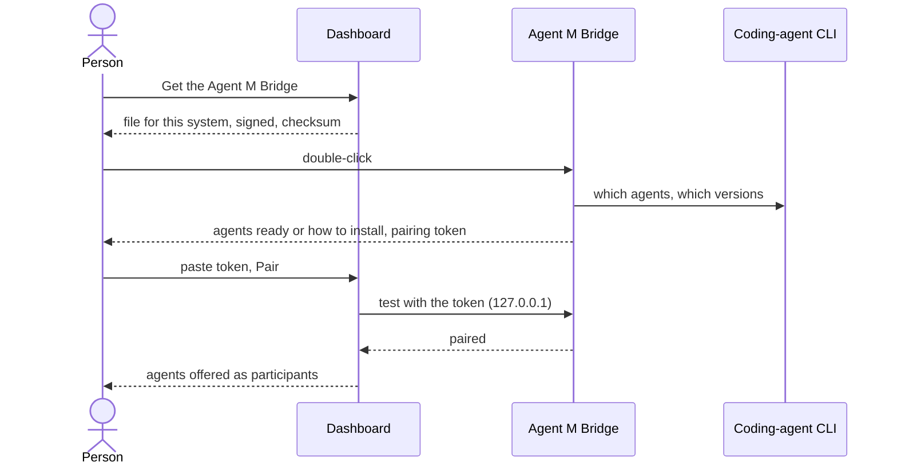

# UC-044 Install and pair the Agent M Bridge

**Goal.** A person who is not a programmer gets Agent M's second level running on a computer: coding agents
on that computer with their own login, IMAP mailboxes, and machines behind NAT — by downloading one file,
double-clicking it, and copying one token. Nobody types a command.

| | **Level 1 — nothing installed** | **Level 2 — the Agent M Bridge** |
|---|---|---|
| where jobs run | in the browser, and in GitHub Actions or GitLab CI on the server's machines | also on this computer, and on machines reached through it |
| the coding agent logs in with | an API key stored as a CI secret, billed per call | the agent's own login on this computer — the person's subscription |
| mail | Microsoft 365 and Gmail | also any IMAP/SMTP server |
| needs | nothing | this app, and the agent's command-line version (Claude Code, Codex or opencode) |

## Actors

- **Person** — the single user of the instance; may never have used a terminal.
- **Agent M Bridge** — the app: one signed file per platform, with an icon in the menu bar or tray.
- **Coding-agent CLI** — Claude Code, Codex or opencode, installed on the same computer.
- **Jump host** — a host the person can reach by SSH, when a machine behind NAT is to be reached.

## Precondition

- The person has their instance's dashboard (UC-014).

## Main flow

1. On the dashboard, the person opens **Settings → This computer → Get the Agent M Bridge**. The page
   explains the two levels with the table above, recognises the operating system, and offers the one file
   for it, signed by the publisher of the release, with its size and checksum.
2. The person downloads the file and double-clicks it. The system shows the publisher's name, not a
   warning, because the file is signed (and, on macOS, notarised). The bridge starts; its icon appears in
   the menu bar or tray, and its window opens.
3. **Agents.** The window lists the supported coding agents: for each installed one its version and *ready*;
   for each missing one **How to install**, which opens the vendor's instructions for this system, and
   **Check again**. A folded explanation says that the agent will use its own login on this computer, so no
   key is needed and the person's subscription pays.
4. **Pairing.** The window shows the bridge's pairing token with **Copy**. The person pastes it on the
   dashboard's settings page, under the shared-origin notice, and presses **Pair** — one click. The dashboard
   stores address and token (UC-042) and tests the bridge; the bridge's window shows *paired with
   `<owner>.github.io`*.
5. The bridge now appears as a place where participants run (UC-017): each ready agent can be added as a
   CLI agent in one click, with *this computer* as its processing place.

## Alternative flows

- **3a. No supported agent is installed.** The window shows the install instructions of each; the bridge is
  still useful for mail and tunnels. After installing one, **Check again** lists it.
- **3b. An agent is installed but not logged in.** The bridge says so and shows the agent's own login step;
  it never asks for the password itself.
- **4a. The person pairs from another browser.** They copy the token again from the bridge's window, or
  import the dashboard's settings export (UC-042), which contains it.
- **4b. The token may have leaked.** **Pair anew** in the bridge's window makes a new token; the old one is
  refused from then on; the person pastes the new one once.
- **6a. This computer is behind NAT and is to be reached from elsewhere** (a lab machine, a GPU box).
  1. In the bridge's window the person enters the jump host — hostname, SSH user —, or imports the
     dashboard's settings export that names it and this session's port.
  2. On first use the bridge creates its own SSH key and shows the public key with **Copy** and the one
     sentence of what to do with it: add it to `~/.ssh/authorized_keys` of that user on the jump host, or
     hand it to whoever administers the jump host.
  3. The bridge opens the reverse tunnel itself, bound to the jump host's loopback, and keeps it open,
     reconnecting after sleep or network changes; the window shows *tunnel open* or the reason it is not.
  4. On the person's own computer, a bridge there opens the matching forward the same way; without a bridge
     there, the dashboard's two commands (UC-011, 1c) remain.
- **7a. A newer release exists.** The bridge shows it with its release notes; **Update** installs it only
  after the click, and only if its signature is valid.
- **7b. The person quits the bridge.** Jobs running there end as *cancelled*; the dashboard shows the bridge
  as not reachable, and level-1 jobs go on.

## Postcondition

- The bridge runs as an app on this computer, paired with the person's dashboard; nothing was typed in a
  terminal.
- Its installed agents are available as participants and use their own login; no key passed through
  Agent M.
- If configured, its tunnel to the jump host is open and ends on the jump host's loopback; its private SSH key
  never left this computer.
