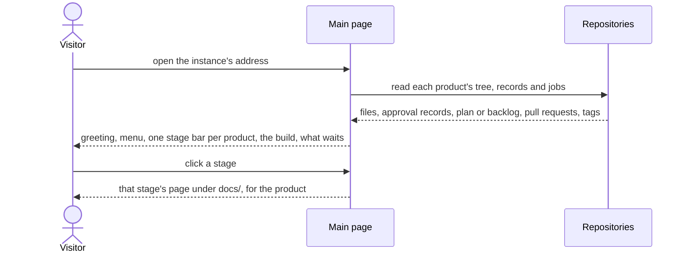

# UC-046 See what goes on in the instance

**Goal.** Whoever opens the instance's address sees at a glance where each product stands on its way through the
requirements-driven process — and, while the instance has no product yet, where Agent M itself stands on its way to its
first release. The page is welcoming and simple, wears the look of the Pattern Recognition Lab, and leads from each stage
to the pages where its work is reviewed and done.

| Stage | Its share of done work |
|---|---|
| Requirements | the share of the product's SPEC change entries that are decided; full when the SPEC holds requirements and no change is open |
| Use cases | the share of the use cases that are accepted |
| Architecture | the share of the architecture's files that are accepted |
| Implementation | the share of the steps of the implementation plan (UC-045), or of the backlog items (UC-032), that are done |
| Tests | the share of the requirements that a passing test guards on the default branch |
| Release | full once the first release is tagged |

## Actors

- **Visitor** — anyone who opens the instance's site, with or without a token; for example a reader of the book.
- **Author** — runs the instance and acts on what the page shows.

## Precondition

- The instance's site is served from the root of its repository (UC-014).

## Main flow

1. The visitor opens the instance's address. The main page greets them: the logo of the Pattern Recognition Lab, Agent M's
   name, one sentence on what Agent M is — requirements-driven software engineering with people and agents —, and what to
   do first, with a folded **What is this?** for people new to it.
2. The menu leads through the process in its order — **Requirements**, **Use cases**, **Architecture**, **Implementation**,
   **Tests**, **Releases** —, followed by **Maintenance** — issues and mail — and **Settings**. Every page of the site
   carries the same menu; each entry opens the page under `docs/` where that stage's work is reviewed and done, for the
   product chosen.
3. Below the greeting, one card per product this browser manages (UC-001): its name, its process model, and its progress
   as one bar of the six stages of the table above, each filled by its share; the stage the product is in is marked, and a
   click on a stage opens that stage's page for the product. Every share is derived when the page is shown, from the
   product's repository and its records; none is stored.
4. **The build.** For a product in implementation, the card shows the steps of its implementation plan or its backlog items
   in progress, each with the job working on it — its participant, its state and its elapsed time (UC-036) —, and keeps
   them current while the page is open; a step or an item moves on to *done* when its pull request is merged.
5. Below the products, Agent M lists what waits for a person across the instance: open use cases, open SPEC changes, gates
   waiting for a decision, and failed jobs, each linked to the page where it is decided.

## Alternative flows

- **3a. The instance manages no product** — a new instance, or a visitor's browser without products. The main page shows
  Agent M's own progress in the same bar of six stages, derived from Agent M's repository; the bar is full once Agent M's
  first release is tagged. Beside it stands **+ Add product** (UC-001).
- **3b. A product's repository cannot be read** — a private repository without a stored token, or a server that does not
  answer. Its card says which, and links to the token's setting (UC-042); the other cards are shown.
- **3c. A product has not declared its process model yet.** Its implementation stage says that the process is configured
  when implementation starts (UC-024, step 1).
- **4a. A job's runtime cannot be reached** — for example the bridge of another machine. The card says that jobs running
  there are not shown (UC-036).

## Postcondition

- Nothing was written; everything shown was derived at the moment it was shown.
- The visitor has seen each product's progress by stage — or Agent M's own —, the build in progress, and what waits for a
  person.
