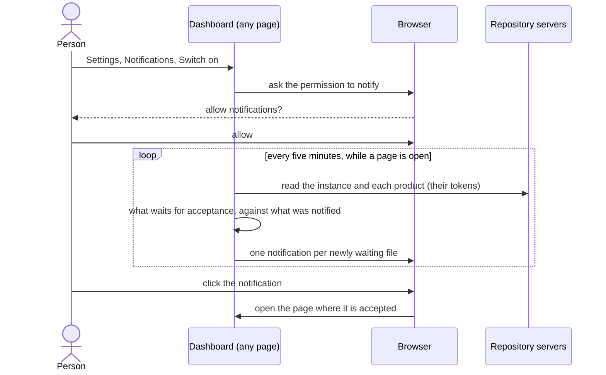

# UC-047 Be told what waits for your acceptance

**Goal.** The person learns that a SPEC change, a use case, an architecture file or a release test report waits for their
acceptance as soon as it does, without looking for it — and one click takes them to where they accept it.

## Actors

- **Person** — the single user of the instance, who accepts what its participants draft.
- **Browser** — shows the notifications, once the person has allowed it to.
- **Repository servers** — GitHub and GitLab; they answer the checks of the instance and its products.

## Precondition

- The person has their instance's dashboard, with its token stored in this browser (UC-014).

## Main flow

1. On the settings page, in the section *this browser* (UC-042), the line **Notifications** says *off*. The person presses
   **Switch on**. The browser asks its own question — allow notifications from this site? —, and the person allows them. The
   line says *on*, with **Test**, which shows a notification at once, and **Switch off**.
2. While a page of the dashboard is open in this browser — in front or in the background —, the dashboard checks every five
   minutes what waits for the person's acceptance in the instance and in each product this browser keeps: open SPEC change
   entries, open use cases, open architecture files — decisions and modules —, and open release test reports. It derives them
   as the main page derives what waits (UC-046, step 5), from the files and the approval records, and with the token of each.
3. For each of them that has come to wait since the last check, the browser shows a notification that names it and where it
   is — *UC-047 waits for your acceptance · akmaier/agent-m* —; a click on it opens the page where it is accepted. When more
   than three come at once, one notification names their number and opens the main page's list of what waits.
4. What was notified is kept in this browser, by file and text: nothing is notified twice while it waits; a file changed
   again comes to wait anew.

The line carries a folded **What is this?**: what is checked and how often, that the checks go to the repository servers
with the tokens of this browser and nowhere else, and that nothing is checked while no page of the dashboard is open.

## Alternative flows

- **1a. The person, or the browser, refuses.** The line says that notifications are blocked for this site, and where the
  browser's own site settings allow them; nothing is notified.
- **1b. On an iPhone or an iPad.** Safari shows notifications only for a site added to the Home Screen; the line says so and
  how to add it, and *Switch on* works from the dashboard opened there.
- **2a. No page of the dashboard is open.** Nothing is checked and nothing is notified: Agent M runs no server that could. At
  the next check after a page is opened, what came to wait meanwhile is notified as in step 3.
- **2b. The browser pauses a page in the background** to save power, as some do; the check runs when it runs the page again.
- **2c. A server's request limit is used up, or a server cannot be reached.** That check skips it and the next one tries
  again; nothing is notified for it in between.
- **4a. The person switches notifications off.** The checks stop at once. The browser keeps its permission until the person
  takes it back in the browser's settings; the line says so.

## Postcondition

- While a page of the dashboard was open, the person was notified once of everything that came to wait for their acceptance,
  each with a link to where they accept it.
- Nothing was written to any repository and no server of Agent M's own was used; the notifications were shown by this browser.
