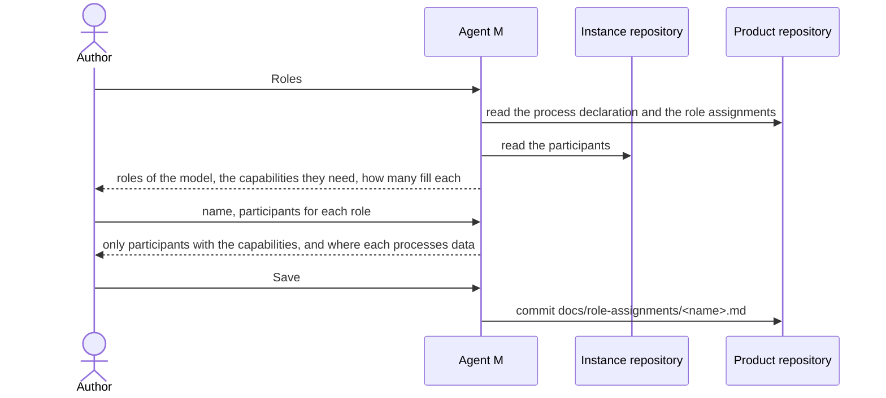

# UC-048 Fill the roles

**Goal.** The author decides who does the product's work. The process (UC-002) names roles and no one; a role assignment
fills them with participants, and does nothing else. In every model a role is filled by one participant, or by as many as
the work needs where the model lets several fill it — the developers, testers and reviewers of Kanban and the V-model, the
Developers of a Scrum team. A product has one role assignment; in a model that works in sprints, one for each of its
teams, which work in parallel (UC-032).

| What | Configured in | Use case |
|---|---|---|
| who exists — people and agents | the instance: `docs/participants.md` | UC-017 |
| how the product is developed — model, practices, branches, Definition of Done | the product: its process declaration | UC-002 |
| who fills which role of that process | the product: `docs/role-assignments/<name>.md` — one, or one per team | this use case |

## Actors

- **Author** — fills the roles of the product's process.
- **Product repository** — holds the process declaration and the role assignments.

## Precondition

- The product declares its process model (UC-002).
- The instance lists its participants (UC-017).

## Main flow

1. The author opens **Roles** for the product. Agent M shows the roles of the product's process model; for each, whether a
   person, an agent or either may fill it, which capabilities it needs, and whether one participant fills it or several may
   (UC-002, step 4).
2. The author names the role assignment — in a model that works in sprints, the team, for example `team1`.
3. The author assigns participants from the instance's list (UC-017) to each role: people, model endpoints, CI agents,
   CLI agents or sandboxed agents — one to a role that one fills, as many as the work needs to a role that several may
   fill. Agent M offers only participants that have every capability the role needs, and shows for each where it
   processes data.
4. The author presses **Save** — one click. Agent M commits `docs/role-assignments/<name>.md` to the product repository:
   for each role of the model, its participants by name, and nothing of the process. From now on, the product's jobs go to
   these holders of their roles, and its gates are decided by them (UC-034).

Every step carries a folded **What is this?**: what a role is and why it is filled apart from the process, why Scrum has
teams and Kanban and the V-model do not, and pointers to book ch. 6 and ch. 7.

## Alternative flows

- **2a. The model works in sprints, and the product has a team.** The author chooses **+ Team**, names the new team and
  fills its roles as in step 3, in a role assignment of its own; a participant may hold roles in several teams. Each team
  plans and closes sprints of its own (UC-032, UC-041).
- **2b. The model works without sprints, and the product has its role assignment.** **+ Team** is not offered; the author
  changes the one role assignment, adding or removing developers, testers or reviewers as the work needs (4a).
- **3a. A role that needs a person has none.** *Save* stays disabled, and the role is named.
- **3b. No participant has the capabilities a role needs** — for example only a model endpoint is configured, and
  *Developers* must run tests. Agent M names the missing capability and links to UC-017 to add a participant that has
  it.
- **3c. An assigned participant processes data where a linked source does not permit it.** Agent M says which source and
  which role; the assignment stays possible, and that source's content is never given to that participant.
- **3d. The author gives a role that one participant fills a second one.** Agent M says that the model lets one fill it,
  and saves nothing.
- **4a. The author changes a role assignment.** They open it, change who fills which role and press **Save**; Agent M
  commits the file. Jobs already running keep their participant.
- **4b. The author removes a team.** While one of its sprints holds items (UC-032), the team cannot be removed, and Agent M
  names them; otherwise Agent M removes its role assignment.

## Postcondition

- The product repository holds its role assignment under `docs/role-assignments/` — one, or one per team in a model that
  works in sprints —, each assigning participants of the instance's list to the roles of the product's process, and
  nothing else.
- The process declaration names no participant, and `docs/participants.md` holds every participant once.
