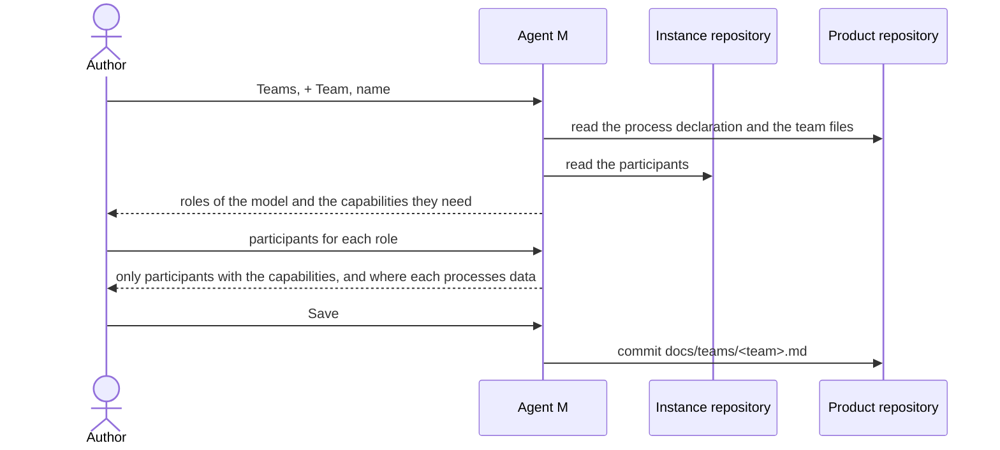

# UC-048 Set up a team

**Goal.** The author decides who does the product's work: a team, whose members hold the roles of the product's
process model. The process (UC-002) says how the product is developed and names no one; a team says who, and nothing
else. A product has one team or — in a model with sprints — several that work in parallel (UC-032). Each team is a file
of its own, so that adding or changing a team changes neither the process nor another team.

| What | Configured in | Use case |
|---|---|---|
| who exists — people and agents | the instance: `docs/participants.md` | UC-017 |
| how the product is developed — model, practices, branches, Definition of Done | the product: its process declaration | UC-002 |
| who holds which role of that process | the product: `docs/teams/<team>.md`, one per team | this use case |

## Actors

- **Author** — sets up the product's teams.
- **Product repository** — holds the process declaration and the team files.

## Precondition

- The product declares its process model (UC-002).
- The instance lists its participants (UC-017).

## Main flow

1. The author opens **Teams** for the product. Agent M lists its teams, each with who holds which role.
2. The author chooses **+ Team** and names the team, for example `team1`.
3. Agent M shows the roles of the product's process model; for each, whether a person, an agent or either may fill it,
   and which capabilities it needs (UC-002, step 4).
4. The author assigns participants from the instance's list (UC-017) to each role: people, model endpoints, CI agents,
   CLI agents or sandboxed agents — several to one role where the role allows it. Agent M offers only participants that
   have every capability the role needs, and shows for each where it processes data. A participant may hold roles in
   several teams.
5. The author presses **Save** — one click. Agent M commits `docs/teams/<team>.md` to the product repository: for each
   role of the model, its holders by name, and nothing of the process. From now on, the team's jobs go to its holders
   of their roles, and its gates are decided by them (UC-034); in a model with sprints, it plans and closes sprints of
   its own (UC-032, UC-041).

Every step carries a folded **What is this?**: what a team is, why it is kept apart from the process and from the list
of participants, and a pointer to book ch. 7 §5.

## Alternative flows

- **2a. The product's model works without sprints, and the product has a team.** **+ Team** is not offered; Agent M
  says that several teams need a model with sprints (UC-002).
- **4a. A role that needs a person has none.** *Save* stays disabled, and the role is named.
- **4b. No participant has the capabilities a role needs** — for example only a model endpoint is configured, and
  *Developers* must run tests. Agent M names the missing capability and links to UC-017 to add a participant that has
  it.
- **4c. An assigned participant processes data where a linked source does not permit it.** Agent M says which source and
  which role; the assignment stays possible, and that source's content is never given to that participant.
- **5a. The author changes a team.** They open it, change who holds which role and press **Save**; Agent M commits the
  team's file. Jobs already running keep their participant.
- **5b. The author removes a team.** While one of its sprints holds items (UC-032), the team cannot be removed, and
  Agent M names them; otherwise Agent M removes the team's file.

## Postcondition

- The product repository holds one file per team under `docs/teams/`, each assigning the roles of the product's process
  model to participants of the instance's list, and nothing else.
- The process declaration names no participant, and `docs/participants.md` holds every participant once.
