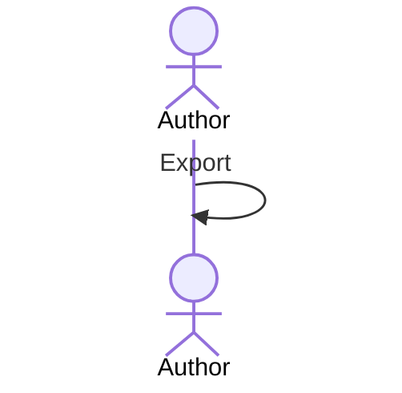

# UC-001 Export the list

## Actors

- **Author** — exports the list.

## Precondition

- The list exists.

## Main flow

1. The author presses **Export**.

## Alternative flows

- **1a. The list is empty.** Nothing is exported.

## Postcondition

- The file exists.
