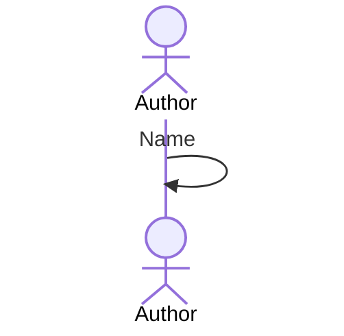

# UC-002 Name the export

## Actors

- **Author** — names the export.

## Precondition

- An export is about to be written.

## Main flow

1. The author types a name.

## Alternative flows

- **1a. The name is empty.** The export is not written.

## Postcondition

- The export carries the name.
