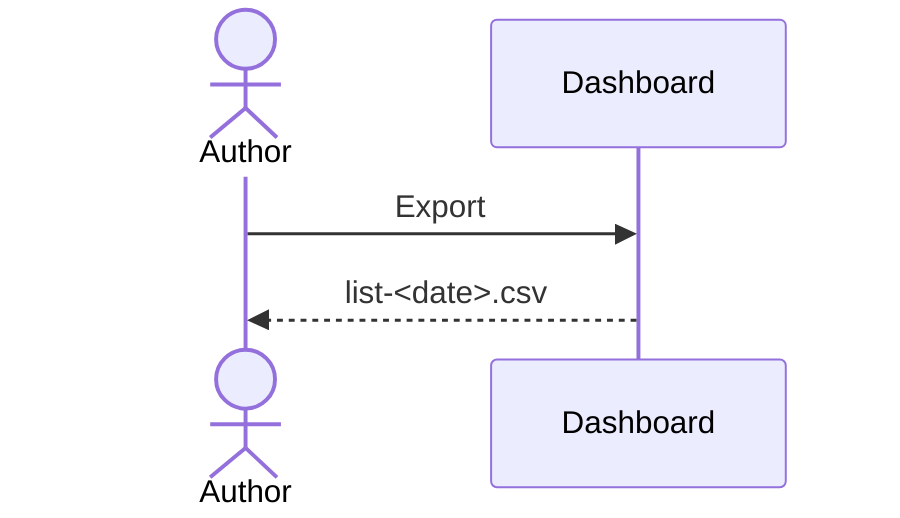

# UC-001 Export the list

## Actors

- **Author** — wants the list as a file.

## Precondition

- The list exists.

## Main flow

1. The author presses **Export**.
2. The dashboard writes a CSV file named with today's date.

## Alternative flows

- **1a. The list is empty.** Nothing is written.

## Postcondition

- The file holds the list.
