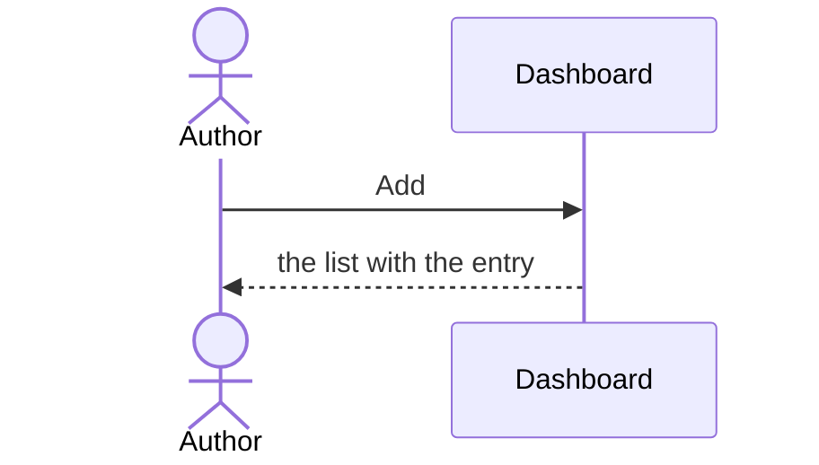

# UC-002 Add an entry

## Actors

- **Author** — writes the entry.

## Precondition

- The author is logged in.

## Main flow

1. The author writes the entry and presses **Add**.
2. The list shows the entry in its place by name.

## Alternative flows

- **1a. The entry has no name.** Nothing is added.

## Postcondition

- The list holds the entry.
