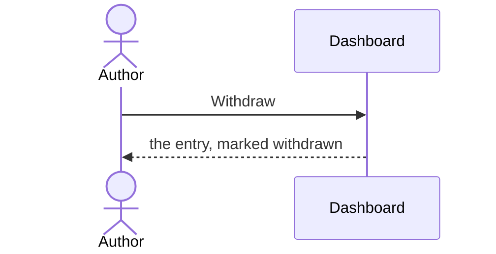

# UC-003 Withdraw an entry

## Actors

- **Author** — withdraws an entry they added.

## Precondition

- The entry exists.

## Main flow

1. The author presses **Withdraw** on the entry.
2. The list marks the entry as withdrawn; its link keeps working.

## Alternative flows

- **1a. The entry is already withdrawn.** Nothing changes.

## Postcondition

- The entry is marked withdrawn and still reachable.
